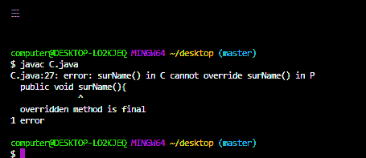

# Java 中私有 vs 最终访问修饰符

> 原文:[https://www . geesforgeks . org/private-vs-final-access-修饰符-in-java/](https://www.geeksforgeeks.org/private-vs-final-access-modifier-in-java/)

每当我们编写类时，我们必须向 JVM 提供一些关于类的信息，比如这个类是否可以从任何地方访问，子类创建是否可能，对象创建是否可能等等。我们可以通过在 java 中使用一个称为访问修饰符的适当关键字来指定这些信息。因此，访问修饰符用于设置类、方法和其他成员的可访问性。

**私有访问修饰符:**

此修饰符不适用于顶级类或接口。它只适用于类内部的构造函数、方法和字段。如果一个变量、方法或构造函数被声明为私有的，那么我们只能从类内访问它们，也就是说，从类外我们不能访问它们。

## Java 语言(一种计算机语言，尤用于创建网站)

```java
// Java Program to illustrate Private Access Modifier

// import required packages
import java.io.*;

import java.util.*;

// helper class
class A {

    // helper method
    private void m1() { System.out.println("GFG"); }
}

// driver class
class B {

    // main method
    public static void main(String[] args)
    {
        // creating an object of type class A
        A a = new A();

        // accessing the method m1()
        a.m1();
    }
}
```


**最终访问修饰符:**

它是一个适用于类、方法和变量的修饰符。如果我们将父类方法声明为 final，那么我们就不能在子类中重写该方法，因为它的实现是 final，如果一个类被声明为 final，我们就不能扩展该类的功能，即我们不能为该类创建子类，即最终类不可能继承。最终类中出现的每个方法总是最终的 y 默认值，但是最终类中出现的每个变量不一定是最终的。final 关键字的主要优势是我们可以实现安全性，并且我们可以提供独特的实现。但是最后一个关键字的主要缺点是我们缺少了像继承(因为最后一个类)、多态(因为最后一个方法)这样的 OOPs 的主要好处，因此如果没有具体的要求，那么不建议使用最后一个关键字。

## Java 语言(一种计算机语言，尤用于创建网站)

```java
// Java program to illustrate Final keyword

// import required packages
import java.io.*;
import java.util.*;
// Declaring parent class P
class P {
    // Declaring a first name
    // method
    public void firstName()
    {
        // Display firstname
        System.out.println("Rahul ");
    }
    /// Declaring a final surName
    // method
    public final void surName()
    {
        // Display surname
        System.out.println("Trivedi");
    }
}
// Creating a child class
// of above parent class
class C extends P {
    // overriding the surName
    // method
    public void surName()
    {
        // Display surname
        System.out.println("Sharma");
    }
    // Main method
    public static void main(String[] args)
    {
        // Display message
        System.out.println("GFG");
    }
}
```



<figure class="table">

| **Private access modifier** | **Final access modifier** |
| --- | --- |
| This modifier is not suitable for top-level occupations. | This modifier is suitable for top-level classes. |
| We can't access private methods outside the class. | We can access the final method outside the class. |
| We can hide private law. | The final method cannot be hidden. |
| This modifier applies to both enumerations and constructors. | Final modifiers do not apply to enumerations and constructors. |
| This modifier does not apply to local variables. | The final modifier is the only modifier applicable to local variables. |

</figure>