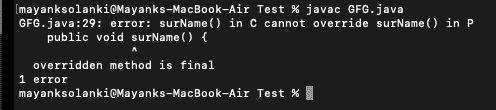

# Java 中私有 vs 受保护 vs 最终访问修饰符

> 原文:[https://www . geesforgeks . org/private-vs-protected-vs-final-access-修饰符-in-java/](https://www.geeksforgeeks.org/private-vs-protected-vs-final-access-modifier-in-java/)

每当我们编写类时，我们都必须向 [JVM](https://www.geeksforgeeks.org/jvm-works-jvm-architecture/) 提供一些关于我们的类的信息，比如这个类是否可以从任何地方访问，子类创建是否可能，对象创建是否可能等。我们可以通过在 java 中使用一个称为访问修饰符的适当关键字来指定这些信息。因此，访问修饰符用于设置类、方法和其他成员的可访问性。

**访问修饰符:**

1.  私人的
2.  保护
3.  最后的

让我们先深入讨论它们，以便在了解它们之间的差异之前更好地理解它们。

**私有访问修饰符:**该修饰符不适用于顶级类或接口。它只适用于类内部的构造函数、方法和字段。如果一个变量、方法或构造函数被声明为私有的，那么我们只能从类内访问它们，也就是说，我们不能从类外访问它们。

## Java 语言(一种计算机语言，尤用于创建网站)

```java
// Java Program to illustrate Private Access Modifier

// Importing required packages
import java.io.*;
import java.util.*;

// Class 1
// Helper class
class A {

    // Method of this class
    private void m1() {

        // Print statement whenever this method is called
        System.out.println("GFG");
    }
}

// Class 2
// Main class
class B {

    // Main driver method
    public static void main(String[] args) {
        // Creating an object of above class
        A a = new A();

        // Accessing the method m1() of above class
        // by creating object of above class in
        // main() method of this class
        a.m1();
    }
}
```


**受保护访问修饰符:**该修饰符可以应用于数据成员、方法和构造函数，但不能应用于顶级类和接口。成员被声明为受保护的，因为我们只能在当前包中访问该成员，但只能在外部包的子类中访问。

## Java 语言(一种计算机语言，尤用于创建网站)

```java
// Java program to illustrate Protected Access Modifier
// import required packages
import java.io.*;
import java.util.*;

// declaring a parent class A
class A {

    // declaring a protected method m1()
    protected void m1() { System.out.println("GFG"); }
}

// creating a child class by extending the class A
class B extends A {

    // main method
    public static void main(String[] args)
    {
        // creating an object of parent class
        // using parent reference
        A a = new A();

        /// calling method m1
        a.m1();

        // creating an object of child class
        // using child reference
        B b = new B();

        // calling method m1
        b.m1();

        // creating an object of child class
        // using parent reference
        A a1 = new B();

        // calling m1 method
        a1.m1();
    }
}
```

**Output**

```java
GFG
GFG
GFG
```

**输出说明:**在上面的例子中，我们使用父引用和子引用创建了三个对象，并在其上调用 m1()方法，它成功地执行了，因此从上面的例子中我们可以说，我们可以使用父引用或子引用在任何地方访问当前包中的受保护方法。

**最终访问修饰符:**适用于类、方法和变量的修饰符。如果我们将父类方法声明为 final，那么我们就不能在子类中重写该方法，因为它的实现是 final，如果一个类被声明为 final，我们就不能扩展该类的功能，即我们不能为该类创建子类，即最终类不可能继承。最终类中出现的每个方法总是最终的 y 默认值，但是最终类中出现的每个变量不一定是最终的。final 关键字的主要优势是我们可以实现安全性，并且我们可以提供独特的实现。但是最后一个关键字的主要缺点是我们缺少了像继承(因为最后一个类)、多态(因为最后一个方法)这样的 OOPs 的主要好处，因此如果没有具体的要求，那么不建议使用最后一个关键字。

## Java 语言(一种计算机语言，尤用于创建网站)

```java
// Java program to illustrate Final keyword

// import required packages
import java.io.*;
import java.util.*;
// Declaring parent class P
class P {
    // Declaring a first name
    // method
    public void firstName()
    {
        // Display firstname
        System.out.println("Rahul ");
    }
    /// Declaring a final surName
    // method
    public final void surName()
    {
        // Display surname
        System.out.println("Trivedi");
    }
}
// Creating a child class
// of above parent class
class C extends P {
    // overriding the surName
    // method
    public void surName()
    {
        // Display surname
        System.out.println("Sharma");
    }
    // Main method
    public static void main(String[] args)
    {
        // Display message
        System.out.println("GFG");
    }
}
```

**输出:**



现在，在了解了所有这些之后，让我们就它们之间的差异进行总结。

<figure class="table">

| **Private access modifier** | **Protected access modifier** | **Final access modifier** |
| --- | --- | --- |
| This modifier is not applicable to top-level occupations. | This modifier does not apply to top-level classes. | This modifier is suitable for top-level classes. |
| This modifier applies to both enumerations and constructors. | This modifier applies to both enumerations and constructors. | Final modifiers do not apply to enumerations and constructors. |
| This modifier applies to the interface. | This modifier applies to interfaces. | This modifier is not applicable to interfaces. |
| This modifier is not applicable to local variables. | This modifier does not apply to local variables. | This modifier is the only one applicable to local variables. |
| We can't access private members outside the class. | We can access protected members outside the class. | We can access the final members outside the class. |
| We can't access private members from outside the package. | We can access protected members from external packages through sub-references. | We can't access the end member from the external package. |

</figure>