# 项目创意——新冠肺炎床经理 App

> 原文:[https://www . geeksforgeeks . org/project-idea-新冠肺炎-bed-manager-app/](https://www.geeksforgeeks.org/project-idea-covid-19-bed-manager-app/)

这个疫情的床位管理已经成为几乎所有 covid 患者家庭面临的问题。但是通过使用最新的技术，这个问题可以解决，这个问题的主要原因是医院没有一个合适的门户来管理床位。我们对这个问题的解决方案可以用来挽救许多 covid 患者的生命。因此，我们试图在项目的帮助下解决这个问题，项目的重点是确保每个 covid 患者都能得到一张床。我们通过创建两个应用程序实现了这一点，一个应用程序面向用户，用户可以通过它申请医院床位，另一个应用程序面向医院，用户可以在医院管理床位。

### **目标**

我们的应用程序的目标是在疫情提供一个高效的床位管理系统，以挽救 covid 患者的生命

### **当前系统的问题**

在目前的制度下，如果病人足够幸运，病人的亲属必须从一家医院到另一家医院，从 5 家医院到 10 家医院后，病人才能得到一张床，但并不是所有的人都能在医院得到一张床，因此他们失去了生命。有许多网站提供床位管理，但没有一个网站为患者提供自己申请床位的设施，也没有推出任何应用程序，使床位管理任务变得容易。

### **解决方案**

该应用程序旨在通过向用户提供床预订系统来解决这个问题。将向用户提供一个城市中所有医院的床位状态和医院的床位状态。患者可以通过上传自己的 **Aadhar 卡和电晕阳性证明**来请求卧床验证。然后在医院端，医院可以看到床位请求，然后他们可以批准或拒绝患者的请求。患者在他们的手机号码上收到一条短信，当他们到达医院时会显示给接待处。

### **示意图**

下面是一些给出应用程序概念的图表

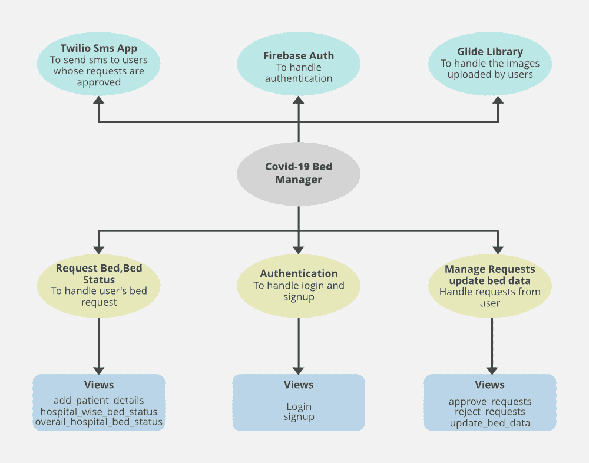 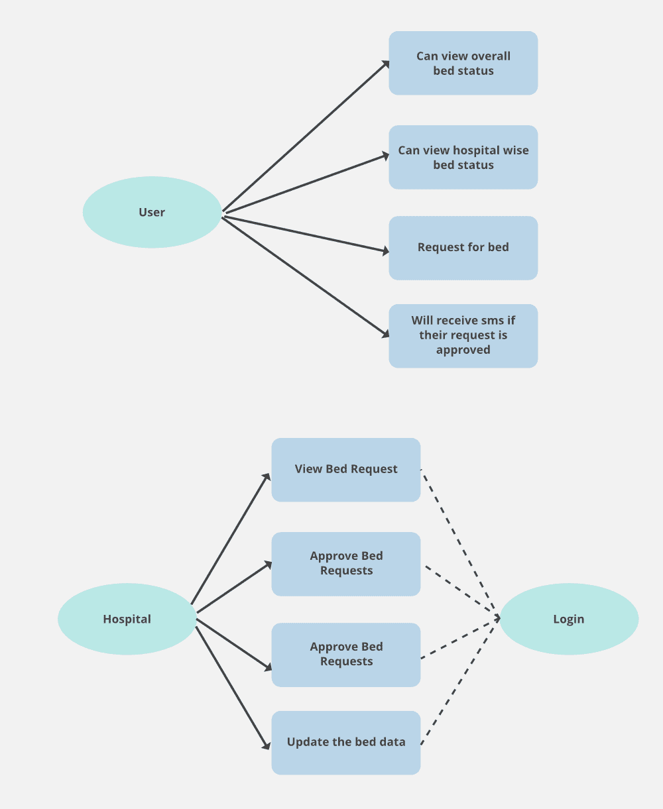

### **使用的工具和技术**

*   机器人
*   火灾
*   Java 语言(一种计算机语言，尤用于创建网站)
*   服务器端编程语言（Professional Hypertext Preprocessor 的缩写）
*   英雄库

这里，对于数据库，使用 Firebase Firestore，这是一个面向 NoSQL 文档的数据库。而对于给用户发送短信，Twilio API 与 PHP 集成，部署在 Heroku 上。

### 项目的实施

这个项目包括两个模块，用户模块和医院模块。现在我们将看到两个模块的工作过程

**1。用户模块**

*   **整体床位状态仪表盘:**在 app 的首页，用户会看到全市所有医院所有床位的整体状态。有一个按钮，用户可以从这里看到医院的病床状态。用户也可以要求在特定的医院里有一张床。

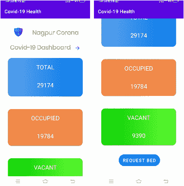

*   **医院智慧床状态仪表盘:**这里用户将能够查看医院智慧床状态这里提供的附加功能是给用户一个搜索框，用户可以通过医院的名称以及医院的区域来搜索医院。当任何医院创建新帐户时，该医院会在列表中自动更新。

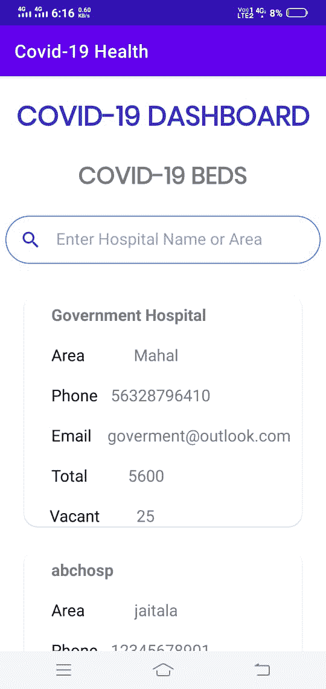

*   **请求床位表:**在该表的帮助下，用户可以填写患者的详细信息，并且他们必须选择他们想要请求床位的医院。除此之外，用户还必须选择到达医院的时间，从最多 6 小时开始，并且他们需要上传 Aadhar 卡和 corona 阳性证明，以供医院核实。

**2。医院模块**

*   **注册/登录页面:**医院管理员必须创建一个新帐户，如果他们没有创建其他帐户，他们可以通过输入电子邮件和密码登录，如果输入的详细信息有效，则管理员将被重定向到仪表板。

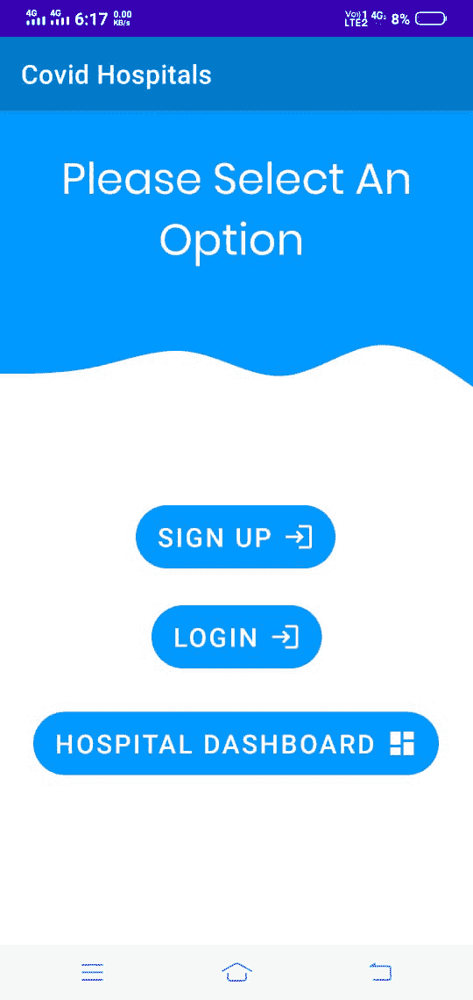

*   **仪表盘:**登录成功后，管理员会被重定向到这个页面，这是主页面，管理员可以更新床位数据，也可以管理床位请求，并从自己的账户注销。

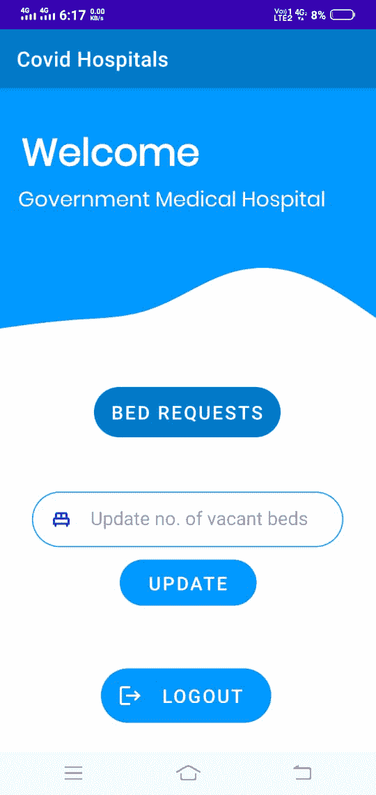

*   **管理床位请求:**当点击管理床位请求按钮时，管理员被重定向到该页面。在这里，管理员可以查看用户为其医院提出的所有床位请求。管理员可以批准或拒绝床位申请。当申请被管理员批准时，会向用户发送一条短信，空床位数减少 1。

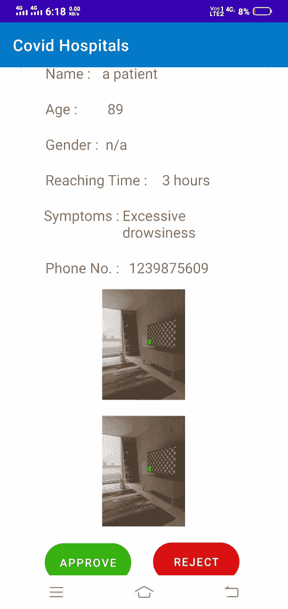

### 完整的视频说明

<video class="wp-video-shortcode" id="video-628527-1" width="640" height="360" preload="metadata" controls=""><source type="video/mp4" src="https://media.geeksforgeeks.org/wp-content/uploads/20210707152550/Project-Idea---Covid-19-Bed-Manager-App.mp4?_=1">[https://media.geeksforgeeks.org/wp-content/uploads/20210707152550/Project-Idea---Covid-19-Bed-Manager-App.mp4](https://media.geeksforgeeks.org/wp-content/uploads/20210707152550/Project-Idea---Covid-19-Bed-Manager-App.mp4)</video>

### <u>进一步增强</u>

在床位管理之前，我们只考虑了两种情况，即医院和用户。但是在分析了这些应用程序后，我们发现当政府需要医院的床位数据时，医院可能存在一些弊端。为此，我们引入了第三个场景。**控制室**。

基本上，控制室要做的是增加一家新医院，删除一家现有医院，并编辑医院的数据，以保持透明度，并确保只有政府批准的医院才具有 covid。除此之外，控制室现在将病人分配到特定的医院。这里，我们还考虑了另一种情况，即如果任何患者直接来到医院并被收治，那么医院必须将直接收治的患者通知给控制室，因为医院可以选择添加直接收治的患者数据，并且控制室可以查看医院的直接收治患者。

#### **UML 图:**

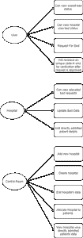

### 实施:

该项目将包含三个模块:用户模块、医院模块和控制室模块。

**1。用户模块**

这里**请求床**部分会有一些变化

*   **请求床位:**在填写患者的详细信息时，用户将无法选择医院，因为医院将由控制室分配，因此作为选择，用户将不得不根据控制室将附近的医院分配给用户来提及他们的区域。

**2。医院模块**

以下是将要进行的更改:

1.  将没有医院的注册页面，因为控制室将创建新医院，
2.  将增加一个新的部分，医院将在其中添加直接入院患者的详细信息
3.  另一个主要的变化是早期的用户只得到总床位和空床位的信息，但是现在我们在空床位中增加了 4 种类型的床位。**氧气床、非氧气床、ICU 床和呼吸机床**。
4.  为了更新床数据，仪表板中提供了“管理床”按钮。

*   **登录页面**:在这里登录时，管理员必须输入电子邮件和密码，并且有一个下拉菜单，管理员必须选择用户类型选项为医院，然后如果输入的详细信息被检查，之后管理员将被重定向到仪表板。

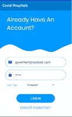

*   **仪表板:**成功登录后，管理员将被引导至此处的仪表板，并显示前面解释的选项，而不是更新空闲床位现在管理床位按钮，管理员可以在此处更新所有类型的床位。

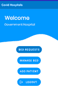

*   **管理床位请求:**在床位请求部分的前面，管理员可以批准或拒绝床位请求，但是现在管理员将能够通过验证患者在短信中获得的唯一代码，在患者每次来医院时接收患者。

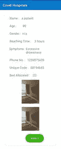

*   **管理床位数据:**这里医院管理员可以更新不同床位的床位数据。

*   **添加患者:**如果任何患者直接来到医院并被收治，则该患者的详细信息应发送到控制室。在此页面中，管理员可以添加直接收治患者的数据。

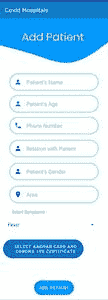

**3。控制室模块**

*   **登录页面:**控制室管理员必须输入登录所需的详细信息，在下拉列表中，管理员必须选择“用户类型”作为控制室，如果详细信息有效，则管理员将被引导至仪表板。

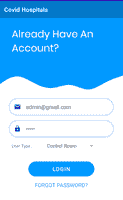

*   **仪表板:**成功登录后，管理员将被重定向到仪表板，在这里管理员可以执行以下操作:

1.  新增一家医院
2.  删除现有医院
3.  编辑医院的数据
4.  查看床位申请
5.  查看医院明智的直接收治患者

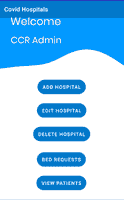

*   **添加新医院:**在这里管理员可以创建一个医院的新账户，在这里每当管理员创建一个新医院时，它就会同时在医院列表中更新。

*   **删除医院:**这里管理员可以删除医院。

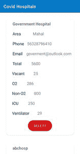

*   **编辑医院:**管理员可以像更新床位数据一样编辑医院数据。

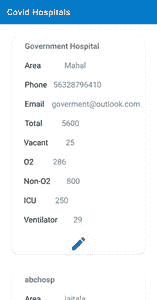

*   **床位请求:**管理员可以查看所有用户的床位请求，管理员将通过从医院列表中选择医院来为患者分配医院，此外，管理员还将从床位列表中分配床位类型，然后管理员可以批准或拒绝床位请求。一旦管理员批准床位请求，就会为每个患者生成一个唯一的代码，通过将该唯一代码与发送给患者的短信和发送给指定医院的请求进行匹配，来帮助在医院验证患者。

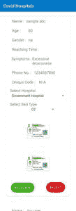

*   **查看患者:**在此页面管理员可以查看医院方面直接收治的患者。

### 修改应用的完整视频说明:

<video class="wp-video-shortcode" id="video-628527-2" width="640" height="360" preload="metadata" controls=""><source type="video/mp4" src="https://media.geeksforgeeks.org/wp-content/uploads/20210715112148/ProjectVideoExplanation.mp4?_=2">[https://media.geeksforgeeks.org/wp-content/uploads/20210715112148/ProjectVideoExplanation.mp4](https://media.geeksforgeeks.org/wp-content/uploads/20210715112148/ProjectVideoExplanation.mp4)</video>

**左侧的 github:**

*   用户应用:[https://github.com/amruta-kashikar/CovidPatients](https://github.com/amruta-kashikar/CovidPatients)
*   医院应用程序:[https://github.com/amruta-kashikar/HospitalsCovid](https://github.com/amruta-kashikar/HospitalsCovid)

**更新的应用链接:**

*   对于用户应用程序:https://github . com/amruta-kashik/coid
*   对于医院和控制室的应用程序:[https://github.com/amruta-kashikar/CovidHospitals](https://github.com/amruta-kashikar/CovidHospitals)

### **投稿人**

*   [【amruta kashikar】](https://auth.geeksforgeeks.org/user/amrutakashikar2/profile)
*   [卡姆莱什帕尔玛](https://auth.geeksforgeeks.org/user/k3xri/profile)