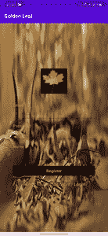
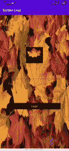
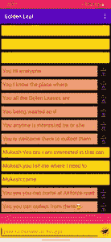

# 项目创意——金叶

> 原文:[https://www.geeksforgeeks.org/project-idea-golden-leaf/](https://www.geeksforgeeks.org/project-idea-golden-leaf/)

### 问题陈述

我们都知道如今农药和其他人造物品是如何在很短的时间内被用于粮食种植以获得更高的产量。这些事情给人类带来了非常严重的问题。由于这些，我们感染了我们祖先未知的疾病。但是现在它已经成为我们日常生活的一部分，我们无法摆脱这种情况。

### 解决方案

所以，解决这种情况的办法是使用有机肥，而不是化肥和农药。我们都知道这种有机肥料是由干树叶、家畜粪便和许多其他东西组成的。在大城市，当树叶遮蔽季节到来的时候，树木会落叶，而这些树叶只是被收集起来，然后无缘无故地被烧掉。解决这个问题的办法就是**金叶**。这样你就可以联系到一个需要干叶的人和一个想把叶子搬出去的人。我设计了这个应用程序，它可以为我们的社会带来非常小的变化，也可以为我们所有人带来丰硕的成果。没有额外的工作，这可以很容易地用我的应用程序来完成。

### 《构想》的实施

现在让我给你简单介绍一下它在做什么。它可以让你在叶子提供者和叶子收集者之间进行交流，叶子收集者需要这些叶子来种植他/她的植物，而不是人工杀虫剂和肥料。为了更好的理解，我提供了一个小例子。

> 树叶提供者—->金叶——->树叶收集者

现在让我告诉你使用 GOLDEN LEAVES 需要做什么。

**第一步:**首先，您需要前往我们的注册门户网站，在那里您需要使用您的电子邮件 ID、姓名和密码进行注册。

**第二步:**然后注册后，你要自己用登录 ID 和密码登录。开始履行你的职责来拯救我们的环境。

**第三步:**现在完成以上两个流程后，你就可以开始你想执行的任务了。

### 工具和技术

*   **类别:**安卓开发
*   **使用的语言**:JAVA
*   **使用的工具:**安卓工作室
*   **认证和数据库服务器** : FireBase DataBase(谷歌子公司)

### **金叶未来展望**

1.  我们正在尝试添加博客活动。通过在博客中写成功的故事，更多的人会被吸引到这一点上。
2.  我们还将添加一个喜欢的按钮，这样你就可以喜欢和评论一个博客作者。
3.  您还可以上传您的照片(收集树叶并将其发送到正确的地方)。
4.  你可以看到所有喜欢你帖子的用户。