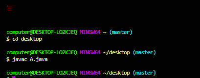

# Java 中的公共 vs 包访问修饰符

> 原文:[https://www . geesforgeks . org/public-vs-package-access-modifiers-in-Java/](https://www.geeksforgeeks.org/public-vs-package-access-modifiers-in-java/)

每当我们编写类时，我们都必须向 [JVM](https://www.geeksforgeeks.org/jvm-works-jvm-architecture/) 提供一些关于我们的类的信息，比如这个类是否可以从任何地方访问，子类创建是否可能，对象创建是否可能等。我们可以通过在 java 中使用一个称为访问修饰符的适当关键字来指定这些信息。因此，访问修饰符用于设置类、方法和其他成员的可访问性。

让我们如下讨论这两个修饰符:

*   公共访问修饰符
*   包(默认)访问修饰符

**修饰符 1:** 公共访问修饰符

如果一个类被声明为公共的，那么我们可以从任何地方访问这个类。

我们将在该包中创建一个包 pack1，我们声明了一个公共的类 A，在该类中，我们声明了一个也是公共的方法 m1。现在我们创建另一个包 pack k2，在那个 pack k2 中，我们导入 pack1 并声明一个 B 类，在 B 类的主方法中，我们创建一个 A 类类型的对象，并尝试访问方法 m1 的数据。

**例 1:**

## Java 语言(一种计算机语言，尤用于创建网站)

```java
// Java Program to illustrate  Public Access Modifiers

// creating a package
package pack1;

// import required packages
import java.io.*;
import java.util.*;

// declaring a public class
public class A {

    // declaring method m1
    public void m1() { System.out.println("GFG"); }
}
```

**输出:**使用以下命令行编译并保存上述代码:



这里我们将把上面创建的包的类导入到新创建的包中。

**例 2:**

## Java 语言(一种计算机语言，尤用于创建网站)

```java
// Java Program to illustrate  Public Access Modifiers

// creating a package
package pack2;

// importing class from above package
// package pack1
// import required packages
import java.io.*;
import java.util.*;
import pack1.A;

// Main class
class B {

    // Main driver method
    public static void main(String[] args)
    {
        // Creating an object of type class A
        A a = new A();

        // accessing the method m1()
        a.m1();
    }
}
```