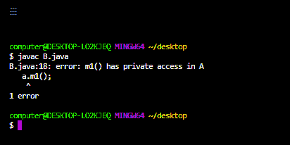

# Java 中的公共与私有访问修饰符

> 原文:[https://www . geesforgeks . org/public-vs-private-access-modifiers-in-Java/](https://www.geeksforgeeks.org/public-vs-private-access-modifiers-in-java/)

每当我们编写类时，我们必须向 JVM 提供一些关于类的信息，比如这个类是否可以从任何地方访问，子类创建是否可能，对象创建是否可能等等。我们可以通过在 java 中使用一个称为访问修饰符的适当关键字来指定这些信息。因此，访问修饰符用于设置类、方法和其他成员的可访问性。

**公共访问修饰符:**

如果一个类被声明为公共的，那么我们可以从任何地方访问这个类。

在下面的例子中，我们在这个包中创建了一个包 pack1，我们声明了一个公共的类 A，在这个类中，我们声明了一个同样是公共的方法 m1。现在我们创建另一个包 pack k2，在那个 pack k2 中，我们导入 pack1 并声明一个 B 类，在 B 类主方法中，我们创建一个 A 类类型的对象，并尝试访问方法 m1 的数据。

## Java 语言(一种计算机语言，尤用于创建网站)

```java
// Java program to showcase the example
// of public access modifier

// import required packages
import java.io.*;
import java.util.*;

// declaring a public class
public class A {

    // declaring method m1
    public void m1() { System.out.println("GFG"); }
}

class B {

    // main method
    public static void main(String[] args)
    {
        // creating an object of type class A
        A a = new A();

        // accessing the method m1()
        a.m1();
    }
}
```

**Output**

```java
GFG

```

如果 A 类在编译 B 类时不是公共的，我们会得到编译时错误，说 pack1。a 在 pack1 中不是公共的，不能从外部包访问。

类似地，如果一个成员或方法或接口被声明为公共的，那么我们可以从任何地方访问该成员。

**私有访问修饰符:**

此修饰符不适用于顶级类或接口。它只适用于类内部的构造函数、方法和字段。

如果一个变量、方法或构造函数被声明为私有的，那么我们只能从类内访问它们，也就是说，从类外我们不能访问它们。

## Java 语言(一种计算机语言，尤用于创建网站)

```java
// Java program to showcase the example
// of private access modifier

// import required packages
import java.io.*;

import java.util.*;

// helper class
class A {

    // helper method
    private void m1() { System.out.println("GFG"); }
}

// driver class
class B {

    // main method
    public static void main(String[] args)
    {
        // creating an object of type class A
        A a = new A();

        // accessing the method m1()
        a.m1();
    }
}
```



<figure class="table">

| 公共访问修饰符 | 私有访问修饰符 |
| --- | --- |
| 该修饰符适用于顶级类和接口。 | 该修饰符不适用于顶级类和接口。 |
| 可以从同一个包的子类访问公共成员。 | 不能从同一包的子类访问私有成员。 |
| 可以从同一个包的非子类访问公共成员。 | 不能从同一包的非子类访问私有成员。 |
| 可以从外部包的子类访问公共成员。 | 无法从外部包的子类访问私有成员。 |
| 可以从外部包的非子类访问公共成员。 | 不能从外部包的非子类访问私有成员。 |
| 公共修饰语是最容易使用的修饰语。 | 私有修饰语是最受限制的修饰语。 |
| 公共修饰符是方法的推荐修饰符。 | 私有修饰符是数据成员的推荐修饰符。 |

</figure>