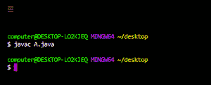
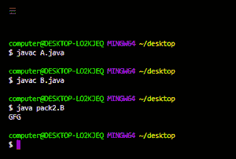
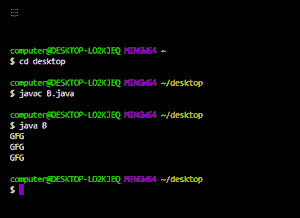

# Java 中的公共与受保护访问修饰符

> 原文:[https://www . geesforgeks . org/public-vs-protected-access-modifier-in-Java/](https://www.geeksforgeeks.org/public-vs-protected-access-modifier-in-java/)

每当我们编写类时，我们都必须向 [**JVM**](https://www.geeksforgeeks.org/jvm-works-jvm-architecture/) 提供一些关于类的信息，比如这个类是否可以从任何地方访问，子类创建是否可能，对象创建是否可能等等。我们可以通过在 java 中使用一个称为访问修饰符的适当关键字来指定这些信息。因此，访问修饰符用于设置类、方法和其他成员的可访问性。

**公共访问修饰符:**如果一个类被声明为公共的，那么我们可以从任何地方访问该类。

在下面的例子中，我们在这个包中创建了一个包 pack1，我们声明了一个公共的类 A，在这个类中，我们声明了一个同样是公共的方法 m1。现在我们创建另一个包 pack k2，在那个 pack k2 中，我们导入 pack1 并声明一个 B 类，在 B 类的主方法中，我们创建一个 A 类类型的对象，并尝试访问方法 m1 的数据。

## Java 语言(一种计算机语言，尤用于创建网站)

```
// creating a package
package pack1;

// import required packages
import java.io.*;
import java.util.*;

// declaring a public class
public class A {

    // declaring method m1
    public void m1() { System.out.println("GFG"); }
}
```

使用下面的命令行编译并保存上述代码:



## Java 语言(一种计算机语言，尤用于创建网站)

```
// creating a package
package pack2;

// import required packages
import java.io.*;
import java.util.*;

// importing package pack1
import pack1.A;

// driver class
class B {

    // main method
    public static void main(String[] args)
    {
        // creating an object of type class A
        A a = new A();

        // accessing the method m1()
        a.m1();
    }
}
```



如果 A 类在编译 B 类时不是公共的，我们会得到一个编译时错误，说 pack1。a 在 pack1 中不是公共的，不能从外部包访问。

类似地，成员、方法或接口被声明为公共的，因为我们可以从任何地方访问该成员。

**受保护访问修饰符:**该修饰符可以应用于数据成员、方法和构造函数，但不能应用于顶级类和接口。

成员被声明为受保护的，因为我们只能在当前包中访问该成员，但只能在外部包的子类中访问。

## Java 语言(一种计算机语言，尤用于创建网站)

```
// import required packages
import java.io.*;
import java.util.*;

// declaring a parent class A
class A {

    // declaring a protected method m1()
    protected void m1() { System.out.println("GFG"); }
}

// creating a child class by extending the class A
class B extends A {

    // main method
    public static void main(String[] args)
    {
        // creating an object of parent class
        // using parent reference
        A a = new A();

        /// calling method m1
        a.m1();

        // creating an object of child class
        // using child reference
        B b = new B();

        // calling method m1
        b.m1();

        // creating an object of child class
        // using parent reference
        A a1 = new B();

        // calling m1 method
        a1.m1();
    }
}
```



在上面的例子中，我们使用父引用和子引用创建了三个对象，并在其上调用 m1()方法，它成功地执行了，因此从上面的例子中我们可以说，我们可以通过使用父引用或子引用在任何地方访问当前包中的受保护方法。

<figure class="table">

| Public access modifier | Protected access modifier |
| --- | --- |
| This modifier applies to top-level classes and interfaces. | This modifier does not apply to top-level classes and interfaces. |
| We can access public members from outsourced non-subclasses. | We cannot access the protected members from non-subclasses of the external package. |
| We can visit public members from anywhere outside the package. | We can only access the protected members through the sub-references of external packages. |
| Public modifiers are more accessible than protected modifiers. | This modifier is more restrictive than the public modifier. |

</figure>