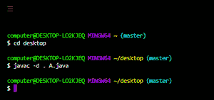
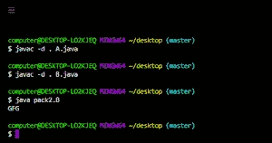
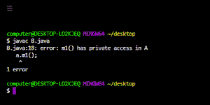

# Java 中的公共 vs 受保护 vs 包 vs 私有访问修饰符

> 原文:[https://www . geesforgeks . org/public-vs-protected-vs-package-vs-private-access-修饰符-in-java/](https://www.geeksforgeeks.org/public-vs-protected-vs-package-vs-private-access-modifier-in-java/)

每当我们编写类时，我们必须向 [JVM](https://www.geeksforgeeks.org/jvm-works-jvm-architecture/) 提供一些关于类的信息，比如这个类是否可以从任何地方访问，子类创建是否可能，对象创建是否可能等等。我们可以通过在 java 中使用一个称为访问修饰符的适当关键字来指定这些信息。因此，访问修饰符用于设置类、方法和其他成员的可访问性。

**修饰符 1:** 公共访问修饰符

如果一个类被声明为公共的，那么我们可以从任何地方访问这个类。

在下面的例子中，我们在这个包中创建了一个包 pack1，我们声明了一个公共的类 A，在这个类中，我们声明了一个同样是公共的方法 m1。现在我们创建另一个包 pack k2，在那个 pack k2 中，我们导入 pack1 并声明一个 B 类，在 B 类的主方法中，我们创建一个 A 类类型的对象，并尝试访问方法 m1 的数据。

**示例:**

## Java 语言(一种计算机语言，尤用于创建网站)

```
// Java program to showcase the example
// of public access modifier

// creating a package
package pack1;

// import required packages
import java.io.*;
import java.util.*;

// declaring a public class
public class A {

    // declaring method m1
    public void m1() { System.out.println("GFG"); }
}
```

使用下面的命令行编译并保存上述代码:



## Java 语言(一种计算机语言，尤用于创建网站)

```
// creating a package
package pack2;

// import required packages
import java.io.*;
import java.util.*;

// importing package pack1
import pack1.A;

// driver class
class B {

    // main method
    public static void main(String[] args)
    {
        // creating an object of type class A
        A a = new A();

        // accessing the method m1()
        a.m1();
    }
}
```



如果 A 类在编译 B 类时不是公共的，我们会得到一个编译时错误，说 pack1。a 在 pack1 中不是公共的，不能从外部包访问。

类似地，成员、方法或接口被声明为公共的，因为我们可以从任何地方访问该成员。

**修改器 2:** 受保护访问修改器

此修饰符可以应用于数据成员、方法和构造函数，但不能应用于顶级类和接口。

成员被声明为受保护的，因为我们只能在当前包中访问该成员，但只能在外部包的子类中访问。

**实施:**

**例**

## Java 语言(一种计算机语言，尤用于创建网站)

```
// Java program to showcase the example
// of protected access modifier
// import required packages
import java.io.*;
import java.util.*;

// declaring a parent class A
class A {

    // declaring a protected method m1()
    protected void m1() { System.out.println("GFG"); }
}

// creating a child class by extending the class A
class B extends A {

    // main method
    public static void main(String[] args)
    {
        // creating an object of parent class
        // using parent reference
        A a = new A();

        /// calling method m1
        a.m1();

        // creating an object of child class
        // using child reference
        B b = new B();

        // calling method m1
        b.m1();

        // creating an object of child class
        // using parent reference
        A a1 = new B();

        // calling m1 method
        a1.m1();
    }
}
```

**Output**

```
GFG
GFG
GFG
```

**输出解释:**

在上面的例子中，我们使用父引用和子引用创建了三个对象，并在其上调用 m1()方法，它成功地执行了，因此从上面的例子中我们可以说，我们可以通过使用父引用或子引用在任何地方访问当前包中的受保护方法。

**修饰符 3:** 私有访问修饰符

此修饰符不适用于顶级类或接口。它只适用于类内部的构造函数、方法和字段。

如果一个变量、方法或构造函数被声明为私有的，那么我们只能从类内访问它们，也就是说，从类外我们不能访问它们。

**示例:**

## Java 语言(一种计算机语言，尤用于创建网站)

```
// Java program to showcase the example
// of private access modifier

// import required packages
import java.io.*;

import java.util.*;

// helper class
class A {

    // helper method
    private void m1() { System.out.println("GFG"); }
}

// driver class
class B {

    // main method
    public static void main(String[] args)
    {
        // creating an object of type class A
        A a = new A();

        // accessing the method m1()
        a.m1();
    }
}
```



**修改器 4:** 包(默认)访问修改器

没有任何访问修饰符的类、方法或变量声明被认为具有包(默认)访问修饰符。默认修饰符在同一个包中充当公共的，在包外充当私有的。如果一个类被声明为默认类，那么我们只能在当前包中访问该类，也就是说，从外部包中我们不能访问它。因此，默认访问修饰符也被称为包级访问修饰符。类似的规则也适用于 java 中的变量和方法。

**示例:**

## Java 语言(一种计算机语言，尤用于创建网站)

```
// Java Program to illustrate Package Level Access Modifier

// Importing utility classes
// Importing input output classes
import java.io.*;
import java.util.*;

// Main Class
class GFG {

    // Declaring default variables that is
    // having no access modifier
    String s = "Geeksfor";
    String s1 = "Geeks";

    // Method 1
    // To declare a default method
    String fullName()
    {

        // Concatenation of strings
        return s + s1;
    }

    // Method 2
    // Main driver method
    public static void main(String[] args)
    {

        // Creating an object of main class(GFG)
        // in the main() method
        GFG g = new GFG();

        // Calling method1 using class instance
        // and printing the concation of strings
        System.out.println(g.fullName());
    }
}
```

**Output**

```
GeeksforGeeks
```

最后，在完成这四个访问修饰符之后，让我们总结一下它们之间的明显区别

<figure class="table">

| [public access modifier] | [Private Access Modifier] | [Protected Access Modifier] | Package access modifier |
| --- | --- | --- | --- |
| This modifier applies to top-level classes and interfaces. | This modifier does not apply to top-level classes and interfaces. | This modifier does not apply to top-level classes and interfaces. | This modifier applies to top-level classes and interfaces. |
| Public members can be accessed from subclasses of the same package. | Private members cannot be accessed from subclasses of the same package. | Protected members can be accessed from subclasses of the same package. | Package members can be accessed from subclasses of the same package. |
| Public members can be accessed from non-subclasses of the same package. | Private members cannot be accessed from non-subclasses of the same package. | Protected members can be accessed from non-subclasses of the same package. | Members of packages can be accessed from non-subclasses of the same package. |
| Public members can be accessed from outsourced subclasses. | Private members cannot be accessed from outsourced subclasses. | Protected members can be accessed from subclasses of external packages, but we should only use sub-references. | Package members cannot be accessed from subclasses of external packages. |
| Public members can be accessed from outsourced non-subclasses. | Private members cannot be accessed from non-subclasses of external packages. | Protected members cannot be accessed from non-subclasses of external packages. | Package members cannot be accessed from non-subclasses of external packages. |
| The public modifier is the most accessible modifier among all modifiers. | Private modifier is the most restricted modifier among all modifiers. | Protected modifiers are easier to access than package and private modifiers, but harder to access than public modifiers. | Package modifiers are more restricted than public and protected modifiers, but less restricted than private modifiers. |

</figure>