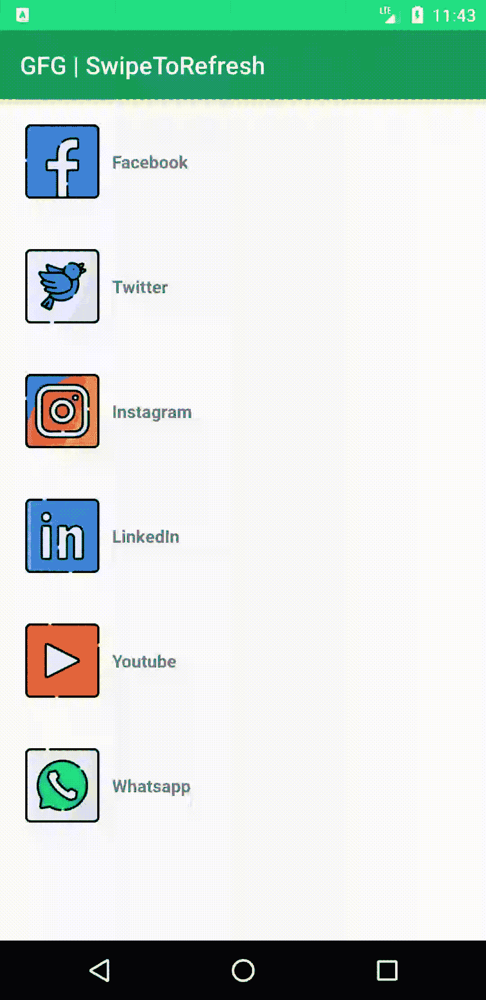

# 在安卓中通过 RecyclerView 拉取刷新，示例

> 原文:[https://www . geeksforgeeks . org/通过示例在安卓中拉取刷新查看/](https://www.geeksforgeeks.org/pull-to-refresh-with-recyclerview-in-android-with-example/)

swipereffreshlayout[小部件](https://www.geeksforgeeks.org/components-android-application/)用于实现一种滑动刷新的用户界面设计模式。其中用户使用垂直滑动手势来刷新[视图](https://www.geeksforgeeks.org/android-ui-layouts/)的内容。垂直滑动由 SwipeRefreshLayout 小部件检测，它显示一个明显的进度条，并触发应用程序中的回调方法。为了使用这个行为，我们需要使用 SwipeRefreshLayout 小部件作为[列表视图](https://www.geeksforgeeks.org/android-listview-in-java-with-example/)或[网格视图](https://www.geeksforgeeks.org/gridview-using-baseadapter-in-android-with-example/)的父部件。这些材料设计用户界面模式可以在 Gmail、Youtube、脸书、Instagram 等应用中看到。它允许用户手动刷新应用程序。SwipeRefreshLayout 类包含一个名为**onrelfreshlistener**的侦听器。想要使用这个监听器的类应该实现**swiperefershlayout。onrelfreshlistener**界面。在垂直向下滑动手势时，该监听器被触发，并调用 **onRefresh()** 方法，可根据需要被覆盖。

### **例**

在本例中，我们将数据存储到[数组列表](https://www.geeksforgeeks.org/arraylist-in-java/)中，该列表用于填充[回收视图](https://www.geeksforgeeks.org/android-recyclerview/)。每当调用 **onRefresh()** 方法时，数组列表数据都会被重新排列。下面给出了一个示例 GIF，以了解我们将在本文中做什么。注意，我们将使用 **Java** 语言来实现这个项目。



### **分步实施**

**第一步:创建新项目**

要在安卓工作室创建新项目，请参考[如何在安卓工作室创建/启动新项目](https://www.geeksforgeeks.org/android-how-to-create-start-a-new-project-in-android-studio/)。注意选择 **Java** 作为编程语言。

**第二步:添加依赖关系**

我们将使用 RecyclerView 和 SwipeRefreshLayout。因此，我们需要为它们添加依赖项。要添加这些依赖项，请转到**渐变脚本>** [**build.gradle(模块:app)**](https://www.geeksforgeeks.org/android-build-gradle/) 并添加以下依赖项。添加这些依赖项后，您需要点击**立即同步**。

> 依赖项{
> 
> 实现“androidx . recycle view:recycle view:1 . 1 . 0”
> 
> 实现“androidx . swiperefershlayout:swiperefershlayout:1 . 1 . 0”
> 
> }

在进一步移动之前，让我们添加一些颜色属性，以增强应用程序栏。转到**应用程序> res >值> colors.xml** 并添加以下颜色属性。

## 可扩展标记语言

```java
<resources>
    <color name="colorPrimary">#0F9D58</color>
    <color name="colorPrimaryDark">#16E37F</color>
    <color name="colorAccent">#03DAC5</color>
</resources>
```

**第三步:使用 activity_main.xml** **文件**

在这一步中，我们将创建 SwipeRefreshLayout 并向其中添加 RecyclerView。转到 **app > res >布局> activity_main.xml** 并添加以下代码片段。

## 可扩展标记语言

```java
<?xml version="1.0" encoding="utf-8"?>
<androidx.swiperefreshlayout.widget.SwipeRefreshLayout
    xmlns:android="http://schemas.android.com/apk/res/android"
    xmlns:tools="http://schemas.android.com/tools"
    android:id="@+id/swipeRefreshLayout"
    android:layout_width="match_parent"
    android:layout_height="match_parent"
    tools:context=".MainActivity">

    <androidx.recyclerview.widget.RecyclerView
        android:id="@+id/recyclerView"
        android:layout_width="match_parent"
        android:layout_height="match_parent" />

</androidx.swiperefreshlayout.widget.SwipeRefreshLayout>
```

**第四步:为 RecyclerView 的列表项新建布局文件 list_item.xml。**

转到 **app > res >布局>右键>新建>布局资源文件**并将其命名为**列表 _ 项**。 **list_item.xml** 布局文件包含一个 [ImageView](https://www.geeksforgeeks.org/imageview-in-kotlin/) 和一个 [TextView](https://www.geeksforgeeks.org/textview-widget-in-android-using-java-with-examples/) ，用于填充 RecyclerView 的行。

## 可扩展标记语言

```java
<?xml version="1.0" encoding="utf-8"?>
<LinearLayout
    xmlns:android="http://schemas.android.com/apk/res/android"
    android:layout_width="match_parent"
    android:layout_height="wrap_content"
    android:layout_margin="10dp"
    android:orientation="horizontal"
    android:padding="10dp">

    <!--For image src we have used ic_launcher
        and for text "GeeksForGeeks they are used only for
        reference how it will looks"-->
    <ImageView
        android:id="@+id/imageView"
        android:layout_width="120dp"
        android:layout_height="120dp"
        android:scaleType="fitXY"
        android:src="@mipmap/ic_launcher" />

    <TextView
        android:id="@+id/textView"
        android:layout_width="wrap_content"
        android:layout_height="wrap_content"
        android:layout_gravity="center_vertical"
        android:paddingStart="10dp"
        android:text="GeeksForGeeks" />

</LinearLayout>
```

**步骤 5:为 RecyclerView 创建适配器类**

现在，我们将创建一个**Adapter.java 类**，它将扩展**回收视图。适配器**带**视图支架**。转到 **app > java >包>右键新建一个 java 类**，命名为**适配器**。在适配器类中，我们将覆盖****oncreateviewpholder()**方法，该方法将膨胀 **list_item.xml 布局**并将其传递给视图持有者。然后是 onBindViewHolder()方法，在这个方法中，我们在视图持有者的帮助下为视图设置数据。下面是**Adapter.java**类的代码片段。**

## **Java 语言(一种计算机语言，尤用于创建网站)**

```java
import android.content.Context;
import android.view.LayoutInflater;
import android.view.View;
import android.view.ViewGroup;
import android.widget.ImageView;
import android.widget.TextView;
import androidx.annotation.NonNull;
import androidx.recyclerview.widget.RecyclerView;
import java.util.ArrayList;

// Extends the Adapter class to RecyclerView.Adapter
// and implement the unimplemented methods
public class Adapter extends RecyclerView.Adapter<Adapter.ViewHolder> {
    ArrayList images, text;
    Context context;

    // Constructor for initialization
    public Adapter(Context context, ArrayList images, ArrayList text) {
        this.context = context;
        this.images = images;
        this.text = text;
    }

    @NonNull
    @Override
    public Adapter.ViewHolder onCreateViewHolder(@NonNull ViewGroup parent, int viewType) {
        // Inflating the Layout(Instantiates list_item.xml layout file into View object)
        View view = LayoutInflater.from(parent.getContext()).inflate(R.layout.list_item, parent, false);

        // Passing view to ViewHolder
        Adapter.ViewHolder viewHolder = new Adapter.ViewHolder(view);
        return viewHolder;
    }

    // Binding data to the into specified position
    @Override
    public void onBindViewHolder(@NonNull Adapter.ViewHolder holder, int position) {
        // TypeCast Object to int type
        int res = (int) images.get(position);
        holder.images.setImageResource(res);
        holder.text.setText((CharSequence) text.get(position));
    }

    @Override
    public int getItemCount() {
        // Returns number of items currently available in Adapter
        return text.size();
    }

    // Initializing the Views
    public class ViewHolder extends RecyclerView.ViewHolder {
        ImageView images;
        TextView text;

        public ViewHolder(View view) {
            super(view);
            images = (ImageView) view.findViewById(R.id.imageView);
            text = (TextView) view.findViewById(R.id.textView);
        }
    }
}
```

****第六步:使用 MainActivity.java 文件****

**在 MainActivity.java 类中，我们创建了两个数组列表来存储图像和文本。这些图像被放置在可绘制文件夹(**应用程序> res >可绘制**)中。你可以用任何图像来代替它。然后我们得到 SwipeRefreshLayout 和 recycle view 的引用，并设置 LayoutManager 和 Adapter 来显示 recycle view 中的项目，并实现 onRefreshListener。以下是**MainActivity.java**文件的代码。**

## **Java 语言(一种计算机语言，尤用于创建网站)**

```java
import android.os.Bundle;
import androidx.appcompat.app.AppCompatActivity;
import androidx.recyclerview.widget.LinearLayoutManager;
import androidx.recyclerview.widget.RecyclerView;
import androidx.swiperefreshlayout.widget.SwipeRefreshLayout;
import java.util.ArrayList;
import java.util.Arrays;
import java.util.Collections;
import java.util.Random;

public class MainActivity extends AppCompatActivity {
    SwipeRefreshLayout swipeRefreshLayout;
    RecyclerView recyclerView;

    // Using ArrayList to store images and text data
    ArrayList images = new ArrayList<>(Arrays.asList(R.drawable.facebook, R.drawable.twitter,
                    R.drawable.instagram, R.drawable.linkedin, R.drawable.youtube, R.drawable.whatsapp));
    ArrayList text = new ArrayList<>(Arrays.asList("Facebook", "Twitter", "Instagram", "LinkedIn", "Youtube", "Whatsapp"));

    @Override
    protected void onCreate(Bundle savedInstanceState) {
        super.onCreate(savedInstanceState);
        setContentView(R.layout.activity_main);

        // Getting reference of swipeRefreshLayout and recyclerView
        swipeRefreshLayout = (SwipeRefreshLayout) findViewById(R.id.swipeRefreshLayout);
        recyclerView = (RecyclerView) findViewById(R.id.recyclerView);

        // Setting the layout as Linear for vertical orientation to have swipe behavior
        LinearLayoutManager linearLayoutManager = new LinearLayoutManager(getApplicationContext());
        recyclerView.setLayoutManager(linearLayoutManager);

        // Sending reference and data to Adapter
        Adapter adapter = new Adapter(MainActivity.this, images, text);

        // Setting Adapter to RecyclerView
        recyclerView.setAdapter(adapter);

        // SetOnRefreshListener on SwipeRefreshLayout
        swipeRefreshLayout.setOnRefreshListener(new SwipeRefreshLayout.OnRefreshListener() {
            @Override
            public void onRefresh() {
                swipeRefreshLayout.setRefreshing(false);
                RearrangeItems();
            }
        });
    }

    public void RearrangeItems() {
        // Shuffling the data of ArrayList using system time
        Collections.shuffle(images, new Random(System.currentTimeMillis()));
        Collections.shuffle(text, new Random(System.currentTimeMillis()));
        Adapter adapter = new Adapter(MainActivity.this, images, text);
        recyclerView.setAdapter(adapter);
    }
}
```

### **输出:**

**<video class="wp-video-shortcode" id="video-511478-1" width="640" height="360" preload="metadata" controls=""><source type="video/mp4" src="https://media.geeksforgeeks.org/wp-content/uploads/20201110002152/Pull-to-Refresh-with-RecyclerView-in-Android.mp4?_=1">[https://media.geeksforgeeks.org/wp-content/uploads/20201110002152/Pull-to-Refresh-with-RecyclerView-in-Android.mp4](https://media.geeksforgeeks.org/wp-content/uploads/20201110002152/Pull-to-Refresh-with-RecyclerView-in-Android.mp4)</video>**