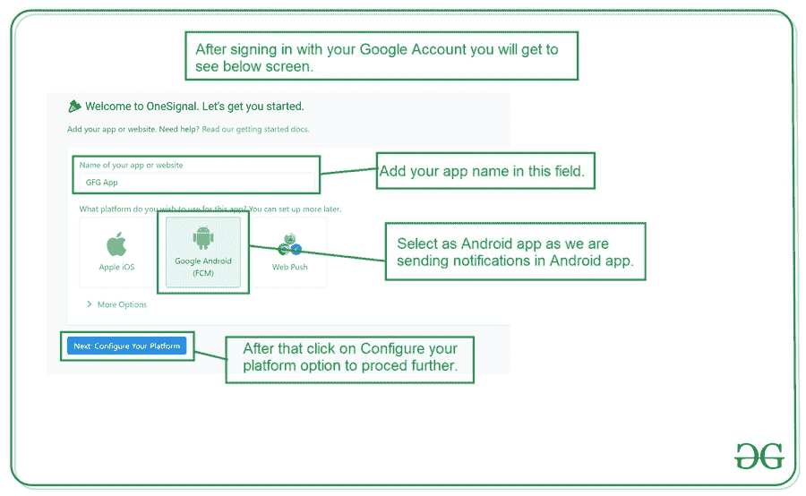
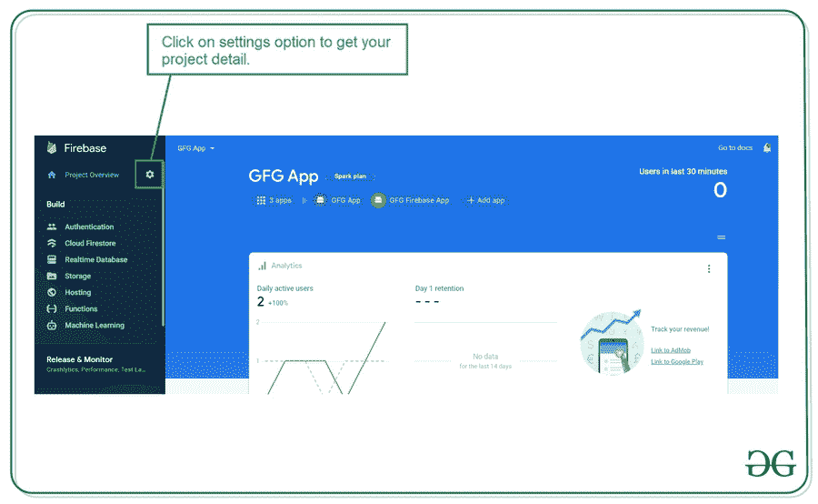
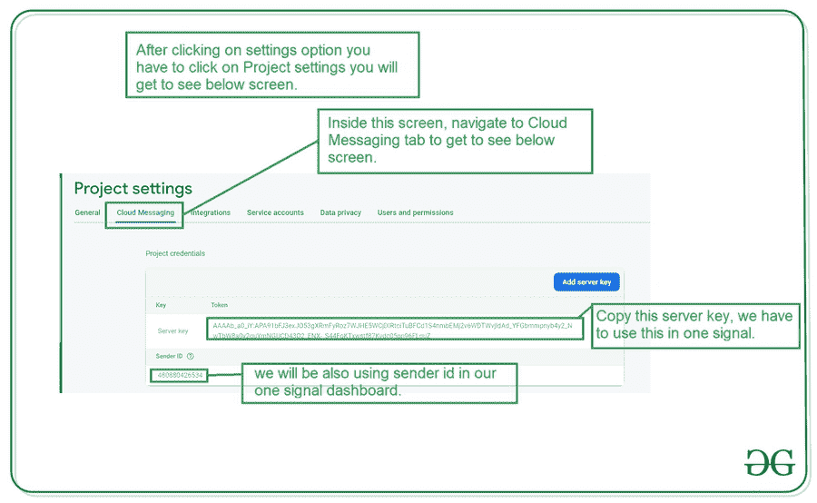
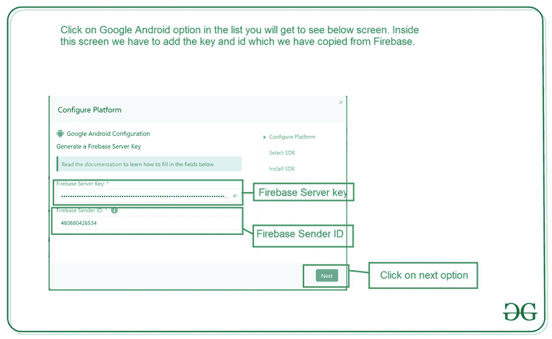
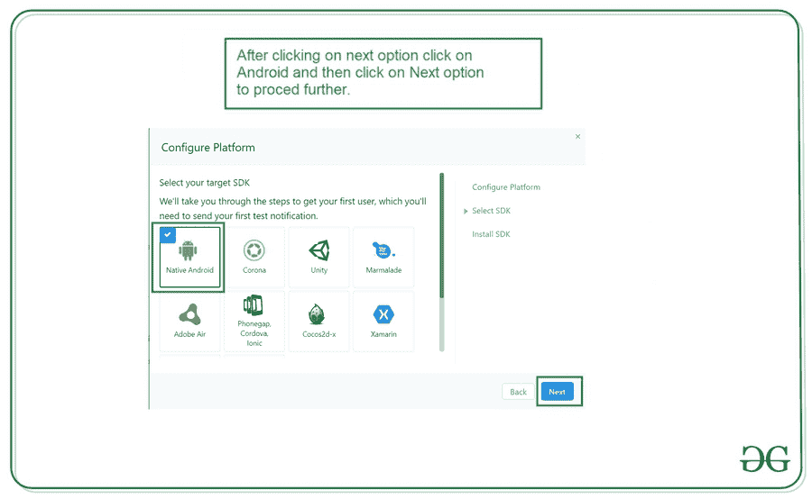
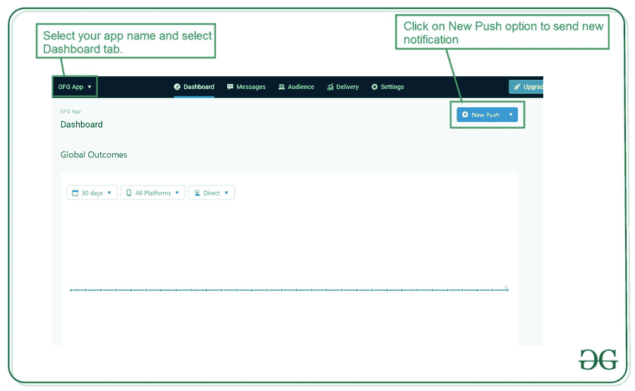
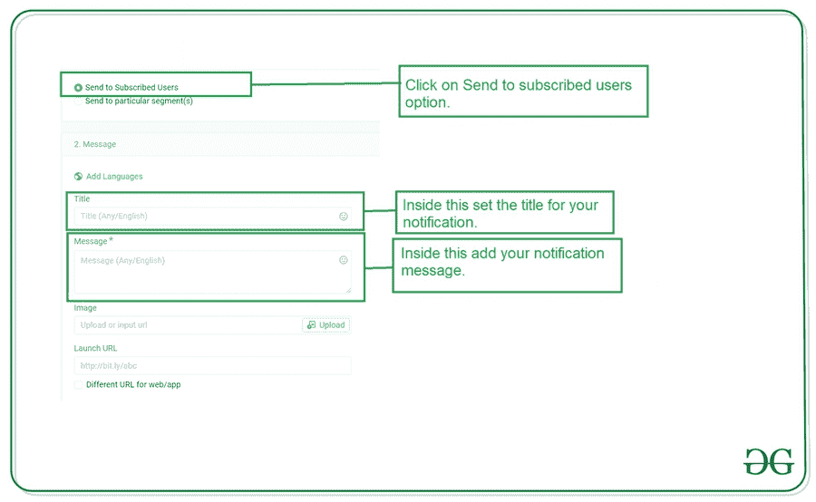
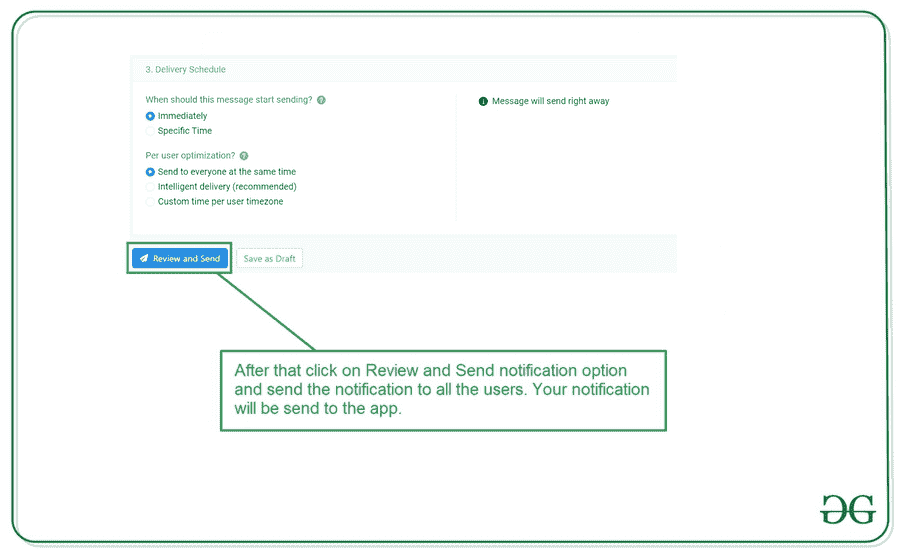

# 使用 OneSignal 在安卓系统中推送通知

> 原文:[https://www . geesforgeks . org/push-notifications-in-Android-using-one signal/](https://www.geeksforgeeks.org/push-notifications-in-android-using-onesignal/)

我们已经在许多安卓应用程序中看到了许多类型的通知。这些通知告知我们的用户我们应用程序中的新优惠、新功能等。在这篇文章中，我们将看看在安卓工作室的安卓应用中，OneSignal 通知平台的实现。

### 我们将在本文中构建什么？

我们将构建一个简单的应用程序，在这个应用程序中，我们将从我们的安卓应用程序中的一个信号平台发送通知。注意，我们将使用 **Java** 语言来实现这个项目。

### **分步实施**

**第一步:创建新项目**

要在安卓工作室创建新项目，请参考[如何在安卓工作室创建/启动新项目](https://www.geeksforgeeks.org/android-how-to-create-start-a-new-project-in-android-studio/)。注意选择 **Java** 作为编程语言。

**第二步:将你的应用连接到 Firebase**

创建新项目后。导航到顶部栏上的工具选项。点击火焰基地。点击 Firebase 后，你可以看到截图中下面提到的右栏。


在那一栏中，导航到火基云火石。点击那个选项，你会看到两个选项:连接应用到 Firebase 和添加云 Firestore 到你的应用。单击立即连接选项，您的应用程序将连接到 Firebase。之后点击第二个选项，现在你的应用程序连接到 Firebase。将您的应用程序连接到 Firebase 后，您将看到下面的屏幕。


之后，验证 Firebase Firestore 数据库的依赖项是否已经添加到我们的 Gradle 文件中。导航到该文件中的**应用程序>梯度脚本**。检查是否添加了以下依赖项。

**第 3 步:在 build.gradle 文件中添加依赖项**

现在我们将在我们的渐变文件中添加使用一个信号的依赖项。导航到 build.gradle (:app)并在 plugins 部分添加下面一行。

> 插件{
> 
> id 'com.android.application '
> 
> id ' com . Google . GMS . Google-services '
> 
> //添加下面一行是插件
> 
> id com . onesignal . androiddk . onesignal gradle 外挂程式
> 
> }

在同一文件的依赖项部分添加下一行。

> 实现' com.onesignal:OneSignal:[4.0.0，4.99.99]'

现在我们将在依赖项部分添加下面的依赖项。导航到 build.gradle(您的应用程序名称)，并向其中添加以下代码。

```
buildscript {
    repositories {
        google()
        jcenter()

        // add below line in build script > repositories section.
        gradlePluginPortal()
    }
    dependencies {
        classpath "com.android.tools.build:gradle:4.1.1"
        classpath 'com.google.gms:google-services:4.3.4'

        // add below line in dependencies section
        classpath 'gradle.plugin.com.onesignal:onesignal-gradle-plugin:[0.12.9, 0.99.99]'

        // NOTE: Do not place your application dependencies here; they belong
        // in the individual module build.gradle files
    }
} 
```

添加上述依赖项部分后，同步您的项目，现在我们将转向 XML 部分。

**第四步:添加互联网权限**

## 可扩展标记语言

```
<!--adding permissions for Internet-->
<uses-permission android:name="android.permission.INTERNET" />
<uses-permission android:name="android.permission.ACCESS_NETWORK_STATE" />
```

**第 5 步:使用 activity_main.xml 文件**

导航到**应用程序> res >布局> activity_main.xml** 并将下面的代码添加到该文件中。下面是 **activity_main.xml** 文件的代码。

## 可扩展标记语言

```
<?xml version="1.0" encoding="utf-8"?>
<RelativeLayout 
    xmlns:android="http://schemas.android.com/apk/res/android"
    xmlns:tools="http://schemas.android.com/tools"
    android:layout_width="match_parent"
    android:layout_height="match_parent"
    android:orientation="vertical"
    android:weightSum="5"
    tools:context=".MainActivity">

    <!--text view for displaying welcome message-->
    <TextView
        android:id="@+id/idTVWelcome"
        android:layout_width="match_parent"
        android:layout_height="wrap_content"
        android:layout_centerInParent="true"
        android:padding="10dp"
        android:text="Geeks for Geeks"
        android:textAlignment="center"
        android:textAllCaps="false"
        android:textColor="@color/purple_500"
        android:textSize="30sp" />

</RelativeLayout>
```

**第六步:为我们的应用生成应用 id**

为了生成我们的应用程序标识，我们必须注册一个信号，类似于我们过去使用谷歌帐户为极客登录极客。登录 One Signal 后，您将看到下面的屏幕来创建一个新的应用程序。



在此屏幕中，您必须输入您的应用程序名称，选择应用程序类型为安卓，然后单击下一步选项来配置您的项目。点击“下一步”选项后，您将看到两个文本字段来输入两个键。

**第七步:获取进入一个信号控制台的按键**

添加完这段代码后，点击这个链接打开 Firebase。点击此链接后，您将看到下面的页面，在此页面上点击右上角的转到控制台选项。


点击此屏幕后，您将看到下面的屏幕，其中包含您选择项目的所有项目。


单击项目名称后，您必须单击设置选项并选择项目设置选项。设置选项如下所示。



点击项目设置后。导航到云消息选项卡，如下所示。在那里，我们将看到服务器密钥和发件人 id。你可以在屏幕下方看到这个。



你必须复制这两个键，然后粘贴到你的单一信号控制台。



添加这些键后，单击“下一步”选项继续。你会看到下面的屏幕。



在此屏幕中，选择安卓选项，然后单击下一步选项继续。您将看到您的应用程序标识显示在屏幕上。

**第 8 步:使用****MainActivity.java 文件**

转到**MainActivity.java**文件，参考以下代码。以下是**MainActivity.java**文件的代码。代码中添加了注释，以更详细地理解代码。

## Java 语言(一种计算机语言，尤用于创建网站)

```
import android.os.Bundle;
import androidx.appcompat.app.AppCompatActivity;
import com.onesignal.OneSignal;

public class MainActivity extends AppCompatActivity {

    @Override
    protected void onCreate(Bundle savedInstanceState) {
        super.onCreate(savedInstanceState);
        setContentView(R.layout.activity_main);

        // OneSignal Initialization
        OneSignal.initWithContext(this);

        // on below line we are setting
        // app id for our one signal
        OneSignal.setAppId("Enter your app id here");
    }
}
```

现在运行您的应用程序，我们将在我们的安卓应用程序中发送我们的第一个通知。要在一个信号中发送通知，请单击一个信号控制台左上角的应用程序名称，然后单击您的应用程序名称，您将看到仪表板屏幕。



单击“新建推送”选项发送新通知。点击“新建推送”选项后，您将看到下面的屏幕。



在此屏幕中，选择发送给订阅用户选项，添加标题选项在标题字段添加您的通知标题，在消息部分添加通知消息，并向下滚动以继续。



向下滚动后，单击查看并发送选项发送您的通知。之后，您的通知将被发送到您的应用程序。您可以在下面的屏幕上看到应用程序的输出。

### **输出:**

<video class="wp-video-shortcode" id="video-554446-1" width="640" height="360" preload="metadata" controls=""><source type="video/mp4" src="https://media.geeksforgeeks.org/wp-content/uploads/20210129225052/Screenrecorder-2021-01-29-20-20-35-587.mp4?_=1">[https://media.geeksforgeeks.org/wp-content/uploads/20210129225052/Screenrecorder-2021-01-29-20-20-35-587.mp4](https://media.geeksforgeeks.org/wp-content/uploads/20210129225052/Screenrecorder-2021-01-29-20-20-35-587.mp4)</video>