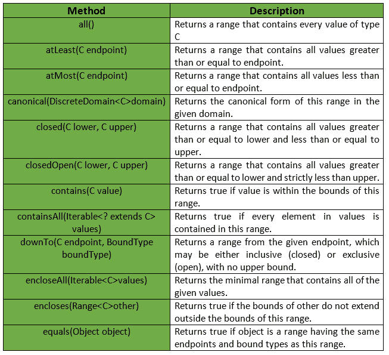
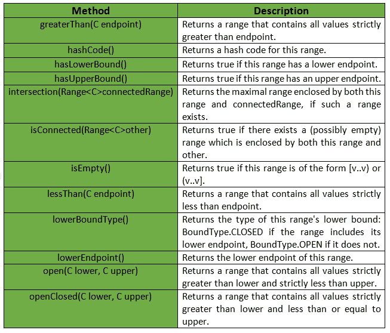
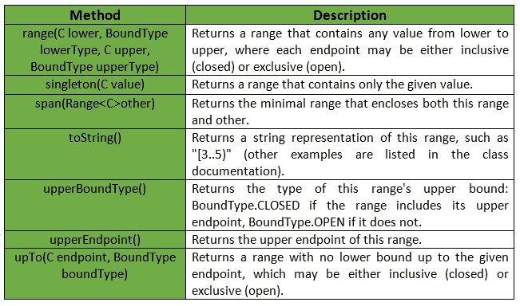

# 靶场级|番石榴|爪哇

> 原文:[https://www.geeksforgeeks.org/range-class-guava-java/](https://www.geeksforgeeks.org/range-class-guava-java/)

番石榴的范围代表一个**区间**，例如一个<范围< b，这里的范围包括 a 和 b 之间的任何值，称为 ***端点*** 形成边界。边界之间的任何值都是可比较类型值的连续范围。

**申报:**申报为**com . Google . common . collect . range<T3】C**T7 类为:

```
@GwtCompatible
public final class Range<C extends Comparable>
   extends Object
      implements Predicate<C>, Serializable

```

范围的每一端可以是有界的，也可以是无界的。如果有界，则有一个关联的端点值。否则，它将被视为无穷大。范围可以进一步定义为开放的或封闭的，这取决于范围是独占的还是包含端点的。

*   **开(a，b)** :代表一个<范围< b，以符号形式，(a，b)。
*   **closed(a，b)** :表示一个< =范围< = b，以记数形式【a，b】。
*   **openClosed(a，b)** :代表一个<范围< = b，以符号形式，(a，b)。
*   **closedOpen(a，b)** :表示一个< =范围< b，以符号形式【a，b】。
*   **greaterThan(a)** :表示范围> a，以记数形式，(a..+inf)。
*   **至少(a，b)** :表示范围> = a，符号形式【a..+inf)。
*   **小于(a，b)** :表示范围< b，以符号形式，(-inf..b)。
*   **atmat(a，b)** :表示范围< = b，以符号形式，(-inf..b]。
*   **all()** :表示-inf <范围< +inf，以符号形式，(-inf..+inf)。

下面给出的是番石榴 Range Class 提供的一些方法:

**注:**当两个端点都存在时，上端点可能不小于下端点。仅当至少一个边界闭合时，端点才可以相等:

*   [a..a]:单例范围。
*   [a..a)或(a)..a]:空范围，也有效。
*   (a)..a):无效，将引发异常。

番石榴范围类提供的其他方法有:

**例外:**

*   **打开:***IllegalArgumentException*如果下限大于或等于上限。
*   **关闭:***IllegalArgumentException*如果下限大于上限。
*   **closedOpen:***IllegalArgumentException*如果下限大于上限。
*   **open closed:***IllegalArgumentException*如果下限大于上限。
*   **范围:***IllegalArgumentException*如果下限大于上限。
*   **encloseAll:***class castexception*如果参数不可相互比较，则 *NoSuchElementException* 如果值为空，则 *NullPointerException* 如果任何值为空。
*   **下限点:** *非法状态异常*如果该范围低于无界(即 hasLowerBound()返回 false)。
*   **lowerBoundType:***illegalsteexception*如果这个范围在下面是无界的(也就是说，hasLowerBound()返回 false)。
*   **上限点:** *非法状态异常*如果这个范围在无界以上(也就是说，hasUpperBound()返回 false)。
*   **upper boundtype:***illegalstatexception*如果这个范围在无界以上(也就是说，hasUpperBound()返回 false)。
*   **交集:***IllegalArgumentException*如果 isConnected(connectedRange)为 false。


下面给出的是一些更好理解实现的例子:
**例子 1 :**

```
// Java code to show implementation
// of Range class of Guava
import com.google.common.collect.Range;

class GFG {

    // Driver code
    public static void main(String[] args)
    {

        // Taking range (1, 5)
        // Note that here 1 and 5 are not included
        Range<Integer> range = Range.open(1, 5);

        // Checking if range contains 1 or not
        System.out.println(range.contains(1));

        // Checking if range contains 2 or not
        System.out.println(range.contains(2));

        // Checking if range contains 3 or not
        System.out.println(range.contains(3));

        // Checking if range contains 4 or not
        System.out.println(range.contains(4));
    }
}
```

输出:

```
false
true
true
true

```

**例 2 :**

```
// Java code to show implementation
// of Range class of Guava
import com.google.common.collect.Range;

class GFG {

    // Driver code
    public static void main(String[] args)
    {

        // Taking range [1, 5]
        // Note that here 1 and 5 are included
        Range<Integer> range = Range.closed(1, 5);

        // Checking if range contains 1 or not
        System.out.println(range.contains(1));

        // Checking if range contains 2 or not
        System.out.println(range.contains(2));

        // Checking if range contains 3 or not
        System.out.println(range.contains(3));

        // Checking if range contains 5 or not
        System.out.println(range.contains(5));
    }
}
```

输出:

```
true
true
true
true

```

**例 3 :**

```
// Java code to show implementation
// of Range class of Guava
import com.google.common.collect.Range;

class GFG {

    // Driver code
    public static void main(String[] args)
    {

        // Taking range (2, +inf)
        // Note that numbers less than equal to 2
        // are not included
        Range<Integer> range = Range.greaterThan(2);

        // Checking if range contains 1 or not
        System.out.println(range.contains(1));

        // Checking if range contains 2 or not
        System.out.println(range.contains(2));

        // Checking if range contains 130 or not
        System.out.println(range.contains(130));

        // Checking if range contains 500 or not
        System.out.println(range.contains(500));
    }
}
```

输出:

```
false
false
true
true

```

**例 4 :**

```
// Java code to show implementation
// of Range class of Guava
import com.google.common.collect.Range;

class GFG {

    // Driver code
    public static void main(String[] args)
    {

        // Taking range (-inf, 2]
        // Note that only numbers less than equal to 2
        // are included
        Range<Integer> range = Range.atMost(2);

        // Checking if range contains 1 or not
        System.out.println(range.contains(1));

        // Checking if range contains 2 or not
        System.out.println(range.contains(2));

        // Checking if range contains -1 or not
        System.out.println(range.contains(-1));

        // Checking if range contains 5 or not
        System.out.println(range.contains(5));
    }
}
```

输出:

```
true
true
true
false

```