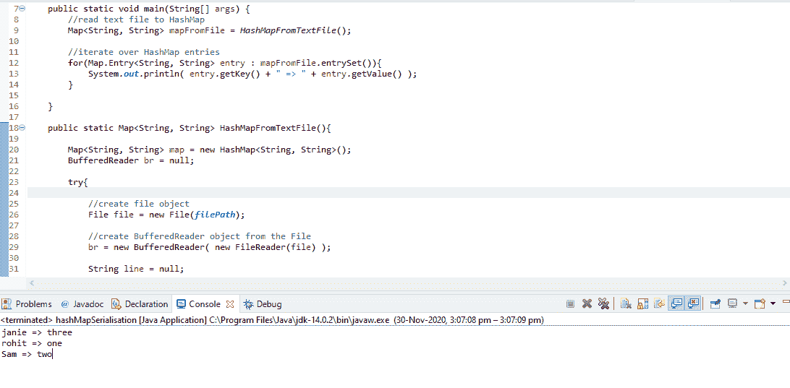

# 将文本文件读入 Java HashMap

> 原文:[https://www . geesforgeks . org/reading-text-file-to-Java-hashmap/](https://www.geeksforgeeks.org/reading-text-file-into-java-hashmap/)

我们将研究允许我们从文件中读取哈希映射文本的方法，或者我们如何对文件进行反序列化

[**【反序列化】**](https://www.geeksforgeeks.org/serialization-in-java/) :这里我们从一个序列化的文件中复制了 HashMap 对象及其内容。

**进场:**

首先方法/函数 **HashMapFromTextFile** 会有方法**[**buffere reader**](https://www.geeksforgeeks.org/java-io-bufferedreader-class-java/)读取文本文件的行并插入到地图中，然后返回地图**

```
bf = new BufferedWriter( new FileWriter(file_name) );
```

*   **首先我们调用**缓存器**读取每一行。**
*   **在每一行，我们都有键值对。所以，现在把它拆分为“:”，同时把键和值放到地图上**
*   **并归还地图**

## **Java 语言(一种计算机语言，尤用于创建网站)**

```
// Java program to reading
// text file to HashMap

import java.io.*;
import java.util.*;

class GFG {
    final static String filePath
        = "F:/Serialisation/write.txt";
    public static void main(String[] args)
    {

        // read text file to HashMap
        Map<String, String> mapFromFile
            = HashMapFromTextFile();

        // iterate over HashMap entries
        for (Map.Entry<String, String> entry :
             mapFromFile.entrySet()) {
            System.out.println(entry.getKey() + " : "
                               + entry.getValue());
        }
    }

    public static Map<String, String> HashMapFromTextFile()
    {

        Map<String, String> map
            = new HashMap<String, String>();
        BufferedReader br = null;

        try {

            // create file object
            File file = new File(filePath);

            // create BufferedReader object from the File
            br = new BufferedReader(new FileReader(file));

            String line = null;

            // read file line by line
            while ((line = br.readLine()) != null) {

                // split the line by :
                String[] parts = line.split(":");

                // first part is name, second is number
                String name = parts[0].trim();
                String number = parts[1].trim();

                // put name, number in HashMap if they are
                // not empty
                if (!name.equals("") && !number.equals(""))
                    map.put(name, number);
            }
        }
        catch (Exception e) {
            e.printStackTrace();
        }
        finally {

            // Always close the BufferedReader
            if (br != null) {
                try {
                    br.close();
                }
                catch (Exception e) {
                };
            }
        }

        return map;
    }
}
```

****