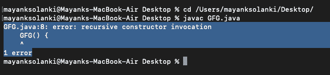
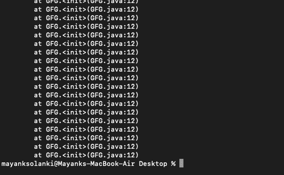

# Java 中的递归构造函数调用

> 原文:[https://www . geesforgeks . org/recursive-constructor-invoke-in-Java/](https://www.geeksforgeeks.org/recursive-constructor-invocation-in-java/)

函数直接或间接调用自身的过程称为递归，相应的函数称为递归函数。在递归程序中，给出了基本情况的解，大问题的解用小问题表示。这里递归构造函数调用和堆栈溢出错误。如下例所示:

**例**

## Java 语言(一种计算机语言，尤用于创建网站)

```java
// Java Program to Illustrate Recursion

// Main class
public class GFG {

    static int count = 0;

    // Method 1
    // Recursive method
    static void function()
    {
        count = count + 1;
        if (count <= 5) {

            System.out.println("Call " + count);
            function();
        }
    }

    // Method 2
    // Main driver method
    public static void main(String[] args) { function(); }
}
```

**Output**

```java
Call 1
Call 2
Call 3
Call 4
Call 5
```

**递归构造函数调用**

如果构造函数调用自己，那么就会出现错误消息“递归构造函数调用”。编译器不允许下面的程序，因为在构造函数内部，我们试图调用同一个构造函数。编译器会立即检测到它并抛出一个错误。

**示例:**

## Java 语言(一种计算机语言，尤用于创建网站)

```java
// Java program to Illustrate How Recursive
// Constructor Invocation Error is Occurred

// Main class
class GFG {

    // Constructor of this class
    // Inside we are trying to call the same constructor
    GFG()
    {
        // This keyword refers to same instance itself
        this();
    }

    // Main driver method
    public static void main(String[] args)
    {

        // Creating an object of class inside main()
        GFG obj = new GFG();
    }
}
```

**输出:**



现在让我们讨论一下堆栈溢出错误具体指的是什么，以及它为什么会出现**。**如果我们没有为递归函数或模板提供适当的终止条件，就会发生堆栈溢出错误，这意味着它将变成一个无限循环。

**实施:**

这里，我们在构造函数中创建了一个 GFG 对象，通过调用构造函数进行初始化，然后创建另一个 GFG 对象，通过调用构造函数再次进行初始化，直到堆栈溢出。这可以从如下图示中证明:

**示例:**

## Java 语言(一种计算机语言，尤用于创建网站)

```java
// Java program to Illustrate Stack Overflow Error

// Main class
public class GFG {

    // Constructor of this class
    GFG()
    {

        // Creating an object of GFG class inside the
        // constructor which is initialized by calling the
        // constructor, which is initialized by
        // calling the constructor and it goes on
        GFG obj1 = new GFG();
    }

    // Main driver method
    public static void main(String[] args)
    {

        // Creating an object of this class
        GFG obj = new GFG();
    }
}
```

**输出:**

