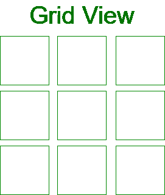
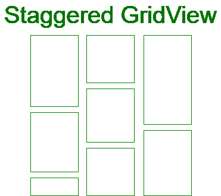
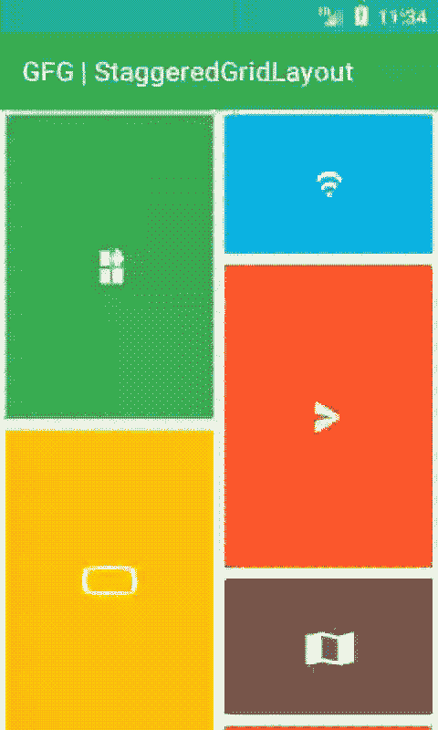

# 在安卓中作为交错网格回收视图，示例

> 原文:[https://www . geeksforgeeks . org/recycle view-as-staggered-grid-in-Android-with-example/](https://www.geeksforgeeks.org/recyclerview-as-staggered-grid-in-android-with-example/)

**网格视图:**一个[视图组](https://www.geeksforgeeks.org/android-ui-layouts/)，显示二维滚动网格中的项目。在[网格视图](https://www.geeksforgeeks.org/gridview-using-baseadapter-in-android-with-example/)中，每个网格大小相同，即每个网格的高度和宽度相等。它在视图中显示对称项目。



**交错网格视图:**该视图组是网格视图的扩展。在这个视图中，网格的大小不同，即它们的高度和宽度可能不同。它在视图中显示不对称的项目。它会根据项目的高度和宽度自动设置项目视图。



为了使用[回收视图](https://www.geeksforgeeks.org/android-recyclerview/)创建交错网格视图，我们需要使用交错网格布局管理器。布局管理器负责在回收视图中测量和定位项目视图，并在用户不再看到项目视图时回收它们。内置布局管理器有三种类型。

1.  **linelayout manager:**用于在垂直和水平列表中显示项目视图。
2.  **GridLayoutManager:** 用于显示项目视图网格视图。
3.  **交错显示管理器:**用于交错显示项目视图。

我们还可以通过 RecyclerView 创建自定义布局管理器。LayoutManager 类。

**StaggeredGridLayoutManager(int spanCount，int orientation)**

*   使用给定参数创建交错网格布局
*   第一个参数“跨度计数”用于设置垂直方向的列数或水平方向的行数
*   第二个参数“方向”用于设置垂直或水平方向

**垂直方向交错网格**

> RecyclerView recyclerView = （RecyclerView）findViewById（R.id.recyclerView）;
> 
> // staggeredGridLayoutManager，带 3 列和垂直方向
> 
> staggeredgridlayout manager staggeredgridlayout manager =新的 StaggeredGridLayoutManager(3，LinearLayoutManager。垂直)；
> 
> //将回收器视图布局设置为交错网格
> 
> recycle service . set layout manager(staggerdgridlayout manager)；

**水平方向交错网格**

> RecyclerView recyclerView = （RecyclerView）findViewById（R.id.recyclerView）;
> 
> // staggeredGridLayoutManager，具有 3 行和水平方向
> 
> staggeredgridlayout manager staggeredgridlayout manager =新的 StaggeredGridLayoutManager(3，LinearLayoutManager。水平)；
> 
> //将回收器视图布局设置为交错网格
> 
> recycle service . set layout manager(staggerdgridlayout manager)；

### **例**

在本例中，我们将数据存储到[数组列表](https://www.geeksforgeeks.org/arraylist-in-java/)中，该列表用于填充[回收视图](https://www.geeksforgeeks.org/android-recyclerview/)。之后，我们将回收视图的布局管理器设置为交错网格视图，然后，我们将回收视图的适配器设置为显示项目视图。下面给出了一个示例 GIF，以了解我们将在本文中做什么。请注意，我们将使用 **Java** 语言来实现这个项目。



### **分步实施**

**第一步:** **新建项目**

要在安卓工作室创建新项目，请参考[如何在安卓工作室创建/启动新项目](https://www.geeksforgeeks.org/android-how-to-create-start-a-new-project-in-android-studio/)。注意选择 **Java** 作为编程语言。

**第二步:添加依赖关系**

我们将使用回收视图。所以，我们需要增加它的依赖性。要添加依赖项，请转到**渐变脚本>** [**build.gradle(模块:app)**](https://www.geeksforgeeks.org/android-build-gradle/) 并添加以下依赖项。添加这些依赖项后，您需要点击**立即同步**。

> 依赖项{
> 
> 实现“androidx . recycle view:recycle view:1 . 1 . 0”
> 
> }

在进一步移动之前，让我们添加一些颜色属性，以增强应用程序栏。**转到 app>RES>values>colors . XML**并添加以下颜色属性。

## 可扩展标记语言

```
<resources>  
    <color name="colorPrimary">#0F9D58</color>  
    <color name="colorPrimaryDark">#16E37F</color>  
    <color name="colorAccent">#03DAC5</color>  
</resources>
```

**步骤 3:使用 activity_main.xml 文件**

在这一步中，我们将在 **activity_main.xml** 文件中创建一个 RecyclerView 布局。转到**应用程序> res >布局> activity_main.xml** 并添加以下代码片段。

## 可扩展标记语言

```
<?xml version="1.0" encoding="utf-8"?>
<RelativeLayout 
    xmlns:android="http://schemas.android.com/apk/res/android"
    xmlns:tools="http://schemas.android.com/tools"
    android:layout_width="match_parent"
    android:layout_height="match_parent"
    tools:context=".MainActivity">

    <androidx.recyclerview.widget.RecyclerView
        android:id="@+id/recyclerView"
        android:layout_width="match_parent"
        android:layout_height="match_parent" />
</RelativeLayout>
```