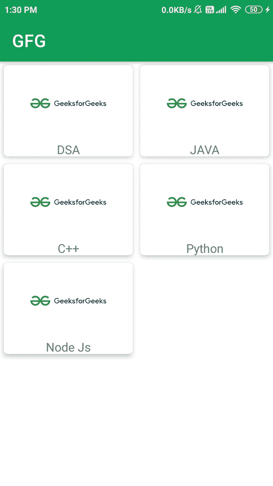

# 在安卓系统中使用 GridLayoutManager 回收视图，示例

> 原文:[https://www . geeksforgeeks . org/recycle view-using-gridlayout manager-in-Android-with-example/](https://www.geeksforgeeks.org/recyclerview-using-gridlayoutmanager-in-android-with-example/)

[recycle view](https://www.geeksforgeeks.org/android-recyclerview/)是安卓系统中[列表视图](https://www.geeksforgeeks.org/android-listview-in-java-with-example/)的临时版本。它最早是在[棉花糖](https://www.geeksforgeeks.org/difference-between-android-1-0-and-android-6-0-1/)中推出的。安卓中的回收器视图是扩展**视图组**并实现滚动界面的类。它可以以列表视图或网格视图的形式使用。

### 如何使用 RecyclerView 作为 GridView？

在安卓中实现回收视图时，我们通常必须设置布局管理器来显示我们的回收视图。有两种类型的布局管理器可供 Recycler View 实现。

1.  **线性布局管理器:**在线性布局管理器中，我们可以通过将回收器视图的方向指定为垂直或水平，以水平或垂直滚动的方式对齐回收器视图。
2.  **网格布局管理器:**在网格布局管理器中，我们可以以网格的形式对齐回收器。这里我们必须提到要在回收视图的网格中显示的列数。

### 回收视图和网格视图的区别

**1。视图支架实施**

在[网格视图](https://www.geeksforgeeks.org/gridview-using-baseadapter-in-android-with-example/)中，不强制使用视图固定器实现，但是在回收视图中，强制对回收视图使用视图固定器实现。它使代码变得复杂，但是 GridView 中面临的许多困难在 RecyclerView 中得到了解决。

**2。回收商视图**的性能

RecyclerView 是 ListView 的临时版本。《回收者视角》的表演是即兴创作的。在回收视图中，项目位于可见条目的前面和后面。

### 回收视图中的网格布局管理器示例

下面给出了一个示例图像，以了解本文中要做什么。请注意，我们将使用 **Java** 语言来实现这个项目。



### 逐步实施

**第一步:在安卓工作室新建项目**

要在安卓项目中创建新项目，只需参考本文[如何在安卓工作室](https://www.geeksforgeeks.org/android-how-to-create-start-a-new-project-in-android-studio/)中创建新项目，并确保语言为 **Java** 。要实现回收视图，需要三个子部分，这有助于控制回收视图。这三个部分包括:

*   **卡片布局:**卡片布局是一个 XML 文件，它将代表回收器视图中的每个单独的网格项目。
*   **View Holder:** View Holder 类是 java 类，存储了对 Card Layout 中 UI 元素的引用，在程序执行过程中可以通过数据列表动态修改这些元素。
*   **数据类:**数据类是一个对象类，保存要在回收器视图中显示的每个回收器视图项目中显示的信息。

**第二步:在应用项目的 build.gradle 文件中添加 google repository。**

> buildscript {
> 
> 存储库{
> 
> 谷歌()
> 
> mavenuentral _)
> 
> }

所有的 Jetpack 组件都可以在 Google Maven 存储库中找到，包括在 build.gradle 文件中

> 所有项目{
> 
> 存储库{
> 
> 谷歌()
> 
> mavenuentral _)
> 
> }
> 
> }

**第 3 步:为回收商视图卡项目创建卡布局**

转到**应用程序> res >布局>右键单击>新建>布局资源文件**，并将文件命名为**卡片 _ 布局**。在这个文件中，所有与回收视图中的卡项目相关的 XML 代码都被写入。下面是 **card_layout.xml** 文件的代码。

## 可扩展标记语言

```
<?xml version="1.0" encoding="utf-8"?>
<androidx.cardview.widget.CardView
    xmlns:android="http://schemas.android.com/apk/res/android"
    xmlns:app="http://schemas.android.com/apk/res-auto"
    android:layout_width="match_parent"
    android:layout_height="120dp"
    android:layout_gravity="center"
    android:layout_margin="5dp"
    app:cardCornerRadius="5dp"
    app:cardElevation="5dp">

    <LinearLayout
        android:layout_width="match_parent"
        android:layout_height="wrap_content"
        android:orientation="vertical">

        <ImageView
            android:id="@+id/idIVcourseIV"
            android:layout_width="100dp"
            android:layout_height="100dp"
            android:layout_gravity="center"
            android:contentDescription="@string/image"
            android:src="@mipmap/ic_launcher" />

        <TextView
            android:id="@+id/idTVCourse"
            android:layout_width="match_parent"
            android:layout_height="wrap_content"
            android:text="@string/app_name"
            android:textAlignment="center" />

    </LinearLayout>

</androidx.cardview.widget.CardView>
```

**第 4 步:为模态数据创建一个 Java 类**

转到**应用程序> java >右键单击应用程序的包名>新建> Java 类**并将文件命名为 **RecyclerData** 。此类将处理要显示的每个回收器项目的数据。以下是**RecyclerData.java**文件的代码。

## Java 语言(一种计算机语言，尤用于创建网站)

```
public class RecyclerData {

    private String title;
    private int imgid;

    public String getTitle() {
        return title;
    }

    public void setTitle(String title) {
        this.title = title;
    }

    public int getImgid() {
        return imgid;
    }

    public void setImgid(int imgid) {
        this.imgid = imgid;
    }

    public RecyclerData(String title, int imgid) {
        this.title = title;
        this.imgid = imgid;
    }
}
```

**步骤 5:为适配器**创建一个新的 java 类

同样，创建一个新的 Java 类，并将该文件命名为**recyclerviewaadapter**。适配器是负责回收视图的主要类。它包含所有在回收视图中有用的方法。

> **注意:**视图持有者类也是在适配器类本身实现的。

这些处理回收视图的方法包括:

*   **oncreateviewpholder:**此方法为回收器视图放大卡片布局项目。
*   **onBindViewHolder:** 此方法将数据设置为卡片项目的特定视图。它还处理与点击 Recycler 视图的项目相关的方法。
*   **getItemCount:** 此方法返回 RecyclerView 的长度。

以下是**RecyclerViewAdapter.java**文件的代码。代码中添加了注释，以更详细地理解代码。

## Java 语言(一种计算机语言，尤用于创建网站)

```
import android.content.Context;
import android.view.LayoutInflater;
import android.view.View;
import android.view.ViewGroup;
import android.widget.ImageView;
import android.widget.TextView;
import androidx.annotation.NonNull;
import androidx.recyclerview.widget.RecyclerView;
import java.util.ArrayList;

public class RecyclerViewAdapter extends RecyclerView.Adapter<RecyclerViewAdapter.RecyclerViewHolder> {

    private ArrayList<RecyclerData> courseDataArrayList;
    private Context mcontext;

    public RecyclerViewAdapter(ArrayList<RecyclerData> recyclerDataArrayList, Context mcontext) {
        this.courseDataArrayList = recyclerDataArrayList;
        this.mcontext = mcontext;
    }

    @NonNull
    @Override
    public RecyclerViewHolder onCreateViewHolder(@NonNull ViewGroup parent, int viewType) {
        // Inflate Layout
        View view = LayoutInflater.from(parent.getContext()).inflate(R.layout.card_layout, parent, false);
        return new RecyclerViewHolder(view);
    }

    @Override
    public void onBindViewHolder(@NonNull RecyclerViewHolder holder, int position) {
        // Set the data to textview and imageview.
        RecyclerData recyclerData = courseDataArrayList.get(position);
        holder.courseTV.setText(recyclerData.getTitle());
        holder.courseIV.setImageResource(recyclerData.getImgid());
    }

    @Override
    public int getItemCount() {
        // this method returns the size of recyclerview
        return courseDataArrayList.size();
    }

    // View Holder Class to handle Recycler View.
    public class RecyclerViewHolder extends RecyclerView.ViewHolder {

        private TextView courseTV;
        private ImageView courseIV;

        public RecyclerViewHolder(@NonNull View itemView) {
            super(itemView);
            courseTV = itemView.findViewById(R.id.idTVCourse);
            courseIV = itemView.findViewById(R.id.idIVcourseIV);
        }
    }
}
```

**第 6 步:使用 activity_main.xml 文件**

这是以网格形式显示所有数据的主屏幕。这里我们必须实现回收视图。下面是 **activity_main.xml** 文件中的 XML 布局的代码片段。

## 可扩展标记语言

```
<?xml version="1.0" encoding="utf-8"?>
<!--XMl Layout for RecyclerView-->
<androidx.constraintlayout.widget.ConstraintLayout
    xmlns:android="http://schemas.android.com/apk/res/android"
    xmlns:tools="http://schemas.android.com/tools"
    android:layout_width="match_parent"
    android:layout_height="match_parent"
    tools:context=".MainActivity">

    <androidx.recyclerview.widget.RecyclerView
        android:id="@+id/idCourseRV"
        android:layout_width="match_parent"
        android:layout_height="match_parent" />

</androidx.constraintlayout.widget.ConstraintLayout>
```

**步骤 7:使用 MainActivity.java 文件**

这是主 java 文件，我们将在其中设置 LayoutManager、适配器，并将数据设置为 recycle view，该视图将在 recycle view 中显示。以下是**MainActivity.java**文件的代码。代码中添加了注释，以更详细地理解代码。

## Java 语言(一种计算机语言，尤用于创建网站)

```
import android.os.Bundle;
import androidx.appcompat.app.AppCompatActivity;
import androidx.recyclerview.widget.GridLayoutManager;
import androidx.recyclerview.widget.RecyclerView;
import java.util.ArrayList;

public class MainActivity extends AppCompatActivity {

    private RecyclerView recyclerView;
    private ArrayList<RecyclerData> recyclerDataArrayList;

    @Override
    protected void onCreate(Bundle savedInstanceState) {
        super.onCreate(savedInstanceState);
        setContentView(R.layout.activity_main);
        recyclerView=findViewById(R.id.idCourseRV);

        // created new array list..
        recyclerDataArrayList=new ArrayList<>();

        // added data to array list
        recyclerDataArrayList.add(new RecyclerData("DSA",R.drawable.ic_gfglogo));
        recyclerDataArrayList.add(new RecyclerData("JAVA",R.drawable.ic_gfglogo));
        recyclerDataArrayList.add(new RecyclerData("C++",R.drawable.ic_gfglogo));
        recyclerDataArrayList.add(new RecyclerData("Python",R.drawable.ic_gfglogo));
        recyclerDataArrayList.add(new RecyclerData("Node Js",R.drawable.ic_gfglogo));

        // added data from arraylist to adapter class.
        RecyclerViewAdapter adapter=new RecyclerViewAdapter(recyclerDataArrayList,this);

        // setting grid layout manager to implement grid view.
        // in this method '2' represents number of columns to be displayed in grid view.
        GridLayoutManager layoutManager=new GridLayoutManager(this,2);

        // at last set adapter to recycler view.
        recyclerView.setLayoutManager(layoutManager);
        recyclerView.setAdapter(adapter);
    }
}
```

**输出:**


您可以查看下面提到的项目链接，在这里您可以获得所有代码来使用网格布局管理器实现 RecyclerView。如果您想在网格布局中实现回收器项目的点击监听器，请查看此帖子以实现[回收器视图](https://www.geeksforgeeks.org/android-recyclerview/)。

**项目链接:** [点击此处](https://media.geeksforgeeks.org/wp-content/cdn-uploads/20210906003643/GFG-GridLayout-Manager-master.zip)