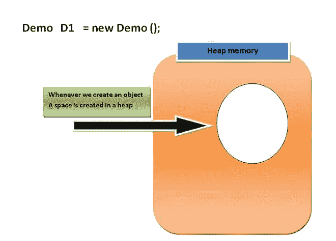
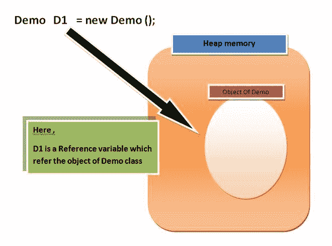
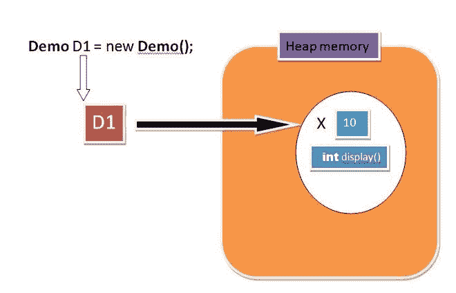
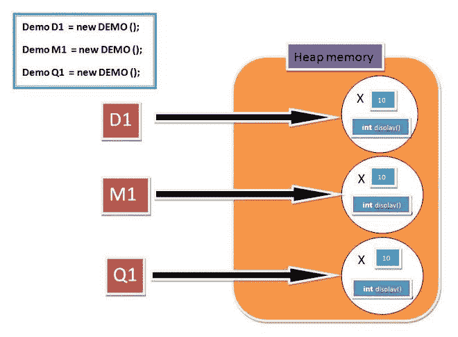
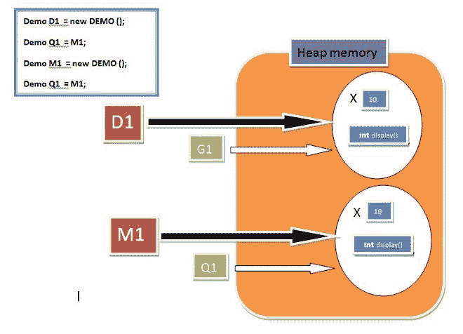
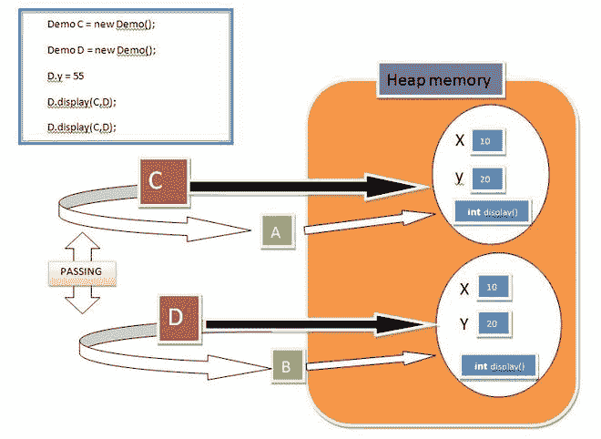
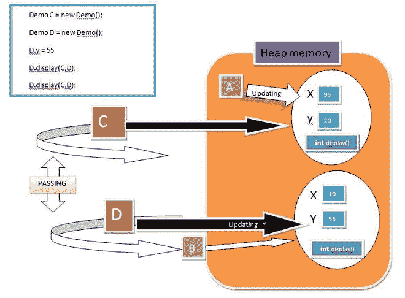
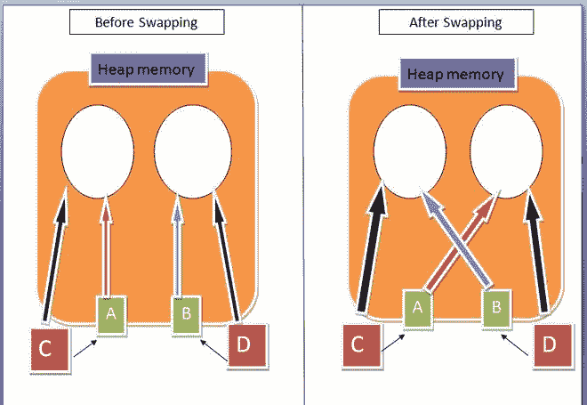
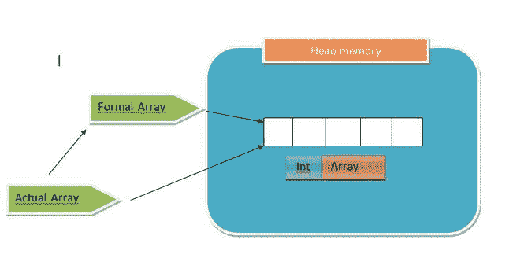
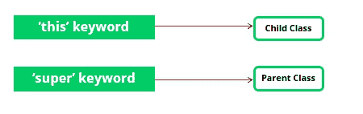

# Java 中的引用变量

> 原文:[https://www.geeksforgeeks.org/reference-variable-in-java/](https://www.geeksforgeeks.org/reference-variable-in-java/)

在我们开始使用**参考变量**之前，我们应该了解以下事实。

**1。**当我们创建类的对象(实例)时，空间被保留在堆内存中。让我们借助一个例子来理解。

> Demo D1 =新 Demo()；



现在，堆内存中的空间被创建，但问题是**如何访问该空间？**。

然后，我们创建一个指向元素或简单地称为**引用变量**，它简单地指出对象(堆内存中创建的空间)。



**理解参考变量**

**1。**参考变量用于指向对象/值。

**2。**类、接口、数组、枚举和注释是 Java 中的引用类型。引用变量保存 Java 中引用类型的对象/值。

**3。**参考变量也可以存储**空值**值。默认情况下，如果没有对象被传递给引用变量，那么它将存储一个空值。

**4。**您可以使用**点**语法使用引用变量来访问对象成员。

> <reference variable="" name="">。<instance method_name=""></instance></reference>

**示例:**

## Java 语言(一种计算机语言，尤用于创建网站)

```
// Java program to demonstrate reference
// variable in java

import java.io.*;

class Demo {
    int x = 10;
    int display()
    {
        System.out.println("x = " + x);
        return 0;
    }
}

class Main {
    public static void main(String[] args)
    {
        Demo D1 = new Demo(); // point 1

        System.out.println(D1); // point 2

        System.out.println(D1.display()); // point 3
    }
}
```

**Output**

```
Demo@214c265e
x = 10
0
```

**让我们一步一步看看实际发生了什么。**

**1。**当我们创建一个 demo 类的对象时**新建 DEMO()；**，调用默认的构造函数，返回对象的一个引用，简单来说这个引用会存储到引用变量 **D1** (我们知道关联性是右手边到左手边)。

**2。**引用变量的值就是引用。当我们试图打印引用变量的值时，输出包含变量的类型和 Java 为其创建的哈希代码:字符串 **Demo@214c265e** 告诉我们，给定变量的类型是 Name，其哈希代码的十六进制格式是 214c265e。

**3。**此时，我们将使用我们创建的自定义引用变量来访问类演示的方法 **display()** 。

> **绑定 UP** :构造函数调用返回一个引用新创建对象的值。等号告诉程序，右侧表达式的值将被复制为左侧变量的值。构造函数调用返回的对新创建的对象的引用被复制为变量值。

## Java 语言(一种计算机语言，尤用于创建网站)

```
import java.io.*;
class Demo {
    int x = 10;

    int display()
    {
        System.out.println("x = " + x);
        return 0;
    }
}

class Main {
    public static void main(String[] args)
    {
          // create instance
        Demo D1 = new Demo();

        // accessing instance(object) variable
        System.out.println(D1.x);

        // point 3
        // accessing instance(object) method
        D1.display();
    }
}
```

**Output**

```
10
x = 10
```



## Java 语言(一种计算机语言，尤用于创建网站)

```
// Accessing instance methods

import java.io.*;
class Demo {

    int x = 10;
    int display()
    {
        System.out.println("x = " + x);
        return 0;
    }
}
class Main {
    public static void main(String[] args)
    {
          // create instances
        Demo D1 = new Demo();

        Demo M1 = new Demo();

        Demo Q1 = new Demo();
    }
}
```



## Java 语言(一种计算机语言，尤用于创建网站)

```
// Pointing to same instance memory

import java.io.*;
class Demo {
    int x = 10;
    int display()
    {
        System.out.println("x = " + x);
        return 0;
    }
}
class Main {
    public static void main(String[] args)
    {
        // create instance
        Demo D1 = new Demo();

        // point to same reference
        Demo G1 = D1;

        Demo M1 = new Demo();

        Demo Q1 = M1;

        // updating the value of x using G!
        // reference variable
        G1.x = 25;

        System.out.println(G1.x); // Point 1

        System.out.println(D1.x); // Point 2
    }
}
```

**Output**

```
25
25
```



> **注:**
> 
> 这里我们通过 G1 和 Q1 的参考变量分别指出同一个对象。其次**在第 1 点**我们尝试用 G1 参考变量获取对象的值，它显示为 **25** 和**在第 2 点**我们尝试用 D1 参考变量获取对象的值，它也显示为 **25** 。这将证明对象中的修改可以通过使用任何引用变量来完成，但条件是它应该保持相同的引用。

### 关于参考变量的更多信息

**1。作为方法参数的参考变量:**

因为原始变量的值直接存储在变量中，而引用变量的值保存对对象的引用。我们还提到，用等号赋值会复制右侧的值(可能是某个变量的值)，并将其存储为左侧变量的值。类似的复制发生在方法调用期间。无论变量是基元类型还是引用类型，都会将值的副本传递给方法的参数并复制到该参数。

> **注意:** Java 只支持按值传递。

但是我们知道引用变量保存实例(对象)的引用，所以引用的副本被传递给方法的参数。

**示例:**

## Java 语言(一种计算机语言，尤用于创建网站)

```
// Pass by reference and value

import java.io.*;
class Demo {
    int x = 10;
    int y = 20;

    int display(Demo A, Demo B)
    {
        //  Updating value using argument
        A.x = 95;

        System.out.println("x = " + x);

        System.out.println("y = " + y);

        return 0;
    }
}
class Main {
    public static void main(String[] args)
    {
        Demo C = new Demo();

        Demo D = new Demo();

        // updating value using primary reference
        // variable
        D.y = 55;

        C.display(C, D); // POINT 1

        D.display(C, D); // POINT 2
    }
}
```

**Output**

```
x = 95
y = 20
x = 10
y = 55
```

**场景 1 :**



**场景二:**



现在，这里发生了什么，当我们传递对方法的引用时，它将复制到方法签名中定义的引用变量，之后，它们也可以访问对象成员。这里，我们定义了两个名为 **C 和 D** 的实例。之后我们通过 C 和 D 进一步给出参考 **A 和 B** 的方法

**在点 1:** A 将 x 的值从 10 更新为 95，因此 C.display()将显示 95 ^ 20，但是在另一个对象 D 中，我们仅将 x 到 D 的值从 y =20 更新为 55，因此 D . display()将显示 10 和 55。

> **注意:**任何物体的上升都不会影响到其他物体的成员。

**2。如果我们在交换方法的帮助下交换参考变量呢？**

事实是，如果我们试图交换引用变量，那么它们只是交换它们的指向元素，对引用变量和对象(实例)空间的地址没有影响。让我们借助一个例子来理解它:

## Java 语言(一种计算机语言，尤用于创建网站)

```
// Swapping object references

import java.io.*;
class Demo {

    // Swapping Method
    int Swap(Demo A, Demo B)
    {
        Demo temp = A;
        A = B;
        B = temp;
        return 0;
    }
}
class Main {
    public static void main(String[] args)
    {
        Demo C = new Demo();

        Demo D = new Demo();

        // Passing C and reference variables
        // to Swap method
        C.Swap(C, D);
    }
}
```

> 在这里，我们创建了演示类的两个实例，并将其传递给交换方法，此外，C 和 D 将分别复制它们对 A 和 B 的引用。在交换 A 指向 C(对象)和 B 指向 D(对象)之前。在我们对 A 和 B 执行交换之后，A 现在将指向 D(对象)，B 将指向 C 的对象。如图所示。



> **注意:**变量之间没有交换，它们只改变它们的引用。

**3。如果我们将数组传递给方法，它能够更新实际数组的值吗，即使我们知道数组的副本是传递给正式数组的？**

答案是**是，**值将由形式参数更新，事实是，当我们创建一个数组时，内存被分配给所需大小的数组，它返回第一个数组元素的引用，该元素是将存储到形式数组的基地址(方法参数)。正如我们之前了解到的，每个指向引用变量都可以改变或更新对象。



**示例:**

## Java 语言(一种计算机语言，尤用于创建网站)

```
import java.io.*;
class Demo {
    int arrayUpdate(int[] formalArray)
    {
        formalArray[2] = 99;
        formalArray[4] = 77;
        return 0;
    }
}
class Main {
    public static void main(String[] args)
    {
        Demo d1 = new Demo();
        int[] actualArray = { 1, 2, 3, 4, 5 };

        for (int items : actualArray)
            System.out.print(items
                             + " , "); // printing array

        System.out.println();
        d1.arrayUpdate(actualArray);
        System.out.println();

        for (int items : actualArray)
            System.out.print(items
                             + " , "); // printing array
    }
}
```

**Output**

```
1 , 2 , 3 , 4 , 5 , 

1 , 2 , 99 , 4 , 77 , 
```

**4。** **这个和超级关键词也是指向元素。**

[这个](https://www.geeksforgeeks.org/this-reference-in-java/)关键词。在 java 中，**这个**是引用当前对象的引用变量。


[super](https://www.geeksforgeeks.org/super-keyword/) 用于引用直接父类实例变量。我们可以使用 super 关键字来访问父类的数据成员或字段。如果父类和子类具有相同的字段，则使用它。



**5。** [**为空**](https://www.google.com/url?client=internal-element-cse&cx=009682134359037907028:tj6eafkv_be&q=https://www.geeksforgeeks.org/interesting-facts-about-null-in-java/&sa=U&ved=2ahUKEwjmxOyn9-jsAhUhyjgGHbTdAo0QFjAAegQIBRAC&usg=AOvVaw28o5zUru7d2Ax5IBZ6WolM) **值的一个参考变量。**

> **演示 obj = 零 ; **

**a .****null**引用可以设置为任何引用类型变量的值。

名为**物体的物体没有人提及。换句话说，对象变成了**垃圾**。在 Java 编程语言中，程序员不必担心程序的内存使用。Java 语言的自动垃圾收集器会不时地清理已经变成垃圾的对象。如果垃圾收集没有发生，垃圾对象将保留一个内存位置，直到程序执行结束。**

## Java 语言(一种计算机语言，尤用于创建网站)

```
// null in java

import java.io.*;
class Demo {
    int x = 10;
    int display()
    {
        System.out.println("x = " + x);
        return 0;
    }
}
class Main {
    public static void main(String[] args)
    {
        Demo obj = null;

        // accessing instance(object) method
        Kuchbhi.display();
    }
}
```

**输出**

```
Exception in thread "main" java.lang.NullPointerException
at Main.main(File.java:17)
Java Result: 1
```

这里，我们试图通过一个不指向任何东西(空)的引用变量来访问对象的成员，因此它显示了**NullPointRexception。**现在，如果您得到错误，第一步是寻找其值可能为空的变量。幸运的是，错误消息是有用的:它告诉哪一行导致了错误。你自己试试吧！