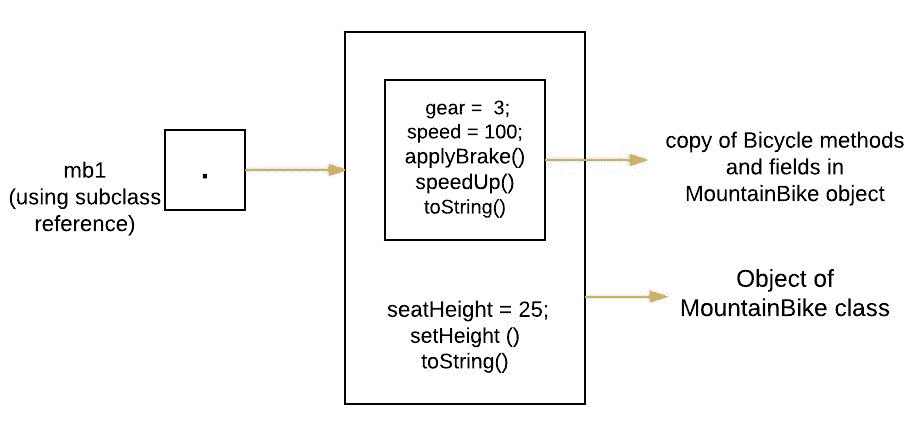
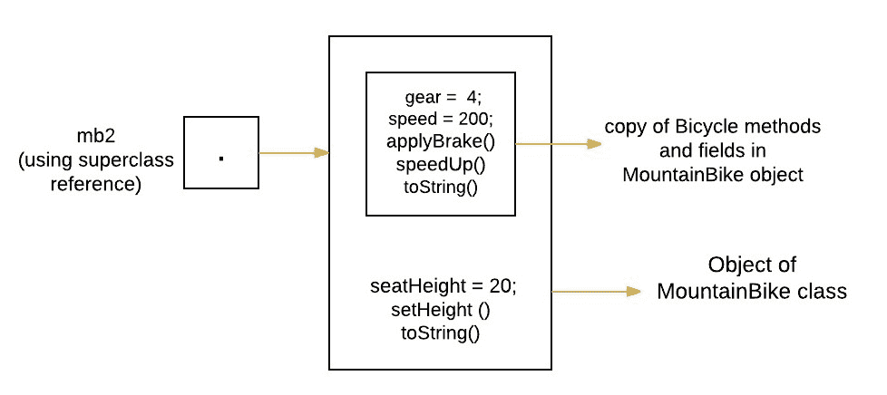

# 用子类对超类引用引用子类对象

> 原文:[https://www . geesforgeks . org/referencing-subclass-objects-subclass-vs-super class-reference/](https://www.geeksforgeeks.org/referencing-subclass-objects-subclass-vs-superclass-reference/)

**先决条件:** [继承](https://www.geeksforgeeks.org/inheritance-in-java/)
在 Java 中，所有非静态方法都基于底层对象的运行时类型，而不是指向该对象的引用类型。因此，无论在对象的声明中使用哪种类型，行为都是一样的。

**如何引用子类对象**

引用子类对象有两种方法。两者都有一些优点/缺点。声明影响在编译时可见的方法上可见。

1.  **第一种方法(使用超类引用进行引用):**超类的引用变量可以用来引用从该超类派生的任何子类对象。如果方法存在于超类中，但是被子类覆盖，那么被覆盖的方法将被执行。
2.  **第二种方法(使用子类引用进行引用):**子类引用可以用来引用其对象。

考虑一个解释这两种方法的例子。

```
// Java program to illustrate 
// referring to a subclass
// base class
class Bicycle 
{
    // the Bicycle class has two fields
    public int gear;
    public int speed;

    // the Bicycle class has one constructor
    public Bicycle(int gear, int speed)
    {
        this.gear = gear;
        this.speed = speed;
    }

    // the Bicycle class has three methods
    public void applyBrake(int decrement)
    {
        speed -= decrement;
    }

    public void speedUp(int increment)
    {
        speed += increment;
    }

    // toString() method to print info of Bicycle
    public String toString() 
    {
        return("No of gears are "+gear
                +"\n"
                + "speed of bicycle is "+speed);
    } 
}

// derived class
class MountainBike extends Bicycle 
{

    // the MountainBike subclass adds one more field
    public int seatHeight;

    // the MountainBike subclass has one constructor
    public MountainBike(int gear,int speed,
                        int startHeight)
    {
        // invoking base-class(Bicycle) constructor
        super(gear, speed);
        seatHeight = startHeight;
    } 

    // the MountainBike subclass adds one more method
    public void setHeight(int newValue)
    {
        seatHeight = newValue;
    } 

    // overriding toString() method
    // of Bicycle to print more info
    @Override
    public String toString() 
    {

        return (super.toString()+
                "\nseat height is "+seatHeight);
    }

}

// driver class
public class Test 
{
    public static void main(String args[]) 
    {
        // using superclass reference
        // first approach
        Bicycle mb2 = new MountainBike(4, 200, 20);

        // using subclass reference( )
        // second approach
        MountainBike mb1 = new MountainBike(3, 100, 25);

        System.out.println("seat height of first bicycle is " 
                                            + mb1.seatHeight);

        // In case of overridden methods
        // always subclass 
        // method will be executed
        System.out.println(mb1.toString());
        System.out.println(mb2.toString());

        /* The following statement is invalid because Bicycle
        does not define a seatHeight. 
        // System.out.println("seat height of second bicycle is " 
                                                + mb2.seatHeight); */

        /* The following statement is invalid because Bicycle
        does not define setHeight() method. 
        mb2.setHeight(21);*/

    }
}
```

输出:

```
seat height of first bicycle is 25
No of gears are 3
speed of bicycle is 100
seat height is 25
No of gears are 4
speed of bicycle is 200
seat height is 20

```

**以上程序说明:**

*   The object of MountainBike class is created which is referred by using subclass reference ‘mb1’. Using this reference we will have access both parts(methods and variables) of the object defined by the superclass or subclass. See below image for clear understanding.

    ```
    MountainBike mb1 = new MountainBike(3, 100, 25);

    ```

    [](https://media.geeksforgeeks.org/wp-content/uploads/z.jpeg)

*   Now we again create object of MountainBike class but this time it is referred by using superclass Bicycle reference ‘mb2’. Using this reference we will have access **only** to those parts(methods and variables) of the object defined by the superclass.

    ```
    Bicycle mb2 = new MountainBike(4, 200, 20);

    ```

    [](https://media.geeksforgeeks.org/wp-content/uploads/a.jpeg)

*   由于引用“mb1”可以访问字段“seatHeight”，因此我们在控制台上打印该字段。

    ```
    System.out.println("seat height of first bicycle  is " + mb1.seatHeight);

    ```

*   如果在超类中存在方法，但是[被子类](https://www.geeksforgeeks.org/overriding-in-java/)覆盖，并且如果创建了子类的对象，那么无论我们使用什么引用(子类或者超类)，它都将**总是**是将被执行的子类中被覆盖的方法。所以下面两个语句将调用 MountainBike 类的 toString()方法。

    ```
    System.out.println(mb1.toString());
    System.out.println(mb2.toString());

    ```

*   由于‘mb2’引用的类型是 Bicycle，所以我们会在下面的语句中得到编译时错误。

    ```
    System.out.println("seat height of second bicycle  is " + mb2.seatHeight);

    ```

*   Again the reference made by ‘mb2’ is of type Bicycle , so we will get compile time error in below statement.

    ```
    mb2.setHeight(21);

    ```

    **型铸造的使用**

    在上面的例子中，我们已经看到，通过使用自行车类型的引用“mb2”，我们无法调用子类特定的方法或访问子类字段。在 java 中使用类型转换可以解决这个问题。例如，我们可以声明另一个引用，比如山地车类型的“mb3”，并使用类型转换将其分配给“mb2”。

    ```
    // declaring MountainBike reference
    MountainBike mb3;

    // assigning mb3 to mb2 using typecasting.
     mb3 = (MountainBike)mb2;

    ```

    所以，下面的陈述是有效的。

    ```
    System.out.println("seat height of second bicycle  is " + mb3.seatHeight);
    mb3.setHeight(21);

    ```

**何时进行第一次进场(使用超类引用进行引用)**

如果我们不知道对象的确切运行时类型，那么我们应该使用这种方法。例如，考虑一个包含不同索引的不同对象的[数组列表](https://www.geeksforgeeks.org/arraylist-in-java/)。现在，当我们试图使用 *arraylist.get(int index)* 方法获取 ArrayList 的元素时，我们必须使用 [Object](https://www.geeksforgeeks.org/object-class-in-java/) 引用，因为在这种情况下，我们不知道对象的确切运行时类型。例如:

```
/* Java program to illustrate referring to a subclass
using superclass reference variable */
import java.util.ArrayList;

public class Test 
{
       public static void main(String args[]) 
       {
           ArrayList al = new ArrayList(2);

           // adding String object to al
           al.add(new String("GeeksForGeeks"));

           // adding Integer object to al
           al.add(new Integer(5));

           // getting all elements using Object reference
           for (Object object : al)
           {
               System.out.println(object);
           }    
       }
}
```

输出:

```
GeeksForGeeks
5

```

**优势:**我们可以使用超类引用来保存从其派生的任何子类对象。

**缺点:**通过使用超类引用，我们将只能访问**超类定义的对象的那些部分(方法和变量)。例如，我们不能访问*座位高度*变量或调用*设置高度(int newValue)* 方法使用上面第一个例子中的自行车引用。这是因为它们是在子类而不是超类中定义的。**

****何时进行第二次进场(使用子类引用进行引用)****

**如果我们知道对象的确切运行时类型，那么这种方法更好。使用这种方法，我们还可以调用特定对象的特定方法。例如:**

```
/* Java program to illustrate referring to a subclass
using subclass reference variable */
import java.util.ArrayList;

public class Test 
{
       public static void main(String args[]) 
       {
           ArrayList al = new ArrayList(2);

           // adding String objects to al
           al.add(new String("GeeksForGeeks"));
           al.add(new String("for java archives"));

           // getting  elements using String reference
            String str1 = (String)al.get(0);
            String str2 = (String)al.get(1);

            System.out.println(str1);
            System.out.println(str2);

            // using String class specific method
            System.out.println(str1.length());
            System.out.println(str2.substring(4,8));
       }
}
```

**输出:**

```
GeeksForGeeks
for java archives
13
java 
```

****优势:**通过使用子类引用，我们将可以访问超类或子类定义的对象的两个部分(方法和变量)。例如，我们可以使用上面第一个例子中的登山自行车引用来调用*设置高度(int newValue)* 方法或*加速(int increment)* 方法。**

****缺点:**我们可以使用子类引用来仅保存那个特定的子类对象。**

**参考: [StackOverflow](http://stackoverflow.com/questions/24807029/superclass-reference-to-subclass-object-showing-same-behaviour-as-subclass-refer)**

**本文由**高拉夫·米格拉尼**供稿。如果你喜欢 GeeksforGeeks 并想投稿，你也可以使用[contribute.geeksforgeeks.org](http://contribute.geeksforgeeks.org)写一篇文章或者把你的文章邮寄到 contribute@geeksforgeeks.org。看到你的文章出现在极客博客主页上，帮助其他极客。**

**如果你发现任何不正确的地方，或者你想分享更多关于上面讨论的话题的信息，请写评论。**