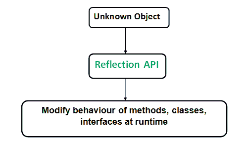

# Java 中的反射

> 原文:[https://www.geeksforgeeks.org/reflection-in-java/](https://www.geeksforgeeks.org/reflection-in-java/)

反射是一个应用编程接口，用于在运行时检查或修改方法、类和接口的行为。

*   反射所需的类在 java.lang.reflect 包中提供。
*   反射为我们提供了关于对象所属的类的信息，以及可以通过使用对象来执行的该类的方法。
*   通过反射，我们可以在运行时调用方法，而不考虑与它们一起使用的访问说明符。


反射可用于获取以下信息–

1.  **类**getClass()方法用于获取对象所属类的名称。
2.  **构造函数**getConstructors()方法用于获取对象所属类的公共构造函数。
3.  **方法**getMethods()方法用于获取一个对象所属类的公共方法。

```java
// A simple Java program to demonstrate the use of reflection
import java.lang.reflect.Method;
import java.lang.reflect.Field;
import java.lang.reflect.Constructor;

// class whose object is to be created
class Test
{
    // creating a private field
    private String s;

    // creating a public constructor
    public Test()  {  s = "GeeksforGeeks"; }

    // Creating a public method with no arguments
    public void method1()  {
        System.out.println("The string is " + s);
    }

    // Creating a public method with int as argument
    public void method2(int n)  {
        System.out.println("The number is " + n);
    }

    // creating a private method
    private void method3() {
        System.out.println("Private method invoked");
    }
}

class Demo
{
    public static void main(String args[]) throws Exception
    {
        // Creating object whose property is to be checked
        Test obj = new Test();

        // Creating class object from the object using
        // getclass method
        Class cls = obj.getClass();
        System.out.println("The name of class is " +
                            cls.getName());

        // Getting the constructor of the class through the
        // object of the class
        Constructor constructor = cls.getConstructor();
        System.out.println("The name of constructor is " +
                            constructor.getName());

        System.out.println("The public methods of class are : ");

        // Getting methods of the class through the object
        // of the class by using getMethods
        Method[] methods = cls.getMethods();

        // Printing method names
        for (Method method:methods)
            System.out.println(method.getName());

        // creates object of desired method by providing the
        // method name and parameter class as arguments to
        // the getDeclaredMethod
        Method methodcall1 = cls.getDeclaredMethod("method2",
                                                 int.class);

        // invokes the method at runtime
        methodcall1.invoke(obj, 19);

        // creates object of the desired field by providing
        // the name of field as argument to the 
        // getDeclaredField method
        Field field = cls.getDeclaredField("s");

        // allows the object to access the field irrespective
        // of the access specifier used with the field
        field.setAccessible(true);

        // takes object and the new value to be assigned
        // to the field as arguments
        field.set(obj, "JAVA");

        // Creates object of desired method by providing the
        // method name as argument to the getDeclaredMethod
        Method methodcall2 = cls.getDeclaredMethod("method1");

        // invokes the method at runtime
        methodcall2.invoke(obj);

        // Creates object of the desired method by providing
        // the name of method as argument to the 
        // getDeclaredMethod method
        Method methodcall3 = cls.getDeclaredMethod("method3");

        // allows the object to access the method irrespective 
        // of the access specifier used with the method
        methodcall3.setAccessible(true);

        // invokes the method at runtime
        methodcall3.invoke(obj);
    }
}
```

输出:

```java
The name of class is Test
The name of constructor is Test
The public methods of class are : 
method2
method1
wait
wait
wait
equals
toString
hashCode
getClass
notify
notifyAll
The number is 19
The string is JAVA
Private method invoked
```

**重要观察值:**

1.  We can invoke an method through reflection if we know its name and parameter types. We use below two methods for this purpose
    **getDeclaredMethod() :** To create an object of method to be invoked. The syntax for this method is

    ```java
    Class.getDeclaredMethod(name, parametertype)
    name- the name of method whose object is to be created
    parametertype - parameter is an array of Class objects
    ```

    **invoke() :** 要在运行时调用类的方法，我们使用以下方法–

    ```java
    Method.invoke(Object, parameter)
    If the method of the class doesn’t accepts any 
    parameter then null is passed as argument.
    ```

2.  Through reflection we can **access the private variables and methods** of a class with the help of its class object and invoke the method by using the object as discussed above. We use below two methods for this purpose.

    **class . getdeclaredfield(field name):**用于获取私有字段。返回指定字段名的字段类型对象。
    **字段。设置可访问(真):**允许访问该字段，而不管该字段使用的访问修饰符。

    **使用反射的优势:**

    *   **扩展性特性:**应用程序可以通过使用完全限定的名称创建扩展性对象的实例来使用外部用户定义的类。
    *   **调试和测试工具**:调试器使用反射的属性来检查类上的私有成员。

    **缺点:**

    *   **性能开销:**反射操作的性能比非反射操作慢，在对性能敏感的应用程序中经常调用的代码段中应该避免使用。
    *   **内部构件的暴露:**反射代码打破了抽象，因此可能会随着平台的升级而改变行为。

     **参考:**
    [https://docs.oracle.com/javase/tutorial/reflect/index.html](https://docs.oracle.com/javase/tutorial/reflect/index.html)

    本文由**阿卡什·奥哈**供稿。如果你喜欢极客博客并想投稿，你也可以写一篇文章并把你的文章邮寄到 contribute@geeksforgeeks.org。看到你的文章出现在极客博客主页上，帮助其他极客。

    如果你发现任何不正确的地方，或者你想分享更多关于上面讨论的话题的信息，请写评论。