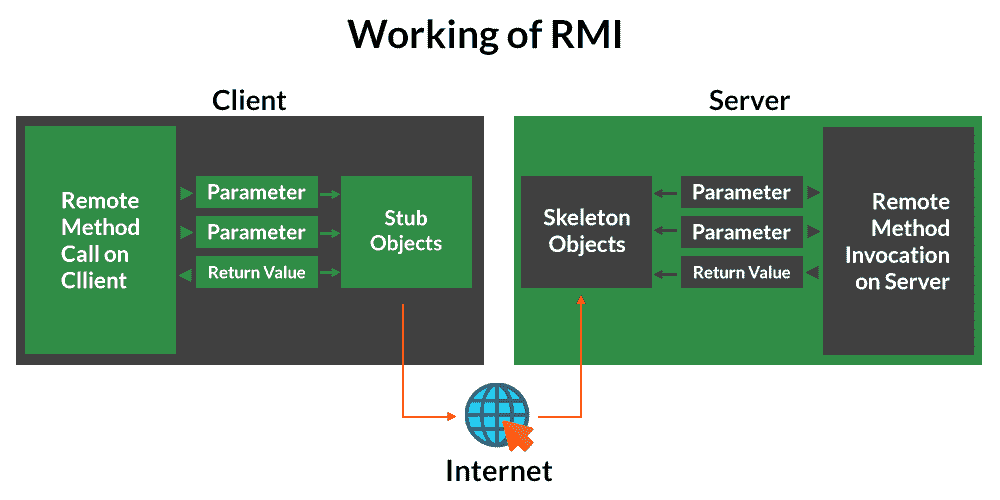

# Java 中的远程方法调用

> 原文:[https://www . geesforgeks . org/remote-method-invoke-in-Java/](https://www.geeksforgeeks.org/remote-method-invocation-in-java/)

远程方法调用(RMI)是一种 API，它允许对象调用存在于另一个地址空间中的对象上的方法，该地址空间可以在同一台机器上，也可以在远程机器上。通过 RMI，运行在计算机(客户端)上的 JVM 中的对象可以调用另一个 JVM(服务器端)中的对象上的方法。RMI 创建一个公共远程服务器对象，通过服务器对象上的简单方法调用来实现客户端和服务器端的通信。

**Stub 对象:**客户端机器上的 Stub 对象构建一个信息块，并将该信息发送给服务器。该区块包括

*   要使用的远程对象的标识符
*   要调用的方法名
*   远程 JVM 的参数

**骨架对象:**骨架对象将请求从存根对象传递到远程对象。它执行以下任务

*   它在服务器上的真实对象上调用所需的方法。
*   它将从存根对象接收的参数转发给方法。

## 马绍尔群岛的工作

客户机和服务器之间的通信是通过使用两个中间对象来处理的:Stub 对象(在客户机端)和 Skeleton 对象(在服务器端)，也可以从下面的媒体中描述如下:



**这些是按顺序执行如下定义的接口所需遵循的步骤:**

1.  定义远程接口
2.  实现远程接口
3.  使用 rmic (RMI 编译器)从实现类创建存根和框架对象
4.  启动 RMI 注册表
5.  创建并执行服务器应用程序
6.  创建并执行客户端应用程序。

**第一步:定义远程界面**

首先要做的是创建一个接口，提供远程客户端可以调用的方法的描述。这个接口应该扩展远程接口，接口中的方法原型应该抛出远程异常。

**示例:**

## Java 语言(一种计算机语言，尤用于创建网站)

```java
// Creating a Search interface
import java.rmi.*;
public interface Search extends Remote
{
    // Declaring the method prototype
    public String query(String search) throws RemoteException;
}
```

**第二步:实现远程界面**

下一步是实现远程接口。为了实现远程接口，该类应该扩展到 java.rmi 包的 UnicastRemoteObject 类。此外，需要创建一个默认构造函数，以便从类中的父构造函数抛出 java.rmi.RemoteException。

## Java 语言(一种计算机语言，尤用于创建网站)

```java
// Java program to implement the Search interface
import java.rmi.*;
import java.rmi.server.*;
public class SearchQuery extends UnicastRemoteObject
                         implements Search
{
    // Default constructor to throw RemoteException
    // from its parent constructor
    SearchQuery() throws RemoteException
    {
        super();
    }

    // Implementation of the query interface
    public String query(String search)
                       throws RemoteException
    {
        String result;
        if (search.equals("Reflection in Java"))
            result = "Found";
        else
            result = "Not Found";

        return result;
    }
}
```

**步骤 3:使用 rmic** 从实现类创建存根和框架对象

rmic 工具用于调用 rmi 编译器，该编译器创建 Stub 和 Skeleton 对象。它的原型是 rmic 类名。对于上述程序，需要在命令提示符
rmic SearchQuery 处执行以下命令。

**第四步:启动 rmiregistry**

通过在命令提示符下发出以下命令启动注册表服务

**第五步:创建并执行服务器应用程序**

下一步是创建服务器应用程序，并在单独的命令提示符下执行它。

*   服务器程序使用 LocateRegistry 类的 createRegistry 方法在服务器 JVM 中创建 rmiregistry，端口号作为参数传递。
*   命名类的重新绑定方法用于将远程对象绑定到新名称。

## Java 语言(一种计算机语言，尤用于创建网站)

```java
// Java program for server application
import java.rmi.*;
import java.rmi.registry.*;
public class SearchServer
{
    public static void main(String args[])
    {
        try
        {
            // Create an object of the interface
            // implementation class
            Search obj = new SearchQuery();

            // rmiregistry within the server JVM with
            // port number 1900
            LocateRegistry.createRegistry(1900);

            // Binds the remote object by the name
            // geeksforgeeks
            Naming.rebind("rmi://localhost:1900"+
                          "/geeksforgeeks",obj);
        }
        catch(Exception ae)
        {
            System.out.println(ae);
        }
    }
}
```

**第六步:创建并执行客户端应用程序**

最后一步是创建客户端应用程序，并在单独的命令提示符下执行它。命名类的查找方法用于获取存根对象的引用。

## Java 语言(一种计算机语言，尤用于创建网站)

```java
// Java program for client application
import java.rmi.*;
public class ClientRequest
{
    public static void main(String args[])
    {
        String answer,value="Reflection in Java";
        try
        {
            // lookup method to find reference of remote object
            Search access =
                (Search)Naming.lookup("rmi://localhost:1900"+
                                      "/geeksforgeeks");
            answer = access.query(value);
            System.out.println("Article on " + value +
                            " " + answer+" at GeeksforGeeks");
        }
        catch(Exception ae)
        {
            System.out.println(ae);
        }
    }
}
```

***注意:**上述客户端和服务器程序在同一台机器上执行，因此使用 localhost。为了从另一台机器访问远程对象，本地主机将被替换为远程对象所在的 IP 地址。*

**重要观察值:**

1.  RMI 是一个纯 java 的远程过程调用(RPC)解决方案，用于用 java 创建分布式应用程序。
2.  存根和框架对象用于客户端和服务器端之间的通信。

本文由**Aakash oja**供稿。如果你喜欢极客博客并想投稿，你也可以写一篇文章并把你的文章邮寄到 review-team@geeksforgeeks.org。看到你的文章出现在极客博客主页上，帮助其他极客。如果你发现任何不正确的地方，或者你想分享更多关于上面讨论的话题的信息，请写评论。