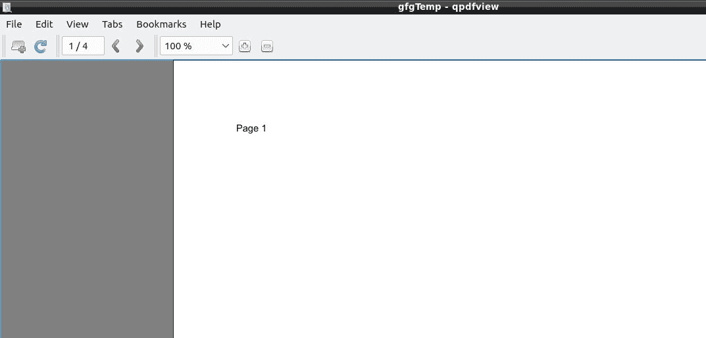
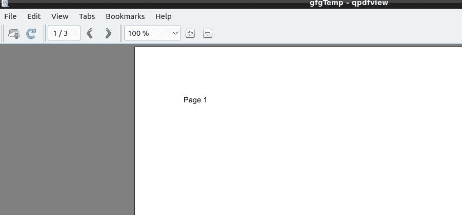

# 使用 Java 从 PDF 文档中移除页面

> 原文:[https://www . geesforgeks . org/remove-pages-from-a-pdf-document-use-Java/](https://www.geeksforgeeks.org/removing-pages-from-a-pdf-document-using-java/)

从现有文档(PDF 文档)中移除页面的程序。程序中需要导入外部 jar 文件。下面是相同的实现。

使用 PDDocument 类的 removePage()方法从现有的 PDF 文档中移除页面。

**进场:**

1.  使用 PDDocument 类的**静态方法 load()** 加载现有的 PDF 文档。此方法接受一个文件对象作为参数，因为这是一个静态方法，您可以使用类名调用它，如下所示。
    **文件文件=新文件(“文档路径”)**
    PDDocument.load(文件)；
2.  使用如下所示的 **getNumberOfPages()** 方法列出 PDF 文档中存在的页数。
    int NoofPages = document . GetNumberofPages()；
    system . out . print(NoofPages)；
3.  使用 PDDocument 类的 **removePage()** 方法从 PDF 文档中删除一页。向此方法传递要删除的页面的索引。在为 PDF 文档中的页面指定索引时，请记住这些页面的索引从零开始。
    T3【文档删除】页面(2)；
4.  删除页面后，使用 PDDocument 类的 save()方法保存 PDF 文档，如下面的代码块所示。
    **文档保存(“路径”)；**
5.  最后，使用 PDDocument 类的 close()方法关闭文档，如下所示。
    **document . close()；**

**注意:** [外罐必选](https://pdfbox.apache.org/download.cgi)(点击此处下载)。

下面是上述方法的实现:

## Java 语言(一种计算机语言，尤用于创建网站)

```
// Removing Pages from a PDF document using Java
import java.io.File;
import java.io.IOException;
import org.apache.pdfbox.pdmodel.PDDocument;
public class RemovingPages {
    public static void main(String args[])
        throws IOException
    {
        // Loading an existing document
        File file
            = new File("/home/mayur/gfgTemp.pdf");
        PDDocument document = PDDocument.load(file);

        // Listing the number of existing pages
        int noOfPages = document.getNumberOfPages();
        System.out.print(noOfPages);

        // Removing the pages
        document.removePage(1);

        System.out.println("page removed");
        // Saving the document
        document.save("/home/mayur/gfgTemp.pdf");

        // Closing the document
        document.close();
    }
}
```

**执行前:**



总共 4 页

**执行后:**



剩余 3 页