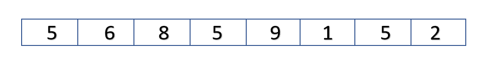
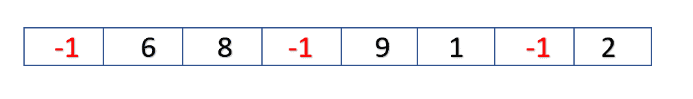
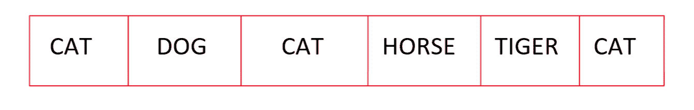
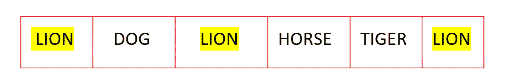

# 替换 Java 向量指定元素的所有出现

> 原文:[https://www . geesforgeks . org/replacing-all-occurs-of-specified-element-of-Java-vector/](https://www.geeksforgeeks.org/replacing-all-occurrences-of-specified-element-of-java-vector/)

[**replace all()**](https://www.geeksforgeeks.org/collections-replaceall-method-in-java-with-examples/)方法的**Java . util . collections**类用于将列表中一个指定值的所有出现替换为另一个。更正式地说，用 newVal 替换列表中的每个元素 e，使得(oldVal==null？e==null : oldVal.equals(e))。(此方法对列表的大小没有影响。)

让我们考虑以下向量:



替换前的向量

现在，在这个向量中，我们必须用一个给定值替换所有出现的 5。假设这里的值是-1。替换后我们的向量应该变成如下所示:



替换后的向量

**进场:**

解决这个问题的一个简单方法是遍历整个向量，当遍历时，如果向量中的元素等于指定的元素，则用给定值替换它。

然而，在 Java 中，我们有一个内置的方法**【replace all()**作为 Java Collections 的一部分，它也是这样做的。

**语法:**

```
public static  boolean
  replaceAll(List list, T oldVal, T newVal)
```

**参数:**该方法将以下参数作为参数

*   **列表–**要进行替换的列表。
*   **旧值–**要替换的旧值。
*   **新值–**替换旧值的新值。

**返回值:**如果列表包含一个或多个元素 e，则该方法返回**true**(oldVal = = null？e==null : oldVal.equals(e))。

**代码:**

## Java 语言(一种计算机语言，尤用于创建网站)

```
// Java program to replace all occurrences
// of Specified Element of Java Vector

import java.io.*;
import java.util.Vector;
import java.util.Collections;
class GFG {
    public static void main (String[] args) 
    {
      // Create a vector
      Vector<Integer> storage =new Vector<Integer>(6);

      // adding elements to the vector
      storage.add(5);      
      storage.add(6);
      storage.add(8);
      storage.add(5);
      storage.add(9);
      storage.add(1);      
      storage.add(5);
      storage.add(2);

      // val to replace with 
      int val=-1;

      // printing the vector before replacing 
      System.out.println("Vector before Replacing is: " + storage);

      // using Collections.replaceAll to replace all occurrences of the element
      Collections.replaceAll(storage,5,val);

      //printing the vector after replacing 
      System.out.println("Vector after Replacing is:  " + storage);

    }
}
```

**Output**

```
Vector before Replacing is: [5, 6, 8, 5, 9, 1, 5, 2]
Vector after Replacing is:  [-1, 6, 8, -1, 9, 1, -1, 2]
```

现在让我们考虑一个有字符串而不是整数值的向量:



替换前的向量

现在在这个向量中，我们必须用一个给定的字符串替换所有出现的 CAT。假设这里的字符串是 LION。替换后我们的向量应该变成如下所示:



替换后的向量

**代码:**

## Java 语言(一种计算机语言，尤用于创建网站)

```
// Java program to replace all occurrences
// of Specified Element of Java Vector

import java.io.*;
import java.util.Vector;
import java.util.Collections;
class GFG {
    public static void main (String[] args) {
      // Create a vector
      Vector<String> storage =new Vector<String>(6);
      // adding elements to the vector
      storage.add("CAT");      
      storage.add("DOG");
      storage.add("CAT");
      storage.add("HORSE");
      storage.add("TIGER");
      storage.add("CAT");

      // val to replace with 
     String val="LION";

      // printing the vector before replacing 
      System.out.println("Vector before Replacing is: " + storage);

      // using Collections.replaceAll to replace all occurrences of specified  element
      Collections.replaceAll(storage,"CAT",val);

      //printing the vector after replacing 
      System.out.println("Vector after Replacing is:  " + storage);

    }
}
```

**Output**

```
Vector before Replacing is: [CAT, DOG, CAT, HORSE, TIGER, CAT]
Vector after Replacing is:  [LION, DOG, LION, HORSE, TIGER, LION]
```