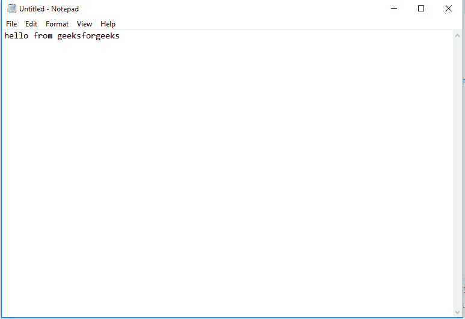

# Java AWT 中的机器人类

> 原文:[https://www.geeksforgeeks.org/robot-class-java-awt/](https://www.geeksforgeeks.org/robot-class-java-awt/)

Java AWT 包中的 Robot 类用于生成本机系统输入事件，用于测试自动化、自运行演示以及其他需要控制鼠标和键盘的应用程序。Robot 的主要目的是促进 Java 平台实现的自动化测试。简单地说，类提供了对鼠标和键盘设备的控制。

下面是一个机器人类如何控制键盘并在一个空白记事本文档中打字的例子。记事本是使用 Process 和 Runtime 调用的，正如本文中所讨论的。

## Java 语言(一种计算机语言，尤用于创建网站)

```java
// Java program to demonstrate working of Robot
// class. This program is for Windows. It opens
// notepad and types a message.
import java.awt.AWTException;
import java.awt.Robot;
import java.awt.event.KeyEvent;
import java.io.*;

public class robo
{
    public static void main(String[] args) throws IOException,
                           AWTException, InterruptedException
    {
        String command = "notepad.exe";
        Runtime run = Runtime.getRuntime();
        run.exec(command);
        try {
            Thread.sleep(2000);
        }
        catch (InterruptedException e)
        {
            // TODO Auto-generated catch block
            e.printStackTrace();
        }

        // Create an instance of Robot class
        Robot robot = new Robot();

        // Press keys using robot. A gap of
        // of 500 milli seconds is added after
        // every key press
        robot.keyPress(KeyEvent.VK_H);
        Thread.sleep(500);
        robot.keyPress(KeyEvent.VK_E);
        Thread.sleep(500);
        robot.keyPress(KeyEvent.VK_L);
        Thread.sleep(500);
        robot.keyPress(KeyEvent.VK_L);
        Thread.sleep(500);
        robot.keyPress(KeyEvent.VK_O);
        Thread.sleep(500);
        robot.keyPress(KeyEvent.VK_SPACE);
        Thread.sleep(500);
        robot.keyPress(KeyEvent.VK_F);
        Thread.sleep(500);
        robot.keyPress(KeyEvent.VK_R);
        Thread.sleep(500);
        robot.keyPress(KeyEvent.VK_O);
        Thread.sleep(500);
        robot.keyPress(KeyEvent.VK_M);
        Thread.sleep(500);
        robot.keyPress(KeyEvent.VK_SPACE);
        Thread.sleep(500);
        robot.keyPress(KeyEvent.VK_G);
        Thread.sleep(500);
        robot.keyPress(KeyEvent.VK_E);
        Thread.sleep(500);
        robot.keyPress(KeyEvent.VK_E);
        Thread.sleep(500);
        robot.keyPress(KeyEvent.VK_K);
        Thread.sleep(500);
        robot.keyPress(KeyEvent.VK_S);
        Thread.sleep(500);
        robot.keyPress(KeyEvent.VK_F);
        Thread.sleep(500);
        robot.keyPress(KeyEvent.VK_O);
        Thread.sleep(500);
        robot.keyPress(KeyEvent.VK_R);
        Thread.sleep(500);
        robot.keyPress(KeyEvent.VK_G);
        Thread.sleep(500);
        robot.keyPress(KeyEvent.VK_E);
        Thread.sleep(500);
        robot.keyPress(KeyEvent.VK_E);
        Thread.sleep(500);
        robot.keyPress(KeyEvent.VK_K);
        Thread.sleep(500);
        robot.keyPress(KeyEvent.VK_S);
    }
}
```

**输出:**

```java
The code opens a blank Notepad file and types 
"hello from geeksforgeeks" onto it with a delay
of 500 ms before typing out each character.

```



**机器人类的方法:**

<figure class="table">

| Return type | way | describe |
| --- | --- | --- |
| BufferedImage | createsscreencapture(矩形屏幕矩形) | Create an image containing pixels read from the screen. |
| hollow | Delay (int ms) | Sleep specified time. |
| （同 Internationalorganizations）国际组织 | getAutoDelay() | Returns the number of milliseconds that this robot sleeps after generating the event. |
| 颜色 | 获取像素颜色(整数 x，整数 y) | Returns the color of the pixel at the given screen coordinates. |
| boolean type | isaautowaitforidle() | Returns whether this robot automatically calls WaitForIdle after generating an event. |
| be invalid | 按键(int 键码) | Press the given key. |
| be invalid | 键释放(int 键码) | Release the given key. |
| 空的 | 鼠标移动(int x，int y) | Move the mouse pointer to the given screen coordinates. |
| become invalid | Mouse down (int buttons) | Press one or more mouse buttons. |
| become invalid | Mouse release (int buttons) | Release one or more mouse buttons. |
| 空的 | 鼠标滚轮(整数轴距) | Rotate the wheel on the mouse with the wheel. |
| 空的 | setAutoDelay(int ms) | Set the number of milliseconds that this robot sleeps after generating the event. |
| 空的 | setAutoWaitForIdle(布林连结) | Set whether this robot automatically calls WaitForIdle after generating an event. |
| 空的 | waitForIdle() | Wait until all events in the current event queue have been processed.
 |

</figure>

**参考文献:**

*   https://docs.oracle.com/javase/7/docs/api/java/awt/Robot.html 

本文由 **Anannya Uberoi** 供稿。如果你喜欢 GeeksforGeeks 并想投稿，你也可以使用[write.geeksforgeeks.org](https://write.geeksforgeeks.org)写一篇文章或者把你的文章邮寄到 review-team@geeksforgeeks.org。看到你的文章出现在极客博客主页上，帮助其他极客。
如果你发现任何不正确的地方，或者你想分享更多关于上面讨论的话题的信息，请写评论。