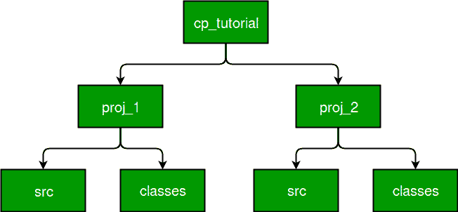

# 如何运行不同目录下的 java 类文件？

> 原文:[https://www . geesforgeks . org/run-Java-class-file-different-directory/](https://www.geeksforgeeks.org/run-java-class-file-different-directory/)

在本文中，我们将学习如何使用其他项目的实用程序、类和成员。在继续之前，让我们了解一些关键词。

**类路径**

类路径是 JVM 开始执行程序的位置。类似于经典的动态加载行为，当执行 Java 程序时，Java 虚拟机会缓慢地查找和加载类(它只在第一次使用类时才加载类的字节码)。类路径告诉 Java 在文件系统中的什么地方查找定义这些类的文件。类路径中可访问和可用的变量和方法称为类路径变量。默认情况下，JVM 总是在执行程序时访问类路径类。JVM 总是深入类路径来搜索类或资源。

**JVM 按照以下顺序搜索和加载类:**

1.  **引导类:**Java 平台的基础类(包括 Java 类库的公共类，以及该库正常运行所必需的私有类)。
2.  **扩展类:**位于 JRE 或 JDK、jre/lib/ext/用户定义的包和库的扩展目录中的包

**使用导入关键字**

import 关键字在 Java 中用于从当前项目的类路径中导入类。您可以从不同的包但从相同的类路径导入类。要记住，类的打包是从类路径开始的。假设您有如下目录结构:

```java
a > b > c > d > class A

```

您的类路径从 c 开始，**那么您的类应该在包 d 中，而不是在 a.b.c.d** 中。

**使用类路径-cp 选项**

import 关键字可以从当前类路径导入类，类路径外的导入不能使用。现在假设您已经有一个项目，其中您已经使用了一些实用程序类，这也是您在第二个项目中需要的。那么在这种情况下，import 关键字不起作用，因为您的第一个项目在另一个类路径中。在这种情况下，您可以在编译和执行程序时使用 **-cp** 命令。

让我们继续下面的例子。创建如下图所示的目录结构。

[](https://media.geeksforgeeks.org/wp-content/uploads/runClassJava.jpg)

这里有两个项目项目 1 和项目 2。proj1 包含 src 和类。在 src 目录中，我们将保留。作为源文件和类目录中的 java 文件，我们将保留。类文件是编译项目后生成的文件。
**下面是运行不同目录下的 java 类文件的步骤:**

*   **Step 1 (Create utility class):** Create A.java in src directory containing following code.

    ```java
    //java utility class
    public class A
    {
        public void test()
        {
            System.out.println("Test() method of class A");
        }
    }
    ```

    在这里，我们有一个公用事业类，就是 a

*   **Step 2 (Compile utility class):** Open terminal at proj1 location and execute following commands.

    ```java
    cp_tutorial/proj1>cd src
    cp_tutorial/proj1/src>javac -d ../classes A.java

    ```

    **-d 选项:**用于将输出存储到不同的目录。如果我们不使用这个选项，那么类文件将在 src 目录中创建。但是分开保存源文件和类文件是一个很好的做法。在-d 选项之后，我们提供应该存储类文件的目录的位置。
    如果有任何编译时错误，请在继续之前解决它。

*   **步骤 3(检查 A.java 是否编译成功):**检查项目 1 的类目录是否创建了类文件。如果你的程序编译成功，肯定会是“是”。
*   **Step 4 (Write main class and compile it):** Move to your proj2 directory. Here are also 2 directories for the same reasons. Create MainClass.java in src directory having the following content and try to compile it.

    ```java
    //java class to execute program
    public class MainClass{
        public static void main(String[] args){
            System.out.println("In main class");
            A a1 = new A();
            a1.test();
        }
    }
    ```

    ```java
    cp_tutorial/proj2>cd src
    cp_tutorial/proj2/src>javac -d ../classes MainClass.java
    MainClass.java:4: error: cannot find symbol
                    A a1 = new A();
                    ^
      symbol:   class A
      location: class MainClass
    MainClass.java:4: error: cannot find symbol
                    A a1 = new A();
                               ^
      symbol:   class A
      location: class MainClass
    2 errors

    ```

    如您所见，存在一个编译时错误，即找不到符号 A。如果我们想使用项目 1 的类 A，那么我们必须使用-cp 选项来包含项目 1 的资源，如下一步所示。

*   **Step 5 (Compile with -cp option):**

    ```java
    cp_tutorial/proj2>cd src
    cp_tutorial/proj2/src>javac -d ../classes -cp 
    ../../proj1/classes MainClass.java

    ```

    现在，您的代码将被成功编译，MainClass.Class 将在 class 目录中创建。-cp 代表类路径，它包含当前类路径给出的路径，一旦包含，JVM 就会识别符号 A，表明它是一个类，并成功编译文件。

*   **Step 6 (Execute the program):** Try executing the program.

    执行以下命令运行您的程序。

    ```java
    cp_tutorial/proj2/src>cd ../classes
    cp_tutorial/proj2/classes>java MainClass
    Exception in thread "main" java.lang.NoClassDefFoundError: A
            at MainClass.main(MainClass.java:4)
    Caused by: java.lang.ClassNotFoundException: A
            at java.net.URLClassLoader$1.run(Unknown Source)
            at java.net.URLClassLoader$1.run(Unknown Source)
            at java.security.AccessController.doPrivileged(Native Method)
            at java.net.URLClassLoader.findClass(Unknown Source)
            at java.lang.ClassLoader.loadClass(Unknown Source)
            at sun.misc.Launcher$AppClassLoader.loadClass(Unknown Source)
            at java.lang.ClassLoader.loadClass(Unknown Source)
            ... 1 more

    ```

    哎呀，我们得到一个错误，找不到 A 类。这是因为你只在编译时告诉 JVM 的路径。在运行 MainClass 的时候，他并不知道其他项目也有 A 类。

*   **Step 7 (Execute with -cp option):** We have to again provide the path of class A.

    ```java
    cp_tutorial/proj2/classes>java -cp ../../proj1/classes; MainClass
    In main class
    Test() method of class A

    ```

    现在，您已经成功运行了您的程序。别忘了包含“；”在提供类路径之后。替换“；”带“:”的操作系统/Linux。

**如何运行类路径中有 jar 的 java 类？**

您也可以使用 jar 文件来代替来自不同类路径的类文件。过程是一样的，你只需要用 jar 文件夹替换 class 文件夹，用 jar 名称替换 class 名称。
假设你在 lib 目录中有 jar 文件，那么要编译你可以使用

```java
cp_tutorial/proj2/src>javac -d ../classes -cp ../../proj1/lib MainClass.java

```

并执行

```java
cp_tutorial/proj2/classes>java -cp ../../proj1/lib; MainClass
```

**相关文章:** [设置 Java 环境](https://www.geeksforgeeks.org/setting-environment-java/)

本文由**维沙尔·加尔格**供稿。如果你喜欢 GeeksforGeeks 并想投稿，你也可以使用[contribute.geeksforgeeks.org](http://www.contribute.geeksforgeeks.org)写一篇文章或者把你的文章邮寄到 contribute@geeksforgeeks.org。看到你的文章出现在极客博客主页上，帮助其他极客。

如果你发现任何不正确的地方，或者你想分享更多关于上面讨论的话题的信息，请写评论。