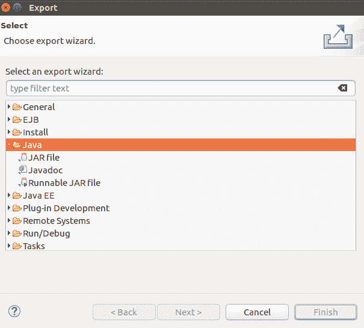
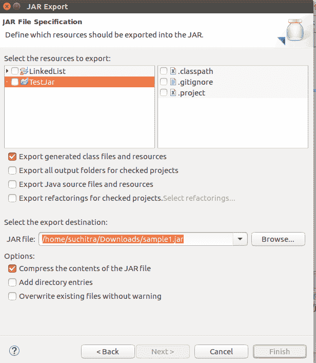
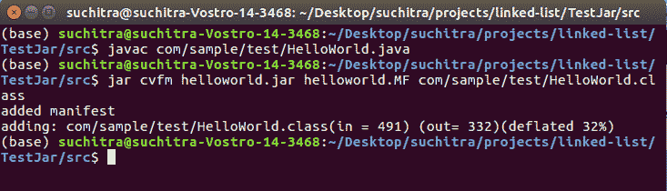
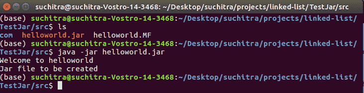

# Java 中的运行时 JAR 文件

> 原文:[https://www.geeksforgeeks.org/runtime-jar-file-in-java/](https://www.geeksforgeeks.org/runtime-jar-file-in-java/)

JAR 代表 Java 存档文件。它是一种平台**–**独立文件格式，允许捆绑和打包所有与 java 应用程序、类文件、音频和图像文件相关的文件。这些文件是我们运行小程序时需要的。它使用数据压缩算法捆绑 JAR 文件。这些 jar 文件可以使用像 WINZIP 或 WINRAR 这样的 zip 程序来操作。

由于所有的类文件都被打包/捆绑在一起并分发到客户端应用程序，因此它使得分发变得容易。作为一个单独的 jar 文件。作者可以使用数字证书对这些 jar 文件进行签名。这些 jar 文件可以使用数字证书和检查作者的签名来验证。JRE (Java 运行时环境)从 JAR 文件中加载类，而不破坏它。

**方法:**创建 JAR 文件有 2 种方式。

1.  使用集成开发环境
2.  使用命令行

让我们深入讨论这两个问题。

### 方法 1–使用集成开发环境

**1。通过像 Netbeans 或 Eclipse 这样的 T2 集成开发环境创建一个 JAR 文件是非常简单的。在文件中，我们有一个导出选项，可以帮助我们将 java 应用程序导出为 JAR 文件。这之后去**

```
File -> Export->Java-> JAR file
```

**2。**现在在一个 JAR 文件规范对话框中，指定要包含在 JAR 文件中的资源/文件。导出目标是要创建 jar 文件的位置。

**3。**点击完成按钮

**4。**然后我们提供希望创建 jar 文件的位置。

**5。**在下面的两个快照中以图片形式描述如下:

 

**方法 2:** 使用命令行

使用 jar 工具，我们可以创建如下所示的 jar 文件

```
cmd>> jar cvf jarfile inputfileDir1 inputfileDir2
```

**这里，**

*   c–创建一个新的 jar 文件
*   v–详细模式，在创建 jar 文件时显示消息。
*   f–捆绑到参数 jar file 指定的 jar 文件中，而不是标准输出。
*   inputfileDir1，inputfiledir 2–指示要在 jar 文件中捆绑在一起的输入文件。

现在我们将展示这个文件，因为这是一个捆绑在你的 JAR 文件中的特殊文件。它有特殊的元数据，如主类名、版本控制、作者的数字签名、用于捆绑 jar 文件的 java 版本。文件名是“MANIFEST。它是 META-INF 子目录的一部分。如果在绑定 JAR 文件的过程中没有提供这个文件，它会被自动创建。当我们提取并打开 jar 文件时，我们可以查看这个文件。它有以下细节

```
Manifest-Version: 1.0
```

如果有一个头文件为 Main-class 的清单文件，jar 文件可以由 java 应用程序直接运行。Main-class 头包含具有 Main()的类的完全限定名。这指定了应用程序的入口点。

**说明:**考虑用名为 ***helloworld 的清单文件创建一个 JAR 文件。**MF*

```
Manifest-Version : 1.0
Main-class : com.sample.test.HelloWorld
```

**示例:**

## Java 语言(一种计算机语言，尤用于创建网站)

```
// Importing the package 
package com.sample.test;

// Main class
public class HelloWorld {

    // Main driver method
    public static void main(String[] args)
    {

        // Print statements only
        System.out.println("Welcome to helloworld");
        System.out.println("Jar file to be created");
    }
}
```

> 请注意，m 表示绑定到 jar 文件时要包含的清单文件

**输出:**



> **注意:**这里我们使用 javac 命令编译 java 文件‘hello world . Java’。此命令编译。java 文件并创建一个类文件 HelloWorld.class .然后我们使用 jar 命令创建 jar 文件 helloworld.jar。

最后，现在在运行 jar 文件时，我们使用下面的命令来运行创建的 JAR 文件。当我们运行 jar 文件时，包含 main()的 *Helloworld* 类被 JVM 加载，代码被执行。

