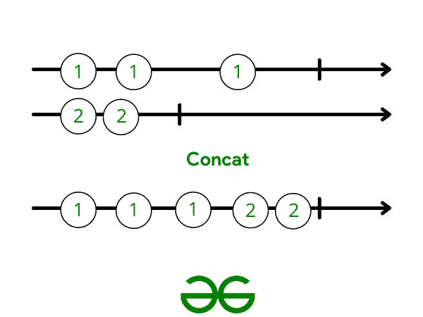

# RxJava 运算符–连接并合并

> 原文:[https://www . geesforgeks . org/rx Java-operator-concat-and-merge/](https://www.geeksforgeeks.org/rxjava-operator-concat-and-merge/)

RxJava 是最有意义的库，被安卓开发者广泛使用。它简化了我们的生活。RxJava 用于多线程、管理后台进程和消除回调地狱。RxJava 允许我们处理各种复杂的用例。它让我们能够以非常简单的方式完成复杂的事情。它给了我们能力。就像你的超级英雄电影里说的那样:有了强大的力量，就有了巨大的责任。RxJava 包含过多的操作符。为了恰当地使用它们，我们必须意识到它们。本节将介绍连接运算符和合并运算符。

#### **串联**

它将两个或多个可观测值的发射连接起来，而不需要交错它们。发射物品时，它会保持可观察物品的顺序。也就是说，它会发出第一个可观察到的所有东西，然后是第二个可观察到的所有项目，以此类推。



图表 1。解释连接

**我们来看一个例子，帮助大家理解:**

## Java 语言(一种计算机语言，尤用于创建网站)

```java
final String[] gfgList = { "DSA", "Py", "Android", "Java" };
final String[] gfgListTwo = { "Intern", "FullTime", "PartTime" };

final Observable<String> gfgObs1 = Observable.fromArray(gfgList);
final Observable<String> gfgObs2 = Observable.fromArray(gfgListTwo);

Observable.concat(gfgObs1, gfgObs2)
    .subscribe(new Observer<String>() {
        @Override public void onSubscribe(Disposable d)
        {
            // Your Code
        }
        @Override public void onNext(String value)
        {
            // Your Code
        }
        @Override public void onError(Throwable e)
        {
            // Your Code
        }
        @Override public void onComplete()
        {
            // Your Code
        }
  });
```