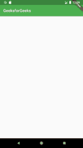
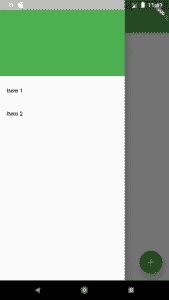
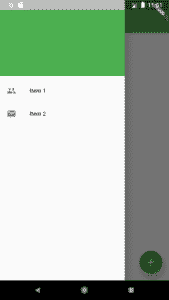

# 颤振中的脚手架等级示例

> 原文:[https://www . geeksforgeeks . org/scaffold-class-in-flutter-with-examples/](https://www.geeksforgeeks.org/scaffold-class-in-flutter-with-examples/)

**脚手架**是 [**flutter**](https://www.geeksforgeeks.org/flutter-an-introduction-to-the-open-source-sdk-by-google/) 中的一个类，提供了很多小部件或者我们可以说[API](https://www.geeksforgeeks.org/introduction-to-apis/)像抽屉、SnackBar、BottomNavigationBar、FloatingActionButton、AppBar 等。**脚手架**将展开或占据整个设备屏幕。它会占用可用空间。脚手架将提供一个[框架](https://www.geeksforgeeks.org/software-framework-vs-library/)来实现应用的基本材料设计布局。

### **阶级等级:**

```
Object
 ↳ Diagnosticable
   ↳ Diagnosticable Tree
     ↳ Widget
       ↳ StateFul Widget
         ↳ Scaffold
```

### **脚手架类的施工人员:**

```
const Scaffold({
    Key key,
    this.appBar,
    this.body,
    this.floatingActionButton,
    this.floatingActionButtonLocation,
    this.floatingActionButtonAnimator,
    this.persistentFooterButtons,
    this.drawer,
    this.endDrawer,
    this.bottomNavigationBar,
    this.bottomSheet,
    this.backgroundColor,
    this.resizeToAvoidBottomPadding,
    this.resizeToAvoidBottomInset,
    this.primary = true,
    this.drawerDragStartBehavior
          = DragStartBehavior.start,
    this.extendBody = false,
    this.drawerScrimColor,
})
```

### **脚手架等级属性:**

*   **appBar:** 显示一个横条，主要放置在*脚手架*的顶部。 *appBar* 使用小部件 *AppBar* 有自己的属性，比如海拔、标题、亮度等。

## 镖

```
Widget build(BuildContext context)
{
  return Scaffold(
    appBar: AppBar(
      title: Text('GeeksforGeeks'),
    ),
```



*   **主体:**它将显示支架中的主要或主要内容。它位于*应用栏*下方和*浮动操作按钮*下方。默认情况下，正文中的小部件位于左上角。

## 镖

```
Widget build(BuildContext context)
{
  return Scaffold(
    appBar: AppBar(
      title: Text('GeeksforGeeks'),
    ),
    body: Center(
      child: Text("Welcome to GeeksforGeeks!!!",
        style: TextStyle(
          color: Colors.black,
          fontSize: 40.0,
        ),
      ),
    ),
```

在这个例子中，我们已经显示了文本*欢迎来到极客论坛！！！*在体内。我们已经使用*中心*小部件在页面中心显示了文本。为了设置文本样式，我们使用了*文本样式*小部件。


*   **浮动动作按钮:** *浮动动作按钮*是默认放置在右下角的按钮。*浮动动作按钮*是一个图标按钮，在固定的位置浮动在屏幕内容上。如果我们滚动页面，它的位置不会改变，而是固定的。

## 镖

```
Widget build(BuildContext context)
{
  return Scaffold(
      appBar: AppBar(title: Text('GeeksforGeeks')),
      body:  Center(
        child: Text("Welcome to GeeksforGeeks!!!",
          style: TextStyle(
            color: Colors.black,
            fontSize: 40.0,
          ),
        ),
      ),
      floatingActionButton: FloatingActionButton(
          elevation: 10.0,
          child: Icon(Icons.add),
          onPressed: (){
        // action on button press
          }
      );
}
```

这里，elevation 属性用于为按钮赋予阴影效果。*图标*用于在 flutter SDK 中使用一些预加载的图标来放置按钮的图标。*OnPreced()*是一个函数，当按钮被按下时会被调用，函数内部的语句会被执行。


*   **抽屉:** *抽屉*是显示在脚手架侧面的滑动菜单或面板。用户必须根据定义的操作从左向右或从右向左滑动才能访问抽屉菜单。在应用栏中，抽屉的适当图标会自动设置在特定位置。打开抽屉的手势也是自动设置的。它由脚手架处理。

## 镖

```
drawer: Drawer(
          child: ListView(
        children: const <Widget>[
          DrawerHeader(
            decoration: BoxDecoration(
              color: Colors.green,
            ),
            child: Text(
              'GeeksforGeeks',
              style: TextStyle(
                color: Colors.green,
                fontSize: 24,
              ),
            ),
          ),
          ListTile(
            title: Text('Item 1'),
          ),
          ListTile(
            title: Text('Item 2'),
          ),
        ],
      ),
    ),
```

作为一个父小部件，我们获取了*列表视图*，在其中，我们将面板分为两部分，标题和菜单。 *DrawerHeader* 用于修改面板的表头。在标题中，我们可以根据应用程序显示用户的图标或详细信息。我们已经使用*列表*将这些项目添加到菜单中。



我们也可以使用*列表*的属性*前导*在项目前添加图标，在列表中我们必须使用*图标*小部件。
**例:**

## 镖

```
ListTile(
    title
    : Text('Item 1'),
      leading
    : Icon(Icons.people), ),
    ListTile(
        title
        : Text('Item 2'),
          leading
        : Icon(Icons.mail), ),
```

**输出:**



*   **底部导航栏:** *底部导航栏*就像脚手架底部的菜单。我们已经在大多数应用程序中看到了这个导航栏。我们可以在栏中添加多个图标或文本或两者作为项目。

## 镖

```
bottomNavigationBar
    : BottomNavigationBar(
          currentIndex : 0,
          fixedColor
          : Colors.green,
            items
          : [
              BottomNavigationBarItem(
                  title
                  : Text("Home"),
                    icon
                  : Icon(Icons.home), ),
              BottomNavigationBarItem(
                  title
                  : Text("Search"),
                    icon
                  : Icon(Icons.search), ),
              BottomNavigationBarItem(
                  title
                  : Text("Profile"),
                    icon
                  : Icon(Icons.account_circle), ),
          ],
            onTap
          : (int indexOfItem){

          }),
```

我们使用*底部导航栏*小部件来显示该栏。对于活动图标的颜色，我们使用*固定颜色*属性。要在栏中添加项目，我们使用*底部导航工具栏*小部件，在其中我们给出文本和图标。对于在项目上点击时执行的动作，我们有 *onTap(int indexOfItem)* 功能，该功能根据项目的索引位置工作。


*   **backgroundColor:** 用于设置整个*脚手架*小部件的颜色。
*   **浮动动作按钮动画师:**用于提供动画移动*浮动动作按钮*。
*   **主要:**告知*脚手架*是否显示。
*   **drawercrimccolor:**用于定义抽屉打开时主要内容的颜色。
*   **bottomSheet** :该属性取一个 widget (final)作为对象显示在屏幕底部。
*   **drawerdraggstartbehavior**:该属性将*draggstartbehavior 枚举*作为确定抽屉拖动行为的对象。
*   **抽屉抽屉宽度**:这决定了滑动或拖动将导致抽屉打开的区域。它以一个*双*为对象。
*   **drawerenablepoengesture**:这个属性保存在一个*布尔*值中，作为确定拖动手势是否会打开抽屉的对象，默认设置为 true。
*   **end drawer**:[*end drawer*](https://www.geeksforgeeks.org/enddrawer-widget-in-flutter/)属性接受一个小部件作为参数。它与抽屉相似，只是它打开的方向相反。
*   **enddrawerenableleopengeture**:同样，该属性采用一个*布尔值*作为对象，以确定拖动手势是否会打开 *endDrawer* 。
*   **扩展体**:扩展体属性接受一个*布尔*作为对象。默认情况下，此属性始终为 false，但不能为 null。如果在出现*底部导航栏*或*持续脚踏按钮*时设置为真，则这些按钮的高度会添加到身体上，并在身体下方移动。
*   **extendBodyBehindAppBar** :这个属性也接受一个*布尔*作为对象。默认情况下，此属性始终为 false，但不能为 null。如果设置为真，则*应用栏*而不是在身体上延伸到身体上方，其高度被添加到身体上。当 *appBar* 的颜色不是完全不透明时，使用该属性。
*   **浮动动作按钮位置**:该物业负责*浮动动作按钮*的位置。
*   **persistentFooterButton** :这个属性接受一个小部件列表。通常是显示在*脚手架*下方的按钮。
*   **resizetovaitbottoninsets**:该属性接受一个*布尔*值作为对象。如果设置为真，则*支架*上的浮动部件会自行调整大小，以避免妨碍屏幕键盘。