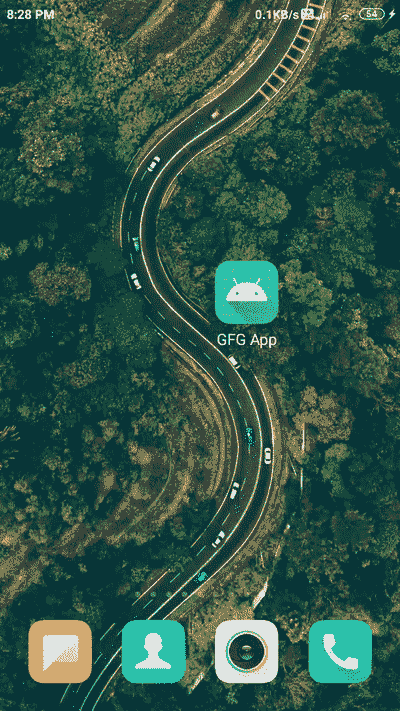

# 安卓中的刮刮卡视图，示例

> 原文:[https://www . geesforgeks . org/scratch-card-view-in-Android-with-example/](https://www.geeksforgeeks.org/scratch-card-view-in-android-with-example/)

**刮刮卡视图**是安卓应用中最常见的 UI 组件之一。这种类型的用户界面组件通常出现在支付应用程序中，如谷歌支付和许多其他支付应用程序。现在，如果你是一个安卓开发者，你应该会惊讶于我们如何在我们的安卓应用程序中创建这种类型的用户界面组件。在本文中，我们将了解一下 Scratch Card View 在 Android 中的实现。为了实现刮刮卡视图，我们将使用 GitHub 的库。使用这个库，我们将创建一个简单的刮刮卡视图，并展示它。

## 安卓系统中刮刮卡视图的实现

下面给出了一个 GIF 示例，来了解一下在本文中要做什么。请注意，我们将使用 **Java** 语言来实现这个项目。



### 逐步实施

**第一步:创建新项目**

要在安卓工作室创建新项目，请参考[如何在安卓工作室创建/启动新项目](https://www.geeksforgeeks.org/android-how-to-create-start-a-new-project-in-android-studio/)。注意选择 **Java** 作为编程语言。

**第二步:添加依赖项进行构建. gradle(模块:app)**

导航到**渐变脚本>构建.渐变(模块:应用)**，并在依赖项部分添加以下依赖项。

> 实现' com . github . cooltechworks:scratch view:v 1.1 '

**第三步:现在在你的 Gradle 文件里面添加 maven URL**

导航到**渐变脚本>构建.渐变(项目)级别**，并在存储库部分添加以下行。

> 所有项目{
> 
> 存储库{
> 
> //下面是我们必须添加的行
> 
> maven { URL " https://jitpack . io " }
> 
> 谷歌()
> 
> jcenter()
> 
> }
> 
> }

**第 4 步:使用 activity_main.xml 文件**

转到 **activity_main.xml** 文件，参考以下代码。下面是 **activity_main.xml** 文件的代码。

## 可扩展标记语言

```
<?xml version="1.0" encoding="utf-8"?>
<RelativeLayout
    xmlns:android="http://schemas.android.com/apk/res/android"
    xmlns:tools="http://schemas.android.com/tools"
    android:id="@+id/container"
    android:layout_width="match_parent"
    android:layout_height="match_parent"
    android:orientation="vertical"
    tools:context=".MainActivity">

    <!--Scratch Card  view to display our hidden image
        src attribute is to add image which wil be visible
        after scratching of our card.-->
    <com.cooltechworks.views.ScratchImageView
        android:id="@+id/idScratchCardIv"
        android:layout_width="200dp"
        android:layout_height="200dp"
        android:layout_centerInParent="true"
        android:background="@color/white"
        android:src="@drawable/gfgimage" />

</RelativeLayout>
```

**步骤 5:使用 MainActivity.java 文件**

转到**MainActivity.java**文件，参考以下代码。以下是**MainActivity.java**文件的代码。代码中添加了注释，以更详细地理解代码。

## Java 语言(一种计算机语言，尤用于创建网站)

```
import android.os.Bundle;
import android.widget.Toast;
import androidx.appcompat.app.AppCompatActivity;
import com.cooltechworks.views.ScratchImageView;

public class MainActivity extends AppCompatActivity {

    @Override
    protected void onCreate(Bundle savedInstanceState) {
        super.onCreate(savedInstanceState);
        setContentView(R.layout.activity_main);

        // initializing our scratchcardimageview.
        ScratchImageView scratchImageView = findViewById(R.id.idScratchCardIv);
        scratchImageView.setRevealListener(new ScratchImageView.IRevealListener() {
            @Override
            public void onRevealed(ScratchImageView iv) {
                // this method is called after revealing the image.
                Toast.makeText(MainActivity.this, "image is revealed", Toast.LENGTH_SHORT).show();
            }

            @Override
            public void onRevealPercentChangedListener(ScratchImageView siv, float percent) {
                // we can check how much percentage of 
                // image is revealed using percent variable
            }
        });
    }
}
```

### 输出:

<video class="wp-video-shortcode" id="video-530748-1" width="640" height="360" preload="metadata" controls=""><source type="video/mp4" src="https://media.geeksforgeeks.org/wp-content/uploads/20201216203045/Screenrecorder-2020-12-16-20-28-55-151.mp4?_=1">[https://media.geeksforgeeks.org/wp-content/uploads/20201216203045/Screenrecorder-2020-12-16-20-28-55-151.mp4](https://media.geeksforgeeks.org/wp-content/uploads/20201216203045/Screenrecorder-2020-12-16-20-28-55-151.mp4)</video>