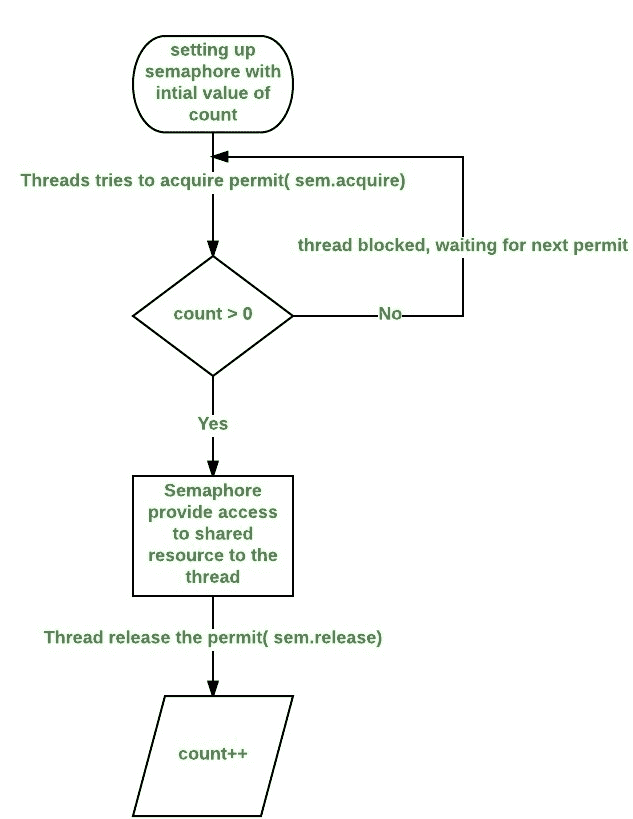

# Java 中的信号量

> 原文:[https://www.geeksforgeeks.org/semaphore-in-java/](https://www.geeksforgeeks.org/semaphore-in-java/)

信号量通过使用计数器来控制对共享资源的访问。如果计数器大于零，则允许访问。如果为零，则拒绝访问。计数器计数的是允许访问共享资源的许可。因此，要访问资源，线程必须获得信号量的许可。

**信号量工作**

一般来说，为了使用信号量，想要访问共享资源的线程会尝试获取许可。

*   如果信号量的计数大于零，那么线程获得一个许可，这导致信号量的计数减少。
*   否则，线程将被阻塞，直到获得许可。
*   当线程不再需要访问共享资源时，它释放许可，这导致信号量的计数增加。
*   如果有另一个线程在等待许可，那么该线程将在那个时候获得许可。

Java 在 *java.util.concurrent* 包中提供**信号量**类来实现这个机制，这样就不用自己实现信号量了。

**流程图:**
[](https://media.geeksforgeeks.org/wp-content/uploads/d2.jpeg)

**Semaphore 类中的构造函数:**Semaphore 类中有两个构造函数。

```java
Semaphore(int num)
Semaphore(int num, boolean how)

```

这里， *num* 指定初始许可计数。因此，它指定了在任何时候可以访问共享资源的线程数量。如果是一个，那么在任何时候只有一个线程可以访问资源。默认情况下，所有等待的线程都以未定义的顺序被授予许可。通过将 *how* 设置为 true，您可以确保等待线程按照其请求访问的顺序获得许可。

**使用信号量作为锁([防止比赛状态](https://practice.geeksforgeeks.org/problems/what-is-race-condition) )**

我们可以使用信号量来锁定对资源的访问，每个想要使用该资源的线程在访问资源之前必须首先调用 *acquire( )* 来获取锁。当线程使用完资源后，它必须调用 *release( )* 来释放锁。这里有一个例子可以证明这一点:

```java
// java program to demonstrate 
// use of semaphores Locks
import java.util.concurrent.*;

//A shared resource/class.
class Shared 
{
    static int count = 0;
}

class MyThread extends Thread
{
    Semaphore sem;
    String threadName;
    public MyThread(Semaphore sem, String threadName) 
    {
        super(threadName);
        this.sem = sem;
        this.threadName = threadName;
    }

    @Override
    public void run() {

        // run by thread A
        if(this.getName().equals("A"))
        {
            System.out.println("Starting " + threadName);
            try 
            {
                // First, get a permit.
                System.out.println(threadName + " is waiting for a permit.");

                // acquiring the lock
                sem.acquire();

                System.out.println(threadName + " gets a permit.");

                // Now, accessing the shared resource.
                // other waiting threads will wait, until this 
                // thread release the lock
                for(int i=0; i < 5; i++)
                {
                    Shared.count++;
                    System.out.println(threadName + ": " + Shared.count);

                    // Now, allowing a context switch -- if possible.
                    // for thread B to execute
                    Thread.sleep(10);
                }
            } catch (InterruptedException exc) {
                    System.out.println(exc);
                }

                // Release the permit.
                System.out.println(threadName + " releases the permit.");
                sem.release();
        }

        // run by thread B
        else
        {
            System.out.println("Starting " + threadName);
            try 
            {
                // First, get a permit.
                System.out.println(threadName + " is waiting for a permit.");

                // acquiring the lock
                sem.acquire();

                System.out.println(threadName + " gets a permit.");

                // Now, accessing the shared resource.
                // other waiting threads will wait, until this 
                // thread release the lock
                for(int i=0; i < 5; i++)
                {
                    Shared.count--;
                    System.out.println(threadName + ": " + Shared.count);

                    // Now, allowing a context switch -- if possible.
                    // for thread A to execute
                    Thread.sleep(10);
                }
            } catch (InterruptedException exc) {
                    System.out.println(exc);
                }
                // Release the permit.
                System.out.println(threadName + " releases the permit.");
                sem.release();
        }
    }
}

// Driver class
public class SemaphoreDemo 
{
    public static void main(String args[]) throws InterruptedException 
    {
        // creating a Semaphore object
        // with number of permits 1
        Semaphore sem = new Semaphore(1);

        // creating two threads with name A and B
        // Note that thread A will increment the count
        // and thread B will decrement the count
        MyThread mt1 = new MyThread(sem, "A");
        MyThread mt2 = new MyThread(sem, "B");

        // stating threads A and B
        mt1.start();
        mt2.start();

        // waiting for threads A and B 
        mt1.join();
        mt2.join();

        // count will always remain 0 after
        // both threads will complete their execution
        System.out.println("count: " + Shared.count);
    }
}
```

输出:

```java
Starting A
Starting B
A is waiting for a permit.
B is waiting for a permit.
A gets a permit.
A: 1
A: 2
A: 3
A: 4
A: 5
A releases the permit.
B gets a permit.
B: 4
B: 3
B: 2
B: 1
B: 0
B releases the permit.
count: 0

```

**注意:**在上述程序的不同执行中，输出可以不同，但*计数*变量的最终值将始终保持为 0。

**以上程序说明:**

*   程序使用信号量来控制对*计数*变量的访问，该变量是共享类中的静态变量。*共享计数*由线程 A 递增五倍，由线程 B 递减五倍。为了防止这两个线程同时访问共享计数，只有在从控制信号量获得许可后，才允许访问。进入完成后，许可证被发放。这样，一次只有一个线程访问 Shared.count，如输出所示。
*   请注意 MyThread 类中 run()方法内对 sleep()的调用。它用来“证明”对 Shared.count 的访问是由信号量同步的。在 run()中，对 sleep()的调用会导致调用线程在每次访问 Shared.count 之间暂停。这通常会使第二个线程能够运行。但是，由于信号量的原因，第二个线程必须等到第一个线程释放了许可，这只有在第一个线程的所有访问都完成之后才会发生。因此，共享计数首先由线程 A 增加五次，然后由线程 b 减少五次。
*   如果不使用信号量，两个线程对*共享计数*的访问将会同时发生，增量和减量将会混合。要确认这一点，请尝试对 *acquire( )* 和 *release( )* 的呼叫进行评论。当您运行程序时，您将看到对 Shared.count 的访问不再同步，因此您不会总是获得 *count* 值 0。

**下一个:** [Java 中的 Java.util.concurrent.Semaphore 类](https://www.geeksforgeeks.org/java-util-concurrent-semaphore-class-java/)

本文由**高拉夫·米格拉尼**供稿。如果你喜欢 GeeksforGeeks 并想投稿，你也可以使用[contribute.geeksforgeeks.org](http://www.contribute.geeksforgeeks.org)写一篇文章或者把你的文章邮寄到 contribute@geeksforgeeks.org。看到你的文章出现在极客博客主页上，帮助其他极客。

如果你发现任何不正确的地方，或者你想分享更多关于上面讨论的话题的信息，请写评论。