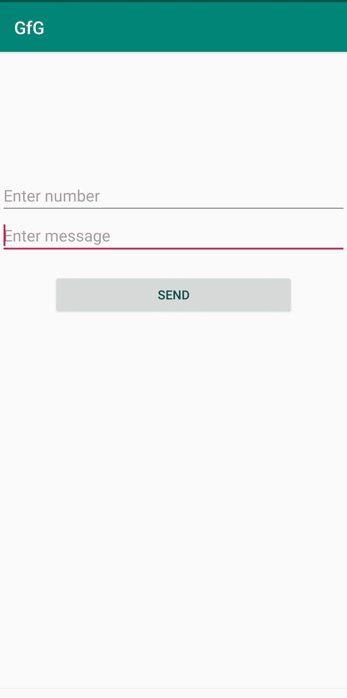
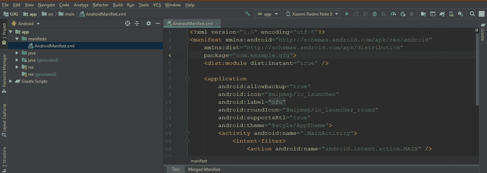
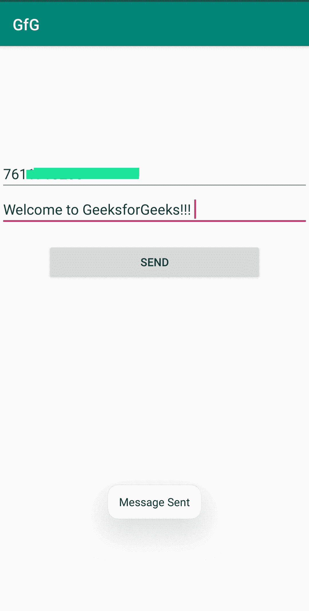
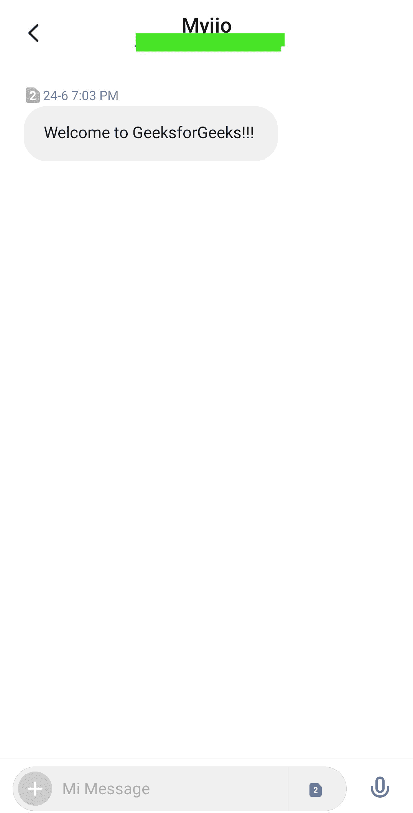

# 在安卓系统中使用短信管理器通过手机发送短信

> 原文:[https://www . geesforgeks . org/通过手机发送短信使用安卓系统中的 smsmsmanager/](https://www.geeksforgeeks.org/sending-a-text-message-over-the-phone-using-smsmanager-in-android/)

本文是关于在安卓应用程序中使用**短信管理器**类通过电话发送短信。为此，需要具备[安卓应用开发基础知识](https://www.geeksforgeeks.org/android-app-development-fundamentals-for-beginners/)[创建新项目](https://www.geeksforgeeks.org/android-how-to-create-start-a-new-project-in-android-studio/)[运行安卓应用](https://www.geeksforgeeks.org/android-running-your-first-android-app/)[视图](https://developer.android.com/reference/android/view/View)[点击事件按钮](https://www.geeksforgeeks.org/handling-click-events-button-android/)的处理。

SMSManager 类管理发送文本消息、数据消息和多媒体消息(MMS)等操作。发送文本消息的方法**发送文本消息()**同样用于彩信**发送多媒体消息()**和数据消息**发送数据消息()**的方法。每个功能的详细信息为:

<figure class="table">T30

| 

功能

 | 

描述

 |
| --- | --- |
| Send a text message () | Send a text message (string destination address,
string address, string text, pendiningtent sentinent,
pendingtent delivery intention, long messageId) |

</figure>

下面是一个发送文本消息的基本应用程序的示例。



### 方法:

**步骤 1:** 创建新的安卓应用程序。

**第二步:**转到 ***和*** 。

> 应用->清单->安卓清单



**第三步**:在 ***中**添加发送短信的权限。它将允许安卓应用程序发送短信。*

## AndroidManifest.xml

```java
<?xml version="1.0" encoding="utf-8"?>
<manifest xmlns:android="http://schemas.android.com/apk/res/android"
    xmlns:dist="http://schemas.android.com/apk/distribution"
    package="com.example.gfg">
    <uses-permission android:name="android.permission.SEND_SMS"/>
    <dist:module dist:instant="true" />

    <application
        android:allowBackup="true"
        android:icon="@mipmap/ic_launcher"
        android:label="@string/app_name"
        android:roundIcon="@mipmap/ic_launcher_round"
        android:supportsRtl="true"
        android:theme="@style/AppTheme">
        <activity android:name=".MainActivity">
            <intent-filter>
                <action android:name="android.intent.action.MAIN" />

                <category android:name="android.intent.category.LAUNCHER" />
            </intent-filter>
        </activity>
    </application>

</manifest>
```

**第四步:**从下面的地址打开***activity _ main . XML***并添加下面的代码。这里，在线性布局中，添加了两个用于获取电话号码和文本消息的编辑文本以及一个用于发送消息的按钮。

> app-> RES-> layout-> activity main . XML

## activity_main.xml

```java
<?xml version="1.0" encoding="utf-8"?>
<LinearLayout xmlns:android="http://schemas.android.com/apk/res/android"
    xmlns:app="http://schemas.android.com/apk/res-auto"
    xmlns:tools="http://schemas.android.com/tools"
    android:layout_width="match_parent"
    android:orientation="vertical"
    android:layout_marginTop="140dp"
    android:layout_height="match_parent"
    tools:context=".MainActivity">

    <EditText
        android:id="@+id/editText"
        android:layout_width="match_parent"
        android:layout_height="wrap_content"
        android:ems="10"
        android:hint="Enter number"
        android:inputType="textPersonName" />

    <EditText
        android:id="@+id/editText2"
        android:layout_width="match_parent"
        android:layout_height="wrap_content"
        android:ems="10"
        android:hint="Enter message"
        android:inputType="textPersonName" />

    <Button
        android:id="@+id/button"
        android:layout_width="match_parent"
        android:layout_height="wrap_content"
        android:layout_marginTop="20dp"
        android:layout_marginLeft="60dp"
        android:layout_marginRight="60dp"
        android:text="SEND" />
</LinearLayout>
```

**第五步:**开启***MainActivity.java***

> app-> Java-> com . example . gfg-> main activity

为使用的视图创建对象，即编辑文本和按钮。在 onCreate 方法中，使用*findwiewbyid()*方法查找所有视图。

> Viewtype 对象=(视图类型)findviewbyid(r . id . idfoview)；

由于发送按钮用于发送消息，因此 **onClickListener** 添加了该按钮。现在创建两个字符串变量，并使用方法**将编辑文本电话号码和消息的值存储到其中(在赋值之前，使用 **toString()** 方法将它们转换为字符串)。现在在 try block 中创建一个 smsmsmanager 类的实例，并获取与默认订阅 id 相关联的 smsmsmanager。现在调用方法 **sendTextMessage()** 发送消息。**

> SmsManager=SmsManager.getDefault（）;
> 
> smscmanager . send text message(number，null，msg，null，null)；

然后将吐司消息显示为“消息已发送”，并关闭尝试块。最后在 catch 块中显示一条 toast 消息，因为如果编译器执行这段代码，消息就不会被发送。

## MainActivity.java

```java
package com.example.gfg;

import androidx.appcompat.app.AppCompatActivity;

import android.os.Bundle;
import android.telephony.SmsManager;
import android.view.View;
import android.widget.Button;
import android.widget.EditText;
import android.widget.Toast;

public class MainActivity extends AppCompatActivity {
    EditText phonenumber,message;
    Button send;
    @Override
    protected void onCreate(Bundle savedInstanceState) {
        super.onCreate(savedInstanceState);
        setContentView(R.layout.activity_main);
        send=findViewById(R.id.button);
        phonenumber=findViewById(R.id.editText);
        message=findViewById(R.id.editText2);
        send.setOnClickListener(new View.OnClickListener() {

            public void onClick(View view) {
                String number=phonenumber.getText().toString();
                String msg=message.getText().toString();
                try {
                    SmsManager smsManager=SmsManager.getDefault();
                    smsManager.sendTextMessage(number,null,msg,null,null);
                    Toast.makeText(getApplicationContext(),"Message Sent",Toast.LENGTH_LONG).show();
                }catch (Exception e)
                {
                    Toast.makeText(getApplicationContext(),"Some fiels is Empty",Toast.LENGTH_LONG).show();
                }
            }
        });
    }
}
```

**注意:** *对于在安卓设备中运行的应用，启用该应用的短信权限。*

```java
*Goto permissions->SMS->YourApp and enable permission.*
```

**输出:**

***发送消息***



***在消息 app** 发送消息*

