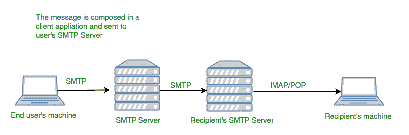

# 通过带有 SSL / TLS 认证的 Java 发送邮件

> 原文:[https://www . geesforgeks . org/sensing-email-Java-ssltls-authentication/](https://www.geeksforgeeks.org/sending-email-java-ssltls-authentication/)

JavaMail 应用编程接口定义了代表邮件系统组件的类。JavaMail 没有实现电子邮件服务器，相反，它允许您使用 Java API 访问电子邮件服务器。为了测试显示的代码，您必须能够访问电子邮件服务器。虽然 JavaMail API 规范没有强制要求支持特定的协议，但 JavaMail 通常包括对 POP3、IMAP 和 SMTP 的支持。



电子邮件是如何工作的？

**先决条件:**

*   有权访问 SMTP 服务器。您必须知道 SMTP 服务器的主机名、端口号和安全设置。网络邮件提供商可能会提供 SMTP 访问，查看您的电子邮件帐户设置或帮助查找更多信息。请注意，您的用户名通常是您的完整电子邮件地址，而不仅仅是@符号前的姓名。

*   一个 Java EE 集成开发环境和应用服务器，如 GlassFish 或甲骨文网络逻辑服务器。JavaMail 可以作为 Java SE 应用程序中的库[下载](https://github.com/javaee/javamail/releases/download/JAVAMAIL-1_5_6/javax.mail.jar)，但是本教程假设使用已经包含 JavaMail 的 Java EE 应用服务器。

使用 JavaMail 发送电子邮件有以下三个步骤。它们如下:

**获取会话对象**–**javax . mail . session**类提供了会话对象、Session.getDefaultInstance()方法和 Session.getInstance()方法。

```java
// Setup mail server
properties.setProperty("mail.smtp.host", host); 

// mail username and password   
properties.setProperty("mail.user", "user");                   
properties.setProperty("mail.password", "password$");           
```

**撰写消息**–**javax . mail . transport**类提供了发送消息的方法。

```java
// javax.mail.internet.MimeMessage class is
// mostly used for abstraction. 
MimeMessage message = new MimeMessage(session);

// header field of the header.  
message.setFrom(new InternetAddress(from)); 
message.addRecipient(Message.RecipientType.TO, 
                     new InternetAddress(to));  
message.setSubject("subject");  
message.setText("Hello, aas is sending email ");  
```

**发送消息**

```java
Transport.send(message);
```

以下是在 java 中使用 SMTP 发送邮件而不进行身份验证在 Java 中的完整实现-

## Java 语言(一种计算机语言，尤用于创建网站)

```java
import java.util.*;
import javax.mail.*;
import javax.mail.internet.*;
import javax.activation.*;

public class SendEmail {

    public static void main(String[] args)
    {
        // change below lines accordingly
        String to = "got@gmail.com";
        String from = "akash@gmail.com";
        String host = "localhost"; // or IP address

        // Get the session object
        // Get system properties
        Properties properties = System.getProperties();

        // Setup mail server
        properties.setProperty("mail.smtp.host", host);

        // Get the default Session object
        Session session = Session.getDefaultInstance(properties);

        // compose the message
        try {

            // javax.mail.internet.MimeMessage class
            // is mostly used for abstraction.
            MimeMessage message = new MimeMessage(session);

            // header field of the header.
            message.setFrom(new InternetAddress(from));
            message.addRecipient(Message.RecipientType.TO,
                                new InternetAddress(to));
            message.setSubject("subject");
            message.setText("Hello, aas is sending email ");

            // Send message
            Transport.send(message);
            System.out.println("Yo it has been sent..");
        }
        catch (MessagingException mex) {
            mex.printStackTrace();
        }
    }
}
```

**输出**T2】

```java
Yo it has been sent...
```

该程序简单易懂，运行良好，但在现实生活中，大多数 SMTP 服务器使用某种身份验证，如 TLS 或 SSL 身份验证。因此，我们现在将看到如何为这些身份验证协议创建会话对象。对于 TLS & SSL，您可以知道运行这些服务的邮件服务器的端口。我们将为您提供考虑 Gmail 的代码。以下是使用带有 TLS 身份验证的 SMTP 在 Java 中发送邮件的完整实现-

## Java 语言(一种计算机语言，尤用于创建网站)

```java
import java.util.*;
import javax.mail.*;
import javax.mail.internet.*;
import javax.activation.*;

public class SendMail {

    public static void main(String[] args) {

        // change accordingly
        final String username = "username@gmail.com";  

        // change accordingly
        final String password = "password";

        // or IP address
        final String host = "localhost";

        // Get system properties
        Properties props = new Properties();            

        // enable authentication
        props.put("mail.smtp.auth", "true");              

        // enable STARTTLS
        props.put("mail.smtp.starttls.enable", "true");   

        // Setup mail server
        props.put("mail.smtp.host", "smtp.gmail.com");    

        // TLS Port
        props.put("mail.smtp.port", "587");               

        // creating Session instance referenced to
        // Authenticator object to pass in
        // Session.getInstance argument
        Session session = Session.getInstance(props,
          new javax.mail.Authenticator() {

            //override the getPasswordAuthentication method
            protected PasswordAuthentication
                           getPasswordAuthentication() {

                return new PasswordAuthentication(username,
                                                 password);
            }
          });

        try {

            // compose the message
            // javax.mail.internet.MimeMessage class is
            // mostly used for abstraction.
            Message message = new MimeMessage(session);   

            // header field of the header.
            message.setFrom(new InternetAddress("from-email@gmail.com"));

            message.setRecipients(Message.RecipientType.TO,
                InternetAddress.parse("to-email@gmail.com"));
            message.setSubject("hello");
            message.setText("Yo it has been sent");

            Transport.send(message);         //send Message

            System.out.println("Done");

        } catch (MessagingException e) {
            throw new RuntimeException(e);
        }
    }
}
```

以下是用 java 发送邮件使用带有 SSL 身份验证的 SMTP 在 Java 中的完整实现-

## Java 语言(一种计算机语言，尤用于创建网站)

```java
import java.util.*;
import javax.mail.*;
import javax.mail.internet.*;
import javax.activation.*;

public class SendEmail {
public static void main(String[] args)
    {  
        // change accordingly
        String to = "got@gmail.com";

        // change accordingly
        String from = "akash@gmail.com";

        // or IP address
        String host = "localhost";

        // mail id
        final String username = "username@gmail.com"

        // correct password for gmail id
        final String password = "mypassword";

        System.out.println("TLSEmail Start");
        // Get the session object

        // Get system properties
        Properties properties = System.getProperties();

        // Setup mail server
        properties.setProperty("mail.smtp.host", host);

        // SSL Port
        properties.put("mail.smtp.port", "465");

        // enable authentication
        properties.put("mail.smtp.auth", "true");

        // SSL Factory
        properties.put("mail.smtp.socketFactory.class",
                "javax.net.ssl.SSLSocketFactory"); 

        // creating Session instance referenced to
        // Authenticator object to pass in
        // Session.getInstance argument
        Session session = Session.getDefaultInstance(props,
            new javax.mail.Authenticator() {

                // override the getPasswordAuthentication
                // method
                protected PasswordAuthentication
                        getPasswordAuthentication() {
                    return new PasswordAuthentication("username",
                                                    "password");
                }
            });
}

 //compose the message
try {
    // javax.mail.internet.MimeMessage class is mostly
    // used for abstraction.
    MimeMessage message = new MimeMessage(session);

    // header field of the header.
    message.setFrom(new InternetAddress(from));

    message.addRecipient(Message.RecipientType.TO,
                          new InternetAddress(to));
    message.setSubject("subject");
    message.setText("Hello, aas is sending email ");

    // Send message
    Transport.send(message);
    System.out.println("Yo it has been sent..");
}
catch (MessagingException mex) {
    mex.printStackTrace();
}
}
}
```

**多个客户端我们可以对以上代码**
进行如下修改

## Java 语言(一种计算机语言，尤用于创建网站)

```java
// This is an array of e-mail ID. You would
// need to use InternetAddress() method
// while specifying email IDs
void addRecipients(Message.RecipientType type,
                        Address[] addresses)
```