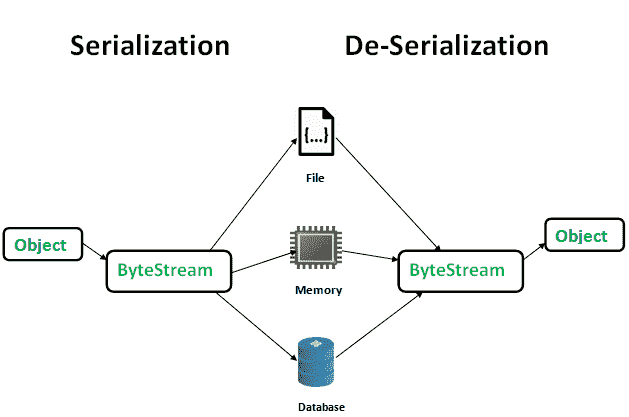
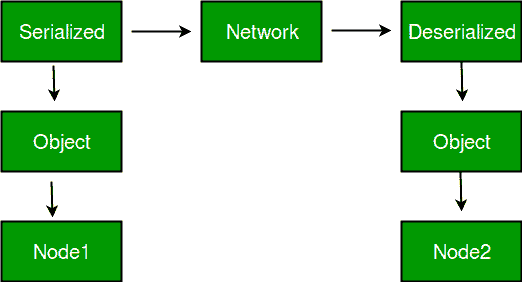
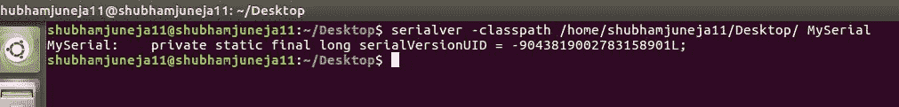

# Java 中的序列化和反序列化，示例

> 原文:[https://www.geeksforgeeks.org/serialization-in-java/](https://www.geeksforgeeks.org/serialization-in-java/)

序列化是一种将对象状态转换为字节流的机制。反序列化是相反的过程，字节流用于在内存中重新创建实际的 Java 对象。这种机制用于持久化对象。



创建的字节流与平台无关。因此，在一个平台上序列化的对象可以在另一个平台上反序列化。

为了使一个 Java 对象可序列化，我们实现了 **java.io.Serializable** 接口。
ObjectOutputStream 类包含用于序列化对象的 **writeObject()** 方法。

```
public final void writeObject(Object obj)
                       throws IOException
```

ObjectInputStream 类包含用于反序列化对象的 **readObject()** 方法。

```
public final Object readObject()
                  throws IOException,
               ClassNotFoundException

```

**系列化优势**
1。保存/保持对象的状态。
2。在网络中传输对象。



只有那些实现 **java.io.Serializable** 接口的类的对象才能被序列化。
Serializable 是一个**标记接口**(没有数据成员和方法)。它用于“标记”java 类，以便这些类的对象可以获得一定的能力。标记接口的其他例子有:-可克隆和远程。

**分记**
1。如果父类已经实现了 Serializable 接口，那么子类就不需要实现它，反之亦然。
2。只有非静态数据成员通过序列化过程保存。
3。静态数据成员和瞬态数据成员不会通过序列化过程保存。因此，如果您不想保存非静态数据成员的值，那么就让它成为瞬态的。
4。当对象被反序列化时，从不调用对象的构造函数。
5。关联的对象必须实现可序列化接口。
示例:

```
class A implements Serializable{

// B also implements Serializable
// interface.
B ob=new B();  
}

```

**序列化版本号**
序列化运行时将版本号与每个称为序列化版本号的可序列化类相关联，该类在反序列化期间用于验证序列化对象的发送方和接收方是否为该对象加载了与序列化兼容的类。如果接收方为对象加载的类的 UID 与相应发送方的类的 UID 不同，反序列化将导致**invaliddclassexception**。可序列化类可以通过声明字段名来显式声明自己的 UID。
必须是静态的，最终的，长型的。
即- ANY-ACCESS-MODIFIER 静态最终长 serialVersionUID = 42L

如果可序列化的类没有显式声明 serialVersionUID，那么序列化运行时将根据类的各个方面为该类计算一个缺省值，如 Java 对象序列化规范中所述。但是，强烈建议所有可序列化的类显式声明 serialVersionUID 值，因为它的计算对类细节高度敏感，这些细节可能因编译器实现而异，类中的任何更改或使用不同的 ID 都可能影响序列化数据。

还建议对 UID 使用私有修饰符，因为它作为继承成员没有用。

**连载**
连载是 JDK 自带的工具。用于获取 Java 类的 serialVersionUID 号。
可以运行以下命令获取 serialVersionUID

serial alvar[-class path][-show][class name ...]



**例 1:**

```
// Java code for serialization and deserialization 
// of a Java object
import java.io.*;

class Demo implements java.io.Serializable
{
    public int a;
    public String b;

    // Default constructor
    public Demo(int a, String b)
    {
        this.a = a;
        this.b = b;
    }

}

class Test
{
    public static void main(String[] args)
    {   
        Demo object = new Demo(1, "geeksforgeeks");
        String filename = "file.ser";

        // Serialization 
        try
        {   
            //Saving of object in a file
            FileOutputStream file = new FileOutputStream(filename);
            ObjectOutputStream out = new ObjectOutputStream(file);

            // Method for serialization of object
            out.writeObject(object);

            out.close();
            file.close();

            System.out.println("Object has been serialized");

        }

        catch(IOException ex)
        {
            System.out.println("IOException is caught");
        }

        Demo object1 = null;

        // Deserialization
        try
        {   
            // Reading the object from a file
            FileInputStream file = new FileInputStream(filename);
            ObjectInputStream in = new ObjectInputStream(file);

            // Method for deserialization of object
            object1 = (Demo)in.readObject();

            in.close();
            file.close();

            System.out.println("Object has been deserialized ");
            System.out.println("a = " + object1.a);
            System.out.println("b = " + object1.b);
        }

        catch(IOException ex)
        {
            System.out.println("IOException is caught");
        }

        catch(ClassNotFoundException ex)
        {
            System.out.println("ClassNotFoundException is caught");
        }

    }
}
```

输出:

```
Object has been serialized
Object has been deserialized 
a = 1
b = geeksforgeeks
```

**例 2:**

```
// Java code for serialization and deserialization 
// of a Java object
import java.io.*;

class Emp implements Serializable {
private static final long serialversionUID =
                                 129348938L;
    transient int a;
    static int b;
    String name;
    int age;

    // Default constructor
public Emp(String name, int age, int a, int b)
    {
        this.name = name;
        this.age = age;
        this.a = a;
        this.b = b;
    }

}

public class SerialExample {
public static void printdata(Emp object1)
    {

        System.out.println("name = " + object1.name);
        System.out.println("age = " + object1.age);
        System.out.println("a = " + object1.a);
        System.out.println("b = " + object1.b);
    }

public static void main(String[] args)
    {
        Emp object = new Emp("ab", 20, 2, 1000);
        String filename = "shubham.txt";

        // Serialization
        try {

            // Saving of object in a file
            FileOutputStream file = new FileOutputStream
                                           (filename);
            ObjectOutputStream out = new ObjectOutputStream
                                           (file);

            // Method for serialization of object
            out.writeObject(object);

            out.close();
            file.close();

            System.out.println("Object has been serialized\n"
                              + "Data before Deserialization.");
            printdata(object);

            // value of static variable changed
            object.b = 2000;
        }

        catch (IOException ex) {
            System.out.println("IOException is caught");
        }

        object = null;

        // Deserialization
        try {

            // Reading the object from a file
            FileInputStream file = new FileInputStream
                                         (filename);
            ObjectInputStream in = new ObjectInputStream
                                         (file);

            // Method for deserialization of object
            object = (Emp)in.readObject();

            in.close();
            file.close();
            System.out.println("Object has been deserialized\n"
                                + "Data after Deserialization.");
            printdata(object);

            // System.out.println("z = " + object1.z);
        }

        catch (IOException ex) {
            System.out.println("IOException is caught");
        }

        catch (ClassNotFoundException ex) {
            System.out.println("ClassNotFoundException" +
                                " is caught");
        }
    }
}
```

输出:

```
Object has been serialized
Data before Deserialization.
name = ab
age = 20
a = 2
b = 1000
Object has been deserialized
Data after Deserialization.
name = ab
age = 20
a = 0
b = 2000

```

输出描述:
在反序列化对象时，您已经看到 a 和 b 的值发生了变化。原因是 a 被标记为暂时的，b 是静态的。
对于**瞬态变量:-** 在序列化过程中，用瞬态关键字定义的变量不会被序列化。在反序列化过程中，将使用默认值初始化该变量。(例如:对于对象，它是 null，对于 int，它是 0)。
对于**静态变量:-** 在序列化过程中，用 static 关键字定义的变量不会被序列化。在反序列化过程中，将使用类中定义的当前值加载该变量。

本文由**迈哈克·纳朗和舒巴姆·朱尼加**供稿。如果你喜欢 GeeksforGeeks 并想投稿，你也可以使用[write.geeksforgeeks.org](https://write.geeksforgeeks.org)写一篇文章或者把你的文章邮寄到 review-team@geeksforgeeks.org。看到你的文章出现在极客博客主页上，帮助其他极客。

发现有不正确的地方请写评论，或者想分享更多以上讨论话题的信息。