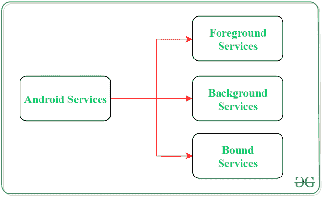
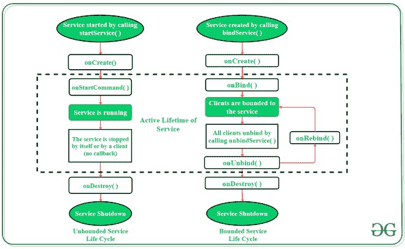

# 安卓中的服务，示例

> 原文:[https://www . geeksforgeeks . org/services-in-Android-with-example/](https://www.geeksforgeeks.org/services-in-android-with-example/)

[安卓](https://www.geeksforgeeks.org/introduction-to-android-development/)中的服务是一个特殊的组件，它便于应用程序在后台运行，以便执行长时间运行的操作任务。服务的主要目标是确保应用程序在后台保持活动状态，以便用户可以同时操作多个应用程序。安卓服务不需要用户界面，因为它被设计为在没有任何用户干预的情况下运行长时间的流程。即使应用程序关闭或用户切换到另一个应用程序，服务也可以在后台连续运行。此外，应用程序组件可以将自身绑定到服务，以执行 [**进程间通信(IPC)**](https://www.geeksforgeeks.org/inter-process-communication-ipc/) 。安卓服务和线程之间有一个很大的区别，不要混淆两者。线程是操作系统提供的一项功能，允许用户在后台执行操作。而服务是一个[安卓组件](https://www.geeksforgeeks.org/components-android-application/)，它执行一个长时间运行的操作，用户可能不知道，因为它没有用户界面。

### 安卓服务的类型



**1。前台服务:**

通知用户其正在进行的操作的服务称为前台服务。用户可以通过提供的关于正在进行的任务的通知与服务进行交互。例如在下载文件时，用户可以跟踪下载进度，也可以暂停和恢复该过程。

**2。后台服务:**

后台服务不需要任何用户干预。这些服务不会通知用户正在进行的后台任务，用户也无法访问它们。数据的计划同步或数据存储等过程都属于这项服务。

**3。绑定服务:**

这种类型的 android 服务允许应用程序的组件像活动一样与它绑定。只要有任何应用程序组件绑定到绑定服务，它就会执行任务。一次允许多个组件将自己与服务绑定。为了将应用程序组件与服务绑定**使用了 bindService()** 方法。

### 安卓服务的生命周期

在安卓系统中，服务有两种可能的路径来完成其生命周期，即 **Started 和有界**。

#### 1.已启动服务(无限服务):

通过遵循此路径，当应用程序组件调用 **startService()** 方法时，服务将启动。一旦启动，即使负责启动服务的组件被破坏，服务也可以在后台持续运行。有两个选项可以停止服务的执行:

*   通过调用 **stopService()** 方法，
*   服务可以使用 **stopSelf()** 方法自行停止。

#### 2.受限服务:

它可以被视为客户端-服务器界面中的服务器。通过遵循这个路径，android 应用程序组件可以向服务发送请求，并可以获取结果。当应用程序组件通过调用 **bindService()** 方法将自己与服务绑定时，服务被称为有界的。要停止此服务的执行，所有组件必须使用**解除绑定服务()**方法解除自身与服务的绑定。



> 要在后台执行下载任务，将调用 **startService()** 方法。然而，要获得关于下载进度的信息，并在应用程序仍处于后台时暂停或恢复该过程，**服务必须与能够执行这些任务的组件**绑定。

### 安卓服务基础

用户定义的服务可以通过扩展**类服务**的普通类来创建。此外，为了在应用程序上执行服务操作，有某些回调方法需要被**覆盖**。以下是 Android Services 的一些重要方法:

<figure class="table">

| 

方法

 | 

描述

 |
| --- | --- |
| onstart 命令() | 当组件(如:activity)请求使用 startService()启动服务时，Android 服务调用此方法。服务一旦启动，就可以使用 stopService()或 stopSelf()方法显式停止。 |
| 【onbind()】 | 这个方法在安卓服务中是强制实现的，每当应用组件调用 bindService()方法时就会被调用，以便用服务绑定自己。还提供了用户界面，通过返回一个 IBinder 对象来有效地与服务进行通信

。如果不需要绑定服务，那么该方法必须返回 null。 |
| onUnbind() | 当所有客户端与特定服务接口断开连接时，安卓系统调用此方法。 |
| onRebind() | 一旦所有客户端都与服务的特定接口断开连接并且有需要将服务与新客户端连接，系统调用此方法。 |
| onCreate() | 每当使用 onStartCommand()或 onBind()创建服务时，安卓系统都会调用此方法。该方法是执行一次性设置所必需的。 |
| onDestroy() | 当某个服务不再使用时，系统会在服务销毁前调用此方法作为最后的清理调用。服务必须实现这个方法，以便清理像注册的监听器、线程、接收器等资源。 |

</figure>

### 安卓服务示例

**在后台播放音乐是安卓**中非常常见的服务例子。从用户启动服务开始，即使用户切换到另一个应用程序，音乐也会在后台持续播放。用户必须明确停止服务才能暂停音乐。下面是这个 android 服务使用一些回调方法的完整分步实现。

> **注**:安卓 Studio 版本执行以下步骤

**第一步:创建新项目**

1.  单击文件，然后单击新建= >新建项目。
2.  选择空活动
3.  选择语言为 Java/Kotlin
4.  根据您的需要选择最小的软件开发工具包。

**第二步:修改 strings.xml 文件**

活动中使用的所有字符串都列在该文件中。

## 可扩展标记语言

```java
<resources>
    <string name="app_name">Services_In_Android</string>
    <string name="heading">Services In Android</string>
    <string name="startButtonText">Start the Service</string>
    <string name="stopButtonText">Stop the Service</string>
</resources>
```

**步骤 3:使用 activity_main.xml 文件**

打开 **activity_main.xml** 文件，在其中添加 2 个[按钮](https://www.geeksforgeeks.org/button-in-kotlin/)，启动和停止服务。以下是设计适当活动布局的代码。

## 可扩展标记语言

```java
<?xml version="1.0" encoding="utf-8"?>
<androidx.constraintlayout.widget.ConstraintLayout
    xmlns:android="http://schemas.android.com/apk/res/android"
    xmlns:app="http://schemas.android.com/apk/res-auto"
    xmlns:tools="http://schemas.android.com/tools"
    android:layout_width="match_parent"
    android:layout_height="match_parent"
    android:background="#168BC34A"
    tools:context=".MainActivity">

    <LinearLayout
        android:id="@+id/linearLayout"
        android:layout_width="match_parent"
        android:layout_height="wrap_content"
        android:layout_centerVertical="true"
        android:orientation="vertical"
        app:layout_constraintBottom_toBottomOf="parent"
        app:layout_constraintEnd_toEndOf="parent"
        app:layout_constraintStart_toStartOf="parent"
        app:layout_constraintTop_toTopOf="parent"
        app:layout_constraintVertical_bias="1.0"
        tools:ignore="MissingConstraints">

        <TextView
            android:id="@+id/textView1"
            android:layout_width="match_parent"
            android:layout_height="wrap_content"
            android:layout_marginBottom="170dp"
            android:fontFamily="@font/roboto"
            android:text="@string/heading"
            android:textAlignment="center"
            android:textAppearance="@style/TextAppearance.AppCompat.Large"
            android:textColor="@android:color/holo_green_dark"
            android:textSize="36sp"
            android:textStyle="bold" />

        <Button
            android:id="@+id/startButton"
            android:layout_width="match_parent"
            android:layout_height="match_parent"
            android:layout_marginStart="20dp"
            android:layout_marginTop="10dp"
            android:layout_marginEnd="20dp"
            android:layout_marginBottom="20dp"
            android:background="#4CAF50"
            android:fontFamily="@font/roboto"
            android:text="@string/startButtonText"
            android:textAlignment="center"
            android:textAppearance="@style/TextAppearance.AppCompat.Display1"
            android:textColor="#FFFFFF"
            android:textStyle="bold" />

        <Button
            android:id="@+id/stopButton"
            android:layout_width="match_parent"
            android:layout_height="match_parent"
            android:layout_marginStart="20dp"
            android:layout_marginTop="10dp"
            android:layout_marginEnd="20dp"
            android:layout_marginBottom="20dp"
            android:background="#4CAF50"
            android:fontFamily="@font/roboto"
            android:text="@string/stopButtonText"
            android:textAlignment="center"
            android:textAppearance="@style/TextAppearance.AppCompat.Display1"
            android:textColor="#FFFFFF"
            android:textStyle="bold" />

        <ImageView
            android:id="@+id/imageView"
            android:layout_width="match_parent"
            android:layout_height="wrap_content"
            android:layout_marginTop="80dp"
            app:srcCompat="@drawable/banner" />
    </LinearLayout>

</androidx.constraintlayout.widget.ConstraintLayout>
```

**第 4 步:创建定制服务类**

将在**主活动**类所在的同一目录中创建一个自定义服务类，该类将扩展**服务类**。回调方法用于启动和销毁服务。要播放音乐，使用**媒体播放器对象**。下面是执行这项任务的代码。

## Java 语言(一种计算机语言，尤用于创建网站)

```java
import android.app.Service;
import android.content.Intent;
import android.media.MediaPlayer;
import android.os.IBinder;
import android.provider.Settings;
import androidx.annotation.Nullable;

public class NewService extends Service {

    // declaring object of MediaPlayer
    private MediaPlayer player;

    @Override

    // execution of service will start
    // on calling this method
    public int onStartCommand(Intent intent, int flags, int startId) {

        // creating a media player which
        // will play the audio of Default
        // ringtone in android device
        player = MediaPlayer.create( this, Settings.System.DEFAULT_RINGTONE_URI );

        // providing the boolean
        // value as true to play
        // the audio on loop
        player.setLooping( true );

        // starting the process
        player.start();

        // returns the status
        // of the program
        return START_STICKY;
    }

    @Override

    // execution of the service will
    // stop on calling this method
    public void onDestroy() {
        super.onDestroy();

        // stopping the process
        player.stop();
    }

    @Nullable
    @Override
    public IBinder onBind(Intent intent) {
        return null;
    }
}
```

## 我的锅

```java
import android.app.Service
import android.content.Intent
import android.media.MediaPlayer
import android.os.IBinder
import android.provider.Settings

class NewService : Service() {

    // declaring object of MediaPlayer
    private lateinit var player:MediaPlayer

    // execution of service will start
    // on calling this method
    override fun onStartCommand(intent: Intent, flags: Int, startId: Int): Int {

        // creating a media player which
        // will play the audio of Default
        // ringtone in android device
        player = MediaPlayer.create(this, Settings.System.DEFAULT_RINGTONE_URI)

        // providing the boolean
        // value as true to play
        // the audio on loop
        player.setLooping(true)

        // starting the process
        player.start()

        // returns the status
        // of the program
        return START_STICKY
    }

    // execution of the service will
    // stop on calling this method
    override fun onDestroy() {
        super.onDestroy()

        // stopping the process
        player.stop()
    }

    override fun onBind(intent: Intent): IBinder? {
        return null
    }
}
```

**步骤 5:使用主活动文件**

现在，按钮对象将被声明，点击这些按钮时要执行的过程将在 MainActivity 类中定义。下面是实现这一步骤的代码。

## Java 语言(一种计算机语言，尤用于创建网站)

```java
import androidx.appcompat.app.AppCompatActivity;
import android.content.Intent;
import android.os.Bundle;
import android.view.View;
import android.widget.Button;

public class MainActivity extends AppCompatActivity implements View.OnClickListener {

    // declaring objects of Button class
    private Button start, stop;

    @Override
    protected void onCreate(Bundle savedInstanceState) {
        super.onCreate( savedInstanceState );
        setContentView( R.layout.activity_main );

        // assigning ID of startButton
        // to the object start
        start = (Button) findViewById( R.id.startButton );

        // assigning ID of stopButton
        // to the object stop
        stop = (Button) findViewById( R.id.stopButton );

        // declaring listeners for the
        // buttons to make them respond
        // correctly according to the process
        start.setOnClickListener( this );
        stop.setOnClickListener( this );
    }

    public void onClick(View view) {

        // process to be performed
        // if start button is clicked
        if(view == start){

            // starting the service
            startService(new Intent( this, NewService.class ) );
        }

        // process to be performed
        // if stop button is clicked
        else if (view == stop){

            // stopping the service
            stopService(new Intent( this, NewService.class ) );

        }
    }
}
```

## 我的锅

```java
import android.content.Intent
import android.os.Bundle
import android.view.View
import android.widget.Button
import androidx.appcompat.app.AppCompatActivity

class MainActivity : AppCompatActivity(), View.OnClickListener {

    // declaring objects of Button class
    private var start: Button? = null
    private var stop: Button? = null

    override fun onCreate(savedInstanceState: Bundle?) {
        super.onCreate(savedInstanceState)
        setContentView(R.layout.activity_main)

        // assigning ID of startButton
        // to the object start
        start = findViewById<View>(R.id.startButton) as Button

        // assigning ID of stopButton
        // to the object stop
        stop = findViewById<View>(R.id.stopButton) as Button

        // declaring listeners for the
        // buttons to make them respond
        // correctly according to the process
        start!!.setOnClickListener(this)
        stop!!.setOnClickListener(this)
    }

    override fun onClick(view: View) {

        // process to be performed
        // if start button is clicked
        if (view === start) {

            // starting the service
            startService(Intent(this, NewService::class.java))
        }

        // process to be performed
        // if stop button is clicked
        else if (view === stop) {

            // stopping the service
            stopService(Intent(this, NewService::class.java))
        }
    }
}
```

**第六步:修改 AndroidManifest.xml 文件**

为了在任何安卓设备上成功实现服务，有必要在 **AndroidManifest.xml** 文件中提到创建的服务。如果服务没有在此文件中提及，它就不可能执行任务。服务名称在**应用标签**中提及。

## 可扩展标记语言

```java
<?xml version="1.0" encoding="utf-8"?>
<manifest xmlns:android="http://schemas.android.com/apk/res/android"
    package="com.example.services_in_android">

    <application
        android:allowBackup="true"
        android:icon="@mipmap/ic_launcher"
        android:label="@string/app_name"
        android:roundIcon="@mipmap/ic_launcher_round"
        android:supportsRtl="true"
        android:theme="@style/AppTheme">
        <activity android:name=".MainActivity">
            <intent-filter>
                <action android:name="android.intent.action.MAIN" />
                <category android:name="android.intent.category.LAUNCHER" />
            </intent-filter>
        </activity>
        <meta-data
            android:name="preloaded_fonts"
            android:resource="@array/preloaded_fonts" />

        <!-- Mention the service name here -->
        <service android:name=".NewService"/>

    </application>

</manifest>
```

### 输出:在模拟器上运行

<video class="wp-video-shortcode" id="video-485848-1" width="640" height="360" preload="metadata" controls=""><source type="video/mp4" src="https://media.geeksforgeeks.org/wp-content/uploads/20200912115416/Recording-of-android-service-tutorial.mp4?_=1">[https://media.geeksforgeeks.org/wp-content/uploads/20200912115416/Recording-of-android-service-tutorial.mp4](https://media.geeksforgeeks.org/wp-content/uploads/20200912115416/Recording-of-android-service-tutorial.mp4)</video>