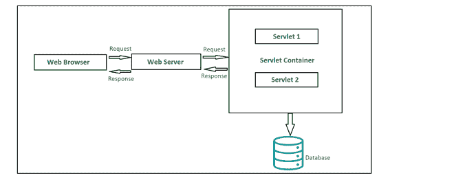

# Servlet 架构

> 原文:[https://www.geeksforgeeks.org/servlet-architecture/](https://www.geeksforgeeks.org/servlet-architecture/)

Servlets 分组在高级 Java 树下，用于创建动态 web 应用程序。Servlets 本质上是健壮的、*可伸缩的*，主要用于开发*服务器端应用程序*。如果我们回到过去，我们将能够见证在引入 servlets 之前，使用了 *CGI(公共网关接口)*。在 servlet 能够完成的几个本地任务中，动态执行客户端请求和响应是最常见的。servlet 可以有效完成的其他任务有:

*   可以轻松管理/控制应用程序流。
*   适合实现业务逻辑。
*   可以有效平衡服务器端的负载。
*   轻松生成动态网页内容。

谈到 servlets 的类型，主要有两种类型，即:

1.  通用 servlet
2.  http servlet

有三种可能的方法可以用来创建 servlet:

1.  实现 Servlet 接口
2.  扩展通用 Servlet
3.  扩展 HTTP Servlet

#### Servlet 架构的组件

下面是 servlet 的高层架构图。让我们简单地看看，每个组件如何增加 servlet 的工作。

Servlet 架构

**1。客户端**

上面的架构中显示的客户端主要是作为一个媒介工作的，它向 web 服务器发送 HTTP 请求，并再次处理从服务器返回的响应。如图所示，我们的客户端是网络浏览器。

**2。网络服务器**

web 服务器的主要工作是处理用户随时间发送的请求和响应，并维护 web 用户如何访问服务器上托管的文件。我们在这里讨论的服务器是一个软件，它管理对网络中集中资源或服务的访问。。有两种类型的网络服务器:

1.  静态网络服务器
2.  动态 web 服务器

**3。网页容器**

Web 容器是 servlet 体系结构中负责与 servlet 通信的另一个典型组件。web 容器的两个主要任务是:

*   管理 servlet 生命周期
*   网址映射

Web 容器位于服务器端，管理和处理来自 servlets、JSP 页面或任何其他文件系统的所有请求。

#### 一个 Servlet 请求是如何流动的？

每个 servlet 都应该覆盖以下 3 种方法，即:

1.  init()
2.  服务()
3.  销毁()

这些方法用于处理来自用户的请求。

下面是请求流过 servlet 的步骤，可以在体系结构图中看到:

*   客户端发送请求。
*   该请求被 web 服务器接受并转发到 web 容器。
*   为了获得 servlet 的地址，web 容器跟踪对应于请求 *URL 模式的 *web.xml* 文件。*
*   当上述过程发生时，servlet 应该已经被实例化和初始化了。如果 servlet 没有被实例化和初始化，调用 *init()* 方法来达到目的。
*   通过传递 *ServletRequest* 和*响应对象*， *public* *service()* 方法由容器调用。
*   在下一步中， *ServletRequest* 和 *ServletResponse* 对象通过*公共服务()*方法类型化为 *HttpServletRequest* 和 *HttpServletResponse* 对象。
*   现在*保护服务()*方法被*公共服务()*方法调用。
*   *受保护服务()*方法根据请求类型将请求分派给正确的处理程序方法。
*   当 servlet 容器关闭时，它卸载所有 servlet，并为每个初始化的 servlet 调用 *destroy()* 方法。

#### 优势

*   servlet 的主要功能是它们独立于服务器配置，并且与任何 web 服务器都兼容
*   Servlets 也是独立于协议的，支持 *FTP* 、 *HTTP* 、 *SMTP* 等。最充分的协议。
*   在手动销毁之前，servlets 可以保留在内存中，随着时间的推移帮助处理几个请求。此外，一旦建立了数据库连接，就可以在同一个数据库会话中处理多个数据库请求。
*   Servlets 继承了 Java 的可移植性，因此几乎可以兼容任何网络服务器。
*   Servlets 首先被转换成字节码，然后被执行，这有助于增加处理时间。

#### 不足之处

*   设计一个 servlet 可能相当费力。
*   设计 servlet 时需要处理异常，因为它们不是线程安全的。
*   开发人员可能需要额外的技能来编写 servlet。

正如我们已经知道的，Servlets 本质上是可移植的(与平台/服务器无关)，因此如果我们从其他脚本语言的角度来看，它是一个更好的选择。他们动态地处理请求和响应。每当我们开发一个需要与不同现有协议协调的 web 应用程序时，servlets 都比其他方法更受欢迎，因为它能够支持各种协议。最后，我们可以得出结论，在开发 web 应用程序时，使用 servlet 可能是最合适的。