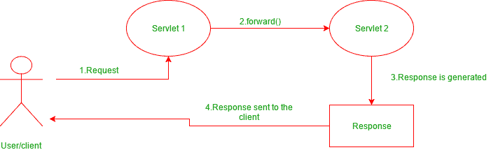
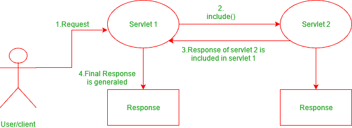
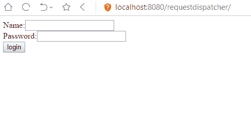
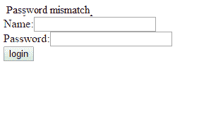
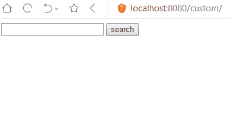

# 使用 RequestDispatcher 和 HttpServletResponse 进行 Java 中的 Servlet 协作

> 原文:[https://www . geeksforgeeks . org/servlet-collaboration-Java-using-request dispatcher-httpservletresponse/](https://www.geeksforgeeks.org/servlet-collaboration-java-using-requestdispatcher-httpservletresponse/)

**什么是 Servlet 协作？**

特定 Java web 应用程序的 Servlet 之间的信息交换被称为 **Servlet 协作**。这使得能够通过方法调用将信息从一个 servlet 传递/共享到另一个 servlet。

**Java 提供的实现 Servlet 协作的主要方式有哪些？**
servlet API 提供了两个接口，即:

1.  javax . servlet . RequestDispatcher
2.  javax . servlet . http . HttpServletresponse

这两个接口包括负责实现 servlets 之间信息共享目标的方法。

**使用请求调度程序界面**

RequestDispatcher 接口提供了将客户端请求分派到另一个 web 资源的选项，该资源可以是一个 HTML 页面、另一个 servlet、JSP 等。它提供了以下两种方法:

*   **public void forward(servlet request，ServletResponse response)抛出 ServletException，Java . io . ioexception:**
    forward()方法用于将客户端请求转移到另一个资源(HTML 文件、servlet、jsp 等)。当调用此方法时，控件被转移到下一个被调用的资源。另一方面，include()方法用于将调用文件的内容包含到被调用文件中。调用此方法后，控件保留在调用资源中，但处理后的输出包含在被调用资源中。
    下图说明了它的工作方式:



*   **public void include(servlet request，ServletResponse response)抛出 ServletException，Java . io . ioexception:**
    include()方法用于将调用资源的内容包含到被调用资源中。当调用此方法时，控件仍保留在调用资源中。它只是将调用资源的已处理输出包含到被调用资源中。
    下图说明了它的工作原理:



*   **使用 RequestDispatcher 进行 Servlet 协作的示例**
    以下示例说明如何使用 RequestDispatcher 界面实现 Servlet 协作:
    **index.html**

## 超文本标记语言

```java
<html>
<head>
<body>
<form action="login" method="post"> 
Name:<input type="text" name="userName"/><br/> 
Password:<input type="password" name="userPass"/><br/> 
<input type="submit" value="login"/> 
</form> 
</body>
</html>
```

*   **Login.java**

## Java 语言(一种计算机语言，尤用于创建网站)

```java
// First java servlet that calls another resource
import java.io.*;
import javax.servlet.*;
import javax.servlet.http.*;

public class Login extends HttpServlet {

    public void doPost(HttpServletRequest req,
                       HttpServletResponse res)
throws ServletException, IOException
    {
        // The method to receive client requests
        // which are sent using 'post'

        res.setContentType("text/html");
        PrintWriter out = response.getWriter();

        // fetches username
        String n = request.getParameter("userName");

        // fetches password
        String p = request.getParameter("userPass");
    if(p.equals("Thanos"){
            RequestDispatcher rd = request.getRequestDispatcher("servlet2");
            // Getting RequestDispatcher object
            // for collaborating with servlet2

            // forwarding the request to servlet2
            rd.forward(request, response);
    } 
    else{
            out.print("Password mismatch");
            RequestDispatcher rd = request.getRequestDispatcher("/index.html");

        rd.include(request, response); 

        } 
    } 

} 
```

*   **Welcome.java**

## Java 语言(一种计算机语言，尤用于创建网站)

```java
// Called servlet in case password matches
import java.io.*;
import javax.servlet.*;
import javax.servlet.http.*;

public class Welcome extends HttpServlet {

    public void doPost(HttpServletRequest request,
                       HttpServletResponse response)
        throws ServletException, IOException
    {

        response.setContentType("text/html");
        PrintWriter out = response.getWriter();

        // fetches username
        String n = request.getParameter("userName");

        // prints the message
        out.print("Welcome " + n);
    }
}
```

*   **web.xml**

## 超文本标记语言

```java
<web-app> 
 <servlet> 
    <servlet-name>Login</servlet-name> 
    <servlet-class>Login</servlet-class> 
  </servlet> 
  <servlet> 
    <servlet-name>WelcomeServlet</servlet-name> 
    <servlet-class>Welcome</servlet-class> 
  </servlet> 

  <servlet-mapping> 
    <servlet-name>Login</servlet-name> 
    <url-pattern>/servlet1</url-pattern> 
  </servlet-mapping> 
  <servlet-mapping> 
    <servlet-name>WelcomeServlet</servlet-name> 
    <url-pattern>/servlet2</url-pattern> 
  </servlet-mapping> 

  <welcome-file-list> 
   <welcome-file>index.html</welcome-file> 
  </welcome-file-list> 
</web-app> 
```

**输出**:

*   **index.html**



*   **如果密码匹配:**


*   **如果密码不匹配:**



**使用 HttpServletResponse 接口**

*   HttpServletResponse 接口负责管理 Http 响应。为了实现 servlet 协作，它使用了以下方法:

```java
public void sendRedirect(String URL)throws IOException;  
```

*   此方法用于将响应重定向到另一个资源，可能是 servlet、jsp 或 html 文件。它接受的参数是一个网址，可以是绝对的，也可以是相对的。它在客户端工作，并使用浏览器的网址栏发出请求。

**使用发送重定向()进行重定向的示例**

*   下面这个使用 servlet 创建的 web 应用程序的例子获取了写在网页文本字段中的文本，并将其指向 servlet。然后 servlet 将其重定向到谷歌，谷歌根据所写的文本生成搜索结果。
    **index.html**

## 超文本标记语言

```java
<html>
<head>
<body>
<form action="search" method="GET">
<input type="text" name="name">
<input type="submit" value="search">
</form>
</body>
</html>
```

## Java 语言(一种计算机语言，尤用于创建网站)

```java
// Servlet class to redirect the text keyword
// in the 'name' field to google.com
// using sendRedirect()
import java.io.IOException;
import javax.servlet.ServletException;
import javax.servlet.http.HttpServlet;
import javax.servlet.http.HttpServletRequest;
import javax.servlet.http.HttpServletResponse;

public class MySearcher extends HttpServlet {
    protected void doGet(HttpServletRequest
                             request,
                         HttpServletResponse response)
        throws ServletException, IOException
    {

        String name = request.getParameter("name");
        response.sendRedirect("https://www.google.co.in/#q=" + name);
        // response redirected to google.com
    }
}
```

*   **web.xml**

## 超文本标记语言

```java
<web-app>
<servlet>
<servlet-name>MySearcher</servlet-name>
<servlet-class>MySearcher</servlet-class>
</servlet>

<servlet-mapping>
<servlet-name>MySearcher</servlet-name>
<url-pattern>/search</url-pattern>
</servlet-mapping>

<welcome-file-list> 
   <welcome-file>index.html</welcome-file> 
  </welcome-file-list> 
</web-app> 
```

**输出:**

*   **index.html**



*   **搜索结果**


**requestispatcher 的 forward()方法和 HttpServletResponse 的 sendRedirect()有什么区别？**

*   虽然这两种方法看起来是一样的，但两者之间还是有区别的，具体如下:

<figure class="table">

| **前进()** | **发送重定向()** |
| 它在服务器端工作 | 它在客户端工作 |
| 它向另一个资源发送相同的请求和响应对象。 | 它总是发送新的请求 |
| 它只在服务器中工作。 | 它可以在服务器内部和外部使用。 |

</figure>