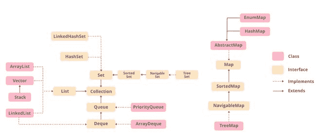

# 用 Java 设定

> 原文:[https://www.geeksforgeeks.org/set-in-java/](https://www.geeksforgeeks.org/set-in-java/)

设置接口存在于 [java.util](https://www.geeksforgeeks.org/java-util-package-java/) 包中，扩展了[集合接口](https://www.geeksforgeeks.org/collections-in-java-2/)是一个无序的对象集合，其中不能存储重复的值。这是一个实现数学集合的接口。此接口包含从集合接口继承的方法，并添加了限制重复元素插入的功能。有两个扩展集合实现的接口，即[排序集合](https://www.geeksforgeeks.org/sortedset-java-examples/)和[导航集合](https://www.geeksforgeeks.org/navigableset-java-examples/)。


在上图中，可导航集扩展了排序集界面。由于集合不保留插入顺序，可导航的集合接口提供了在集合中导航的实现。实现可导航集的类是 TreeSet，它是一个自平衡树的实现。因此，这个界面为我们提供了一种在这个树中导航的方法。

**声明:**设置界面声明为:

```
public interface Set extends Collection 
```

**创建集合对象**

由于 Set 是一个[接口](https://www.geeksforgeeks.org/interfaces-in-java/)，因此不能在排版中创建对象。我们总是需要一个扩展这个列表的类来创建一个对象。此外，在 Java 1.5 中引入[泛型](https://www.geeksforgeeks.org/generics-in-java/)后，可以限制可以存储在集合中的对象类型。这种类型安全集合可以定义为:

```
// Obj is the type of the object to be stored in Set 
Set<Obj> set = new HashSet<Obj> (); 
```

让我们以表格形式讨论下面提供的集合界面中的方法，如下所示:

<figure class="table">

| way | describe |
| --- | --- |
| [Add (element)](https://www.geeksforgeeks.org/set-add-method-in-java-with-examples/) | This method is used to add a specific element to the collection. The function will only add elements when there are no specified elements in the collection, otherwise, if there are already elements in the collection, the function will return False. |
| [Add all (sets)](https://www.geeksforgeeks.org/set-addall-method-in-java-with-examples/) | This method is used to append all the elements in the above collection to the existing collection. Elements are added randomly, without following any particular order. |
| [晴()](https://www.geeksforgeeks.org/set-clear-method-in-java-with-examples/) | This method is used to remove all elements from the collection without deleting the collection. The reference to the collection still exists. |
| [contains (elements)](https://www.geeksforgeeks.org/set-contains-method-in-java-with-examples/) | This method is used to check whether a specific element exists in the collection. |
| [包含所有(集合)](https://www.geeksforgeeks.org/set-containsall-method-in-java-with-examples/) | This method is used to check whether a collection contains all the elements that exist in a given collection. This method returns true if the collection contains all elements, or false if any elements are missing. |
| [hashCode()](https://www.geeksforgeeks.org/set-hashcode-method-in-java-with-examples/) | This method is used to get the hashCode value of this collection instance. It returns an integer value, which is the hash value of this collection instance. |
| isEmpty() | This method is used to check whether the collection is empty. |
| [Iterator ()](https://www.geeksforgeeks.org/set-iterator-method-in-java-with-examples/) | This method is used to return the [iterator](https://www.geeksforgeeks.org/iterators-in-java/) of the collection. The elements in the collection are returned in random order. |
| [Remove (element)](https://www.geeksforgeeks.org/set-remove-method-in-java-with-examples/) | This method is used to remove the given element from the collection. This method returns true if the specified element exists in the collection, otherwise it returns false. |
| [移除所有(集合)](https://www.geeksforgeeks.org/set-removeall-method-in-java-with-examples/) | This method is used to remove all elements existing in the collection from the collection. This method returns true if this collection changes due to the call. |
| [保留全部(集合)](https://www.geeksforgeeks.org/set-retainall-method-in-java-with-example/) | This method is used to retain all elements mentioned in a given collection in a collection. This method returns true if this collection changes due to the call. |
| [Size ()](https://www.geeksforgeeks.org/set-size-method-in-java-with-example/) | This method is used to get the size of the collection. This will return an integer value representing the number of elements. |
| [到数组()](https://www.geeksforgeeks.org/set-toarray-method-in-java-with-example/) | This method is used to form an array of the same elements as Set. |

</figure>

**图解:**图解设置界面的示例程序

## Java 语言(一种计算机语言，尤用于创建网站)

```
// Java program Illustrating Set Interface

// Importing utility classes
import java.util.*;

// Main class
public class GFG {

    // Main driver method
    public static void main(String[] args)
    {
        // Demonstrating Set using HashSet
        // Declaring object of type String
        Set<String> hash_Set = new HashSet<String>();

        // Adding elements to the Set
        // using add() method
        hash_Set.add("Geeks");
        hash_Set.add("For");
        hash_Set.add("Geeks");
        hash_Set.add("Example");
        hash_Set.add("Set");

        // Printing elements of HashSet object
        System.out.println(hash_Set);
    }
}
```

**Output**

```
[Set, Example, Geeks, For]
```

**设置界面上的操作**

器械包界面允许用户对器械包进行基本的数学运算。让我们用两个数组来理解这些基本操作。设 set1 = [1，3，2，4，8，9，0]和 set2 = [1，3，7，5，4，0，7，5]。那么对集合的可能操作是:

**1。交集:**该操作返回给定两个集合中的所有公共元素。对于以上两个集合，交集将是:

```
Intersection = [0, 1, 3, 4] 
```

**2。联合:**此操作将一个集合中的所有元素与另一个集合相加。对于以上两个集合，联合将是:

```
Union = [0, 1, 2, 3, 4, 5, 7, 8, 9] 
```

**3。差异:**此操作从另一个集合中移除一个集合中存在的所有值。对于以上两组，区别在于:

```
Difference = [2, 8, 9]
```

现在让我们实现上面定义的如下操作:

**示例:**

## Java 语言(一种计算机语言，尤用于创建网站)

```
// Java Program Demonstrating Operations on the Set
// such as Union, Intersection and Difference operations

// Importing all utility classes
import java.util.*;

// Main class
public class SetExample {

    // Main driver method
    public static void main(String args[])
    {
        // Creating an object of Set class
        // Declaring object of Integer type
        Set<Integer> a = new HashSet<Integer>();

        // Adding all elements to List
        a.addAll(Arrays.asList(
            new Integer[] { 1, 3, 2, 4, 8, 9, 0 }));

      // Again declaring object of Set class
      // with reference to HashSet
        Set<Integer> b = new HashSet<Integer>();

      b.addAll(Arrays.asList(
            new Integer[] { 1, 3, 7, 5, 4, 0, 7, 5 }));

        // To find union
        Set<Integer> union = new HashSet<Integer>(a);
        union.addAll(b);
        System.out.print("Union of the two Set");
        System.out.println(union);

        // To find intersection
        Set<Integer> intersection = new HashSet<Integer>(a);
        intersection.retainAll(b);
        System.out.print("Intersection of the two Set");
        System.out.println(intersection);

        // To find the symmetric difference
        Set<Integer> difference = new HashSet<Integer>(a);
        difference.removeAll(b);
        System.out.print("Difference of the two Set");
        System.out.println(difference);
    }
}
```

**Output**

```
Union of the two Set[0, 1, 2, 3, 4, 5, 7, 8, 9]
Intersection of the two Set[0, 1, 3, 4]
Difference of the two Set[2, 8, 9]
```

## 对排序集执行各种操作

在 Java 1.5 中引入[泛型](https://www.geeksforgeeks.org/generics-in-java/)后，可以限制集合中可以存储的对象类型。因为 Set 是一个接口，所以它只能与实现该接口的类一起使用。HashSet 是实现 Set 接口的广泛使用的类之一。现在，让我们看看如何在 HashSet 上执行一些常用的操作。我们将执行以下操作:

1.  添加元素
2.  访问元素
3.  移除元素
4.  迭代元素
5.  遍历集合

现在让我们单独讨论这些操作，如下所示:

**操作 1:** 添加元素

为了给集合添加一个元素，我们可以使用 [add()方法](https://www.geeksforgeeks.org/set-add-method-in-java-with-examples/)。但是，插入顺序不会保留在集合中。在内部，对于每个元素，都会生成一个哈希值，并根据生成的哈希值存储这些值。这些值按升序进行比较和排序。我们需要注意，重复的元素是不允许的，所有重复的元素都会被忽略。此外，集合接受空值。

**例**

## Java 语言(一种计算机语言，尤用于创建网站)

```
// Java Program Demonstrating Working of Set by
// Adding elements using add() method

// Importing all utility classes
import java.util.*;

// Main class
class GFG {

    // Main driver method
    public static void main(String[] args)
    {
        // Creating an object of Set and
        // declaring object of type String
        Set<String> hs = new HashSet<String>();

        // Adding elements to above object
        // using add() method
        hs.add("B");
        hs.add("B");
        hs.add("C");
        hs.add("A");

        // Printing the elements inside the Set object
        System.out.println(hs);
    }
}
```

**Output**

```
[A, B, C]
```

**操作 2:** 访问元素

在添加元素之后，如果我们希望访问元素，我们可以使用像[包含()](https://www.geeksforgeeks.org/set-contains-method-in-java-with-examples/)这样的内置方法。

**例**

## Java 语言(一种计算机语言，尤用于创建网站)

```
// Java code to demonstrate Working of Set by
// Accessing the Elements og the Set object

// Importing all utility classes
import java.util.*;

// Main class
class GFG {

    // Main driver method
    public static void main(String[] args)
    {
        // Creating an object of Set and
        // declaring object of type String
        Set<String> hs = new HashSet<String>();

        // Elements are added using add() method
        // Later onwards we wil show accessing the same

        // Custom input elements
        hs.add("A");
        hs.add("B");
        hs.add("C");
        hs.add("A");

        // Print the Set object elements
        System.out.println("Set is " + hs);

        // Declaring a string
        String check = "D";

        // Check if the above string exists in
        // the SortedSet or not
        // using contains() method
        System.out.println("Contains " + check + " "
                           + hs.contains(check));
    }
}
```

**Output**

```
Set is [A, B, C]
Contains D false
```

**操作 3:** 移除值

可以使用[移除()方法](https://www.geeksforgeeks.org/set-remove-method-in-java-with-examples/)从集合中移除这些值。

**例**

## Java 语言(一种计算机语言，尤用于创建网站)

```
// Java Program Demonstrating Working of Set by
// Removing Element/s from the Set

// Importing all utility classes
import java.util.*;

// Main class
class GFG {

    // Main driver method
    public static void main(String[] args)
    {
        // Declaring object of Set of type String
        Set<String> hs = new HashSet<String>();

        // Elements are added
        // using add() method

        // Custom input elements
        hs.add("A");
        hs.add("B");
        hs.add("C");
        hs.add("B");
        hs.add("D");
        hs.add("E");

        // Printing initial Set elements
        System.out.println("Initial HashSet " + hs);

        // Removing custom element
        // using remove() method
        hs.remove("B");

        // Printing Set elements after removing an element
        // and printing updated Set elements
        System.out.println("After removing element " + hs);
    }
}
```

**Output**

```
Initial HashSet [A, B, C, D, E]
After removing element [A, C, D, E]
```

**操作 4:** 遍历集合

有多种方法可以遍历集合。最著名的是使用增强的 for 循环。

**例**

## Java 语言(一种计算机语言，尤用于创建网站)

```
// Java Program to Demonstrate Working of Set by
// Iterating through the Elements

// Importing utility classes
import java.util.*;

// Main class
class GFG {

    // Main driver method
    public static void main(String[] args)
    {
        // Creating object of Set and declaring String type
        Set<String> hs = new HashSet<String>();

        // Adding elements to Set 
        // using add() method

        // Custom input elements
        hs.add("A");
        hs.add("B");
        hs.add("C");
        hs.add("B");
        hs.add("D");
        hs.add("E");

        // Iterating through the Set
        // via for-each loop
        for (String value : hs)

            // Printing all the values inside the object
            System.out.print(value + ", ");

        System.out.println();
    }
}
```

**Output**

```
A, B, C, D, E, 
```

> 在 Java Collections 中实现 Set 接口的类可以很容易地从下图中看到，如下所示:
> 
> *   哈希集
> *   enumset 集
> *   LinkedHashSet
> *   TreeSet(树集)



**1 级:**[**HashSet**](https://www.geeksforgeeks.org/hashset-in-java/)

**在[集合框架](https://www.geeksforgeeks.org/collections-in-java-2/)中实现的 HashSet 类是[哈希表](https://www.geeksforgeeks.org/data-structure-gq/hash-gq/)数据结构的固有实现。我们插入到 HashSet 中的对象不能保证以相同的顺序插入。这些对象是根据它们的 hashcode 插入的。这个类还允许插入空元素。让我们看看如何使用这个类创建一个 set 对象。**

****例****

## **Java 语言(一种计算机语言，尤用于创建网站)**

```
// Java program Demonstrating Creation of Set object
// Using the Hashset class

// Importing utility classes
import java.util.*;

// Main class
class GFG {

    // Main driver method
    public static void main(String[] args)
    {
        // Creating object of Set of type String
        Set<String> h = new HashSet<String>();

        // Adding elements into the HashSet
        // using add() method

        // Custom input elements
        h.add("India");
        h.add("Australia");
        h.add("South Africa");

        // Adding the duplicate element
        h.add("India");

        // Displaying the HashSet
        System.out.println(h);

        // Removing items from HashSet
        // using remove() method
        h.remove("Australia");
        System.out.println("Set after removing "
                           + "Australia:" + h);

        // Iterating over hash set items
        System.out.println("Iterating over set:");

        // Iterating through iterators
        Iterator<String> i = h.iterator();

        // It holds true till there is a single element
        // remaining in the object
        while (i.hasNext())

            System.out.println(i.next());
    }
}
```

****Output**

```
[South Africa, Australia, India]
Set after removing Australia:[South Africa, India]
Iterating over set:
South Africa
India
```** 

****2 级:** [**埃努姆塞特**](https://www.geeksforgeeks.org/enumset-class-java/)**

**在[集合框架](https://www.geeksforgeeks.org/collections-in-java-2/)中实现的枚举类是与[枚举类型](https://www.geeksforgeeks.org/enum-in-java/)一起使用的集合接口的专用实现之一。它是一个高性能的集合实现，比 HashSet 快得多。枚举集中的所有元素必须来自单个枚举类型，该枚举类型是在显式或隐式创建集合时指定的。让我们看看如何使用这个类创建一个 set 对象。**

****例****

## **Java 语言(一种计算机语言，尤用于创建网站)**

```
// Java program to demonstrate the
// creation of the set object
// using the EnumSet class
import java.util.*;

enum Gfg { CODE, LEARN, CONTRIBUTE, QUIZ, MCQ }
;

public class GFG {

    public static void main(String[] args)
    {
        // Creating a set
        Set<Gfg> set1;

        // Adding the elements
        set1 = EnumSet.of(Gfg.QUIZ, Gfg.CONTRIBUTE,
                          Gfg.LEARN, Gfg.CODE);

        System.out.println("Set 1: " + set1);
    }
}
```

****Output**

```
Set 1: [CODE, LEARN, CONTRIBUTE, QUIZ]
```** 

****3 级:** [LinkedHashSet](https://www.geeksforgeeks.org/linkedhashset-in-java-with-examples/)**

**在[集合框架](https://www.geeksforgeeks.org/collections-in-java-2/)中实现的 LinkedHashSet 类是 HashSet 的有序版本，它在所有元素中维护一个[双链表](https://www.geeksforgeeks.org/doubly-linked-list/)。当需要维护迭代顺序时，使用这个类。当遍历 HashSet 时，顺序是不可预测的，而 LinkedHashSet 让我们按照元素插入的顺序遍历元素。让我们看看如何使用这个类创建一个 set 对象。**

****例****

## **Java 语言(一种计算机语言，尤用于创建网站)**

```
// Java program to demonstrate the
// creation of Set object using
// the LinkedHashset class
import java.util.*;

class GFG {

    public static void main(String[] args)
    {
        Set<String> lh = new LinkedHashSet<String>();

        // Adding elements into the LinkedHashSet
        // using add()
        lh.add("India");
        lh.add("Australia");
        lh.add("South Africa");

        // Adding the duplicate
        // element
        lh.add("India");

        // Displaying the LinkedHashSet
        System.out.println(lh);

        // Removing items from LinkedHashSet
        // using remove()
        lh.remove("Australia");
        System.out.println("Set after removing "
                           + "Australia:" + lh);

        // Iterating over linked hash set items
        System.out.println("Iterating over set:");
        Iterator<String> i = lh.iterator();
        while (i.hasNext())
            System.out.println(i.next());
    }
}
```

****Output**

```
[India, Australia, South Africa]
Set after removing Australia:[India, South Africa]
Iterating over set:
India
South Africa
```** 

****4 级:** [**树集**](https://www.geeksforgeeks.org/treeset-in-java/)**

**在[集合框架](https://www.geeksforgeeks.org/collections-in-java-2/)中实现的 TreeSet 类以及[排序集接口](https://www.geeksforgeeks.org/sortedset-java-examples/)和排序集扩展集接口的实现。它的行为就像一个简单的集合，只是它以排序的格式存储元素。TreeSet 使用树形数据结构进行存储。对象以排序的升序存储。但是我们可以使用方法 TreeSet.descendingIterator()以降序进行迭代。让我们看看如何使用这个类创建一个 set 对象。**

****例****

## **Java 语言(一种计算机语言，尤用于创建网站)**

```
// Java Program Demonstrating Creation of Set object
// Using the TreeSet class

// Importing utility classes
import java.util.*;

// Main class
class GFG {

    // Main driver method
    public static void main(String[] args)
    {
        // Creating a Set object and declaring it of String
        // type
        // with reference to TreeSet
        Set<String> ts = new TreeSet<String>();

        // Adding elements into the TreeSet
        // using add()
        ts.add("India");
        ts.add("Australia");
        ts.add("South Africa");

        // Adding the duplicate
        // element
        ts.add("India");

        // Displaying the TreeSet
        System.out.println(ts);

        // Removing items from TreeSet
        // using remove()
        ts.remove("Australia");
        System.out.println("Set after removing "
                           + "Australia:" + ts);

        // Iterating over Tree set items
        System.out.println("Iterating over set:");
        Iterator<String> i = ts.iterator();

        while (i.hasNext())
            System.out.println(i.next());
    }
}
```

****Output**

```
[Australia, India, South Africa]
Set after removing Australia:[India, South Africa]
Iterating over set:
India
South Africa
```**