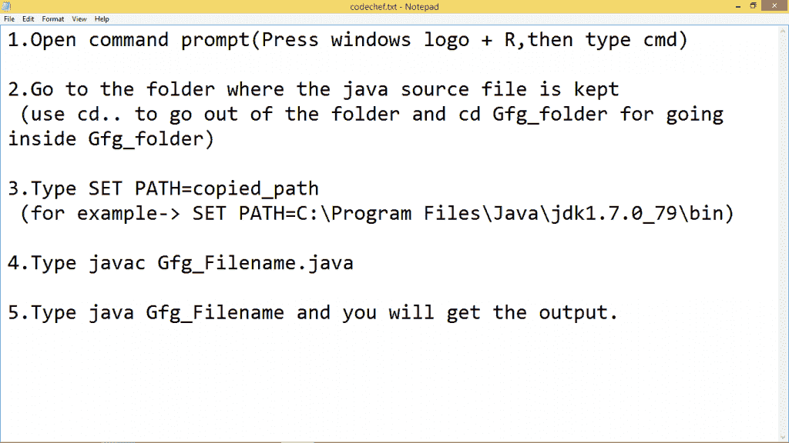
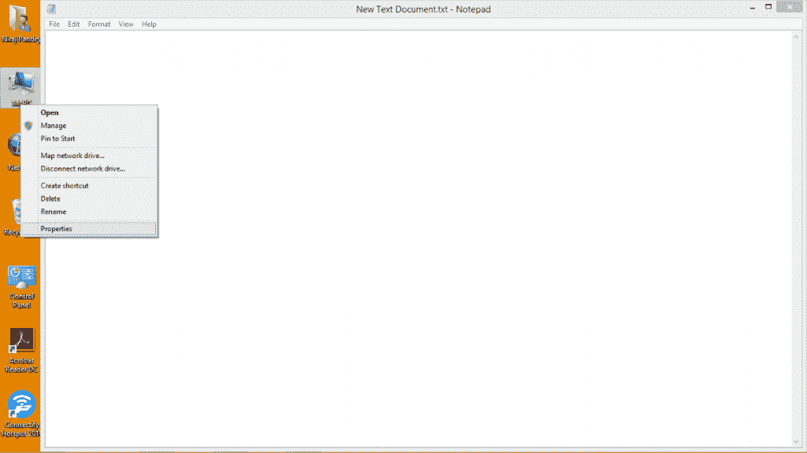
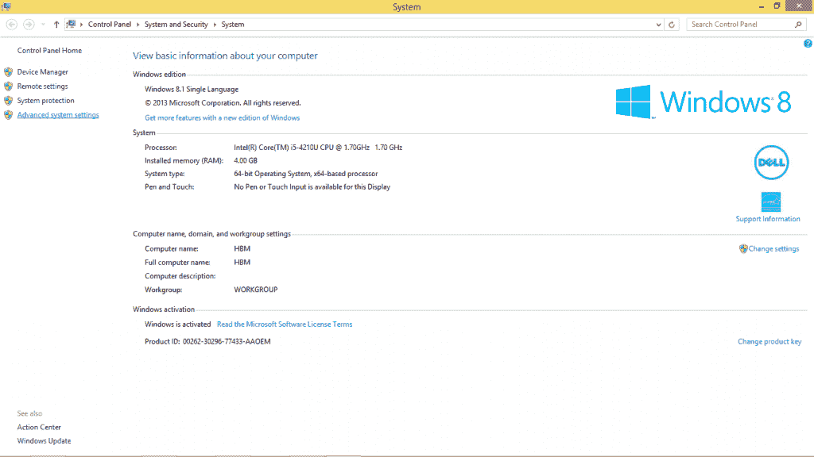
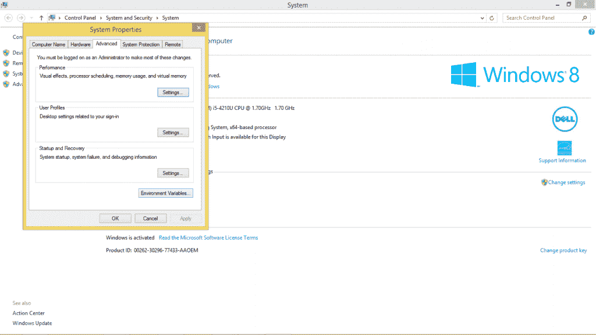
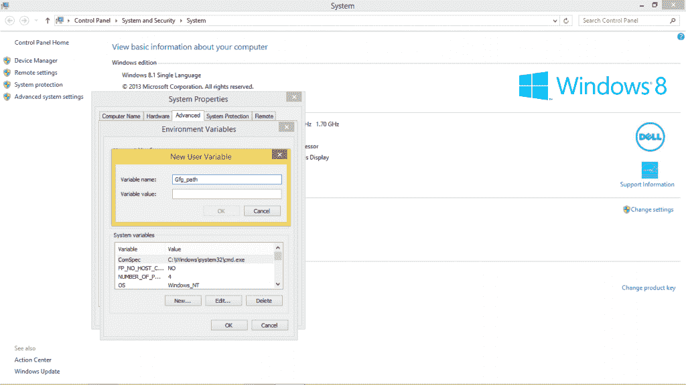
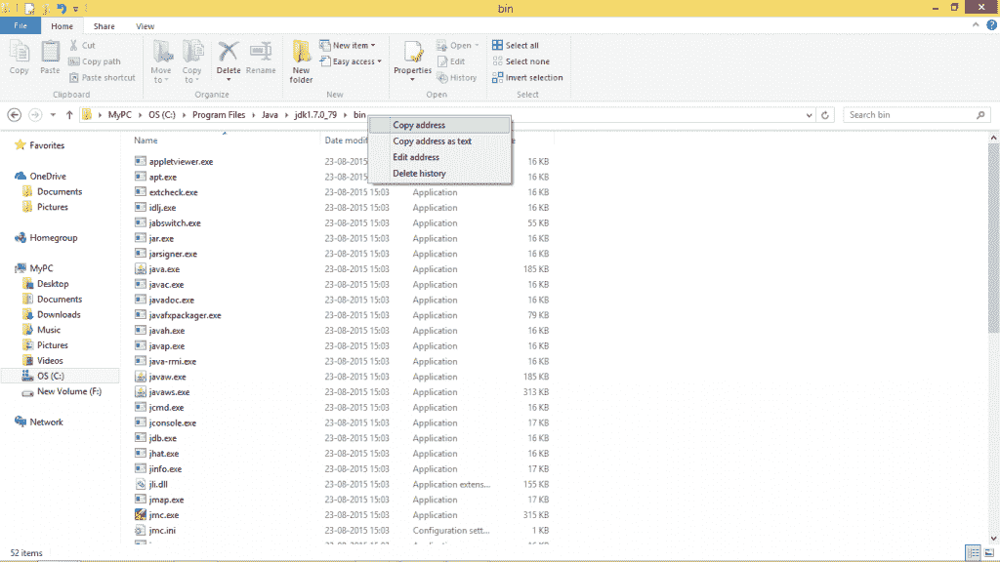
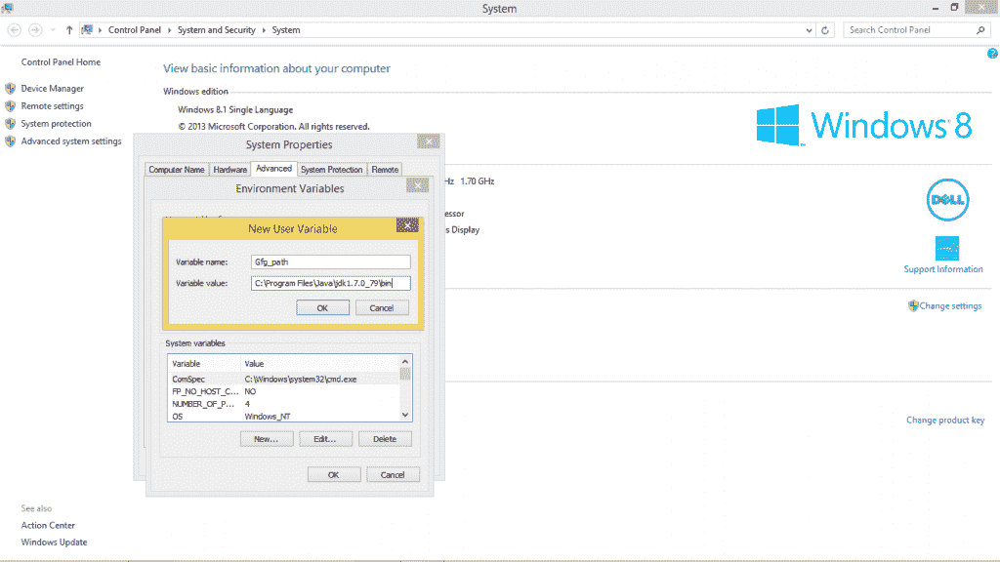
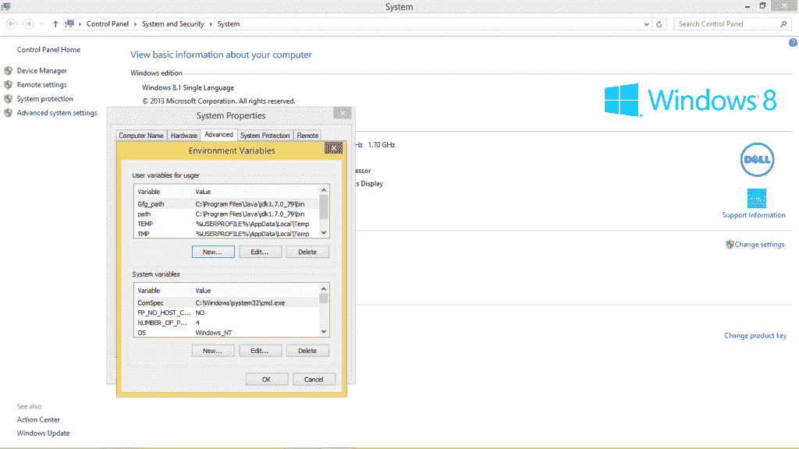
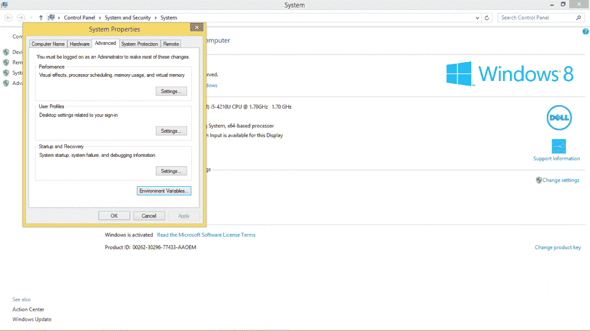

# 如何在 Java 中设置临时路径和永久路径

> 原文:[https://www . geesforgeks . org/set-暂存-永久-路径-java/](https://www.geeksforgeeks.org/set-temporary-permanent-paths-java/)

如果 [Java](https://www.geeksforgeeks.org/java/) 源文件在 jdk/bin 文件夹内，则不需要设置路径，因为像 javac、Java 这样的工具在当前文件夹内。
但是如果 java 源文件在 jdk/bin 文件夹之外，则需要设置路径才能执行 java 源文件。
设置 java 路径有两种方式:

1.  暂时的
2.  永久的

1.  **Setting Temporary Java Path:**

    要设置临时 java 路径:

    *   打开命令提示符
    *   复制 jdk/bin 目录的路径
    *   在命令提示符下写入:SET PATH = copy _ PATH

    **例如:**

    ```java
    SET PATH=C:\Program Files\Java\jdk1.7.0_79\bin
    ```

    

2.  **Setting Permanent Java Path:**

    要设置永久 java 路径:

    1.  **Go to MyPC properties**

        

    2.  **Click on Advanced system settings**

        

    3.  **Click on Environment Variables**

        

    4.  **Click on New tab of User variables**

        

    5.  **Assign value Gfg_path to Variable name:**

        

    6.  **Copy the path of bin folder**

        

    7.  **Paste path of bin folder in Variable value:**

        

    8.  **Click on OK button**

        

    9.  **Click on OK button**

        

        ```java
        In this way Temporary and Permanent Path for Java can be set in Windows.
        ```