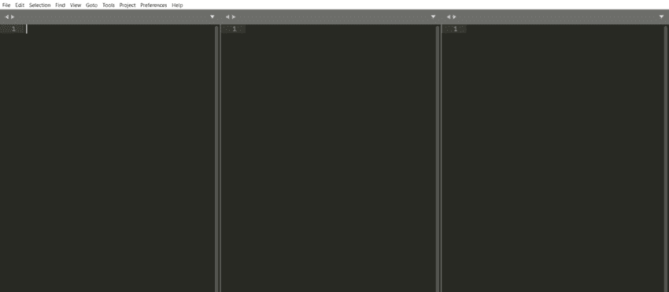
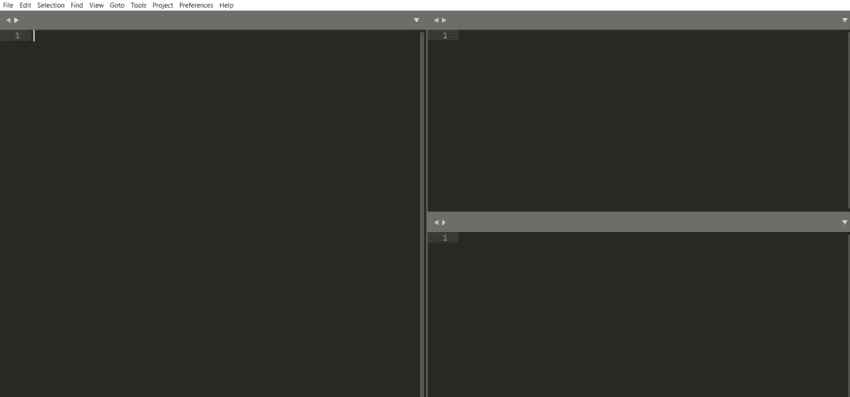
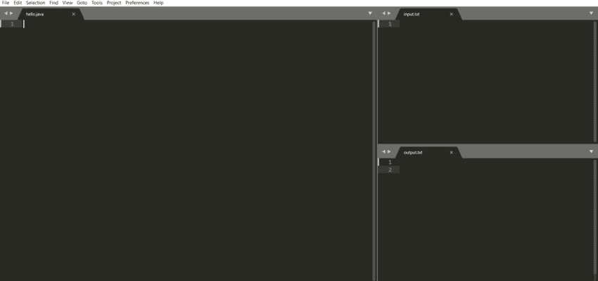
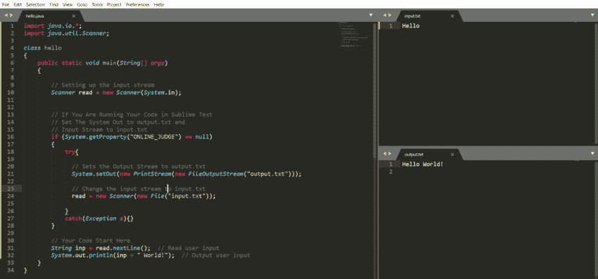

# 设置 Java 竞争编程环境

> 原文:[https://www . geesforgeks . org/setting-Java-competitive-programming-environment/](https://www.geeksforgeeks.org/setting-up-java-competitive-programming-environment/)

您的系统上需要安装一个[操作系统](https://www.geeksforgeeks.org/operating-systems/)。这里我们将讨论 windows 中的设置。但是，您可以选择任何操作系统。安装 JDK (Java 开发工具包)JDK，是一个**程序**，允许你在舒适的桌面上编写 **Java 代码**。它包含多种工具，对于创建、运行和优化您的 **Java 代码**非常有用。按照以下步骤下载 JDK:

*   [下载 JDK 最新版本](https://www.oracle.com/java/technologies/javase-jdk15-downloads.html)。
*   下载后，按照运行安装程序后的提示安装 JDK。

现在有很多好的文本编辑器，比如 VS 代码、崇高文本、Atom、记事本++,等等。然而，本文将使用崇高的文本 3，因为它是轻量级的，最低限度的美学，和高功能。[下载](https://www.sublimetext.com/3)崇高文本，[安装](https://www.geeksforgeeks.org/how-to-install-sublime-text-3-in-windows/)来设置一个 java 构建系统。

### 程序:

**步骤 A:** 建立一个 Java 构建系统

按照下面的步骤来设置 java 的构建系统，这样您就可以编译 JAVA 代码，这里我们将演示 windows 操作系统

1.  转到命令提示符，键入“**其中 Java“**”，并复制 JDK bin 文件夹的**路径，该路径看起来像“C:\程序文件\Java\jdk1.8.0_251\bin”**
2.  现在，打开崇高的文字，进入**工具>建造系统>新建造系统**。
3.  必须出现一个新文件，此时您需要将下面的 JSON 对象粘贴到该文件中
4.  用您在**步骤 1** 中获得的路径替换路径变量

```
{ 
"cmd": ["javac", "$file_name", "&&", "java" ,"$file_base_name"],  
"selector": "source.java",
"file_regex": "^\\s*File \"(...*?)\", line ([0-9]*)", 
"path" :  "C:\\Program Files\\Java\\jdk1.8.0_251\\bin\\",
"shell":true
}
```

现在遵循这三个简单的步骤

1.  通过按下 **CTRL + S** 保存文件，并在提示的文件夹中为构建系统命名，例如**“MYJAVA”**。
2.  请记住，构建系统的文件扩展名应该是“崇高构建”，否则您将无法看到您创建的构建系统的选项。
3.  转到**工具>构建系统**，在**步骤 4** 中，您必须看到一个与您保存文件的名称相同的构建系统，在本例中为**“MYJAVA”**。
4.  通过单击将构建系统标记为勾号。

> 如果遵循以上步骤，那么构建系统就可以使用了。现在任务来了

**步骤 B:** 设置崇高标签

**1。**在比赛期间，在选项卡之间切换变得繁琐，因此您可以设置选项卡，以便查看每个选项卡。遵循以下步骤:

*   如果打开了任何文件，请关闭所有选项卡。
*   转到**查看>布局>列 3。**你会看到如下的布局。



**2** 。位于第一列，前往**查看>组>最大列 2** 。您将看到如下布局。



**3。**在这个设置中，左窗口将包含代码文件，右上方窗口将包含输入文件，左下方窗口将包含输出文件，正如我们将进一步看到的。

**图解:**写你好世界节目

**1。**创建一个包含三个文件的文件夹，一个名为**hello.java**的 java 文件，一个名为 **input.txt** 的用于输入的输入文件，以及一个名为 **output.txt** 的用于存储输出的输出文件，确保这三个文件都在同一个文件夹中。

**2** 。在我们之前做的屏幕设置中，转到文件>打开文件，在左窗口打开 java 文件，在右上方窗口打开输入文件，在右下方窗口打开输出文件。像下面这样



**3。**将下面包含 hello world 程序的 java 标准模板粘贴到 JAVA 文件中，确保文件名和类名**相同**并公开该类。该代码将从**“输入. txt”**中获取一个字符串输入，并通过将其附加到**“世界”中将其打印在**“输出. txt”**中**。

**示例:**

## Java 语言(一种计算机语言，尤用于创建网站)

```
// Java Program that is been setup in Sublime Text
// for Competitive Coding

// Importing input output classes
import java.io.*;
// Importing Scanner class from java.util package
import java.util.Scanner;

// Main Class
class hello {

    // Main driver method
    public static void main(String[] args)
    {

        // Setting up the input stream
        // You can use buffered reader too
        Scanner read = new Scanner(System.in);

        // If You Are Running Your Code
        // in Sublime Text then set The
        // System Out to output.txt and
        // Input Stream to input.txt
        // otherwise leave it as standard
        // ones for ONLINE JUDGE
        if (System.getProperty("ONLINE_JUDGE") == null) {
            // Try block to check for exceptions
            try {
                // Sets the Output Stream
                // to output.txt
                System.setOut(new PrintStream(
                    new FileOutputStream("output.txt")));

                // Change the input stream
                // to input.txt
                read = new Scanner(new File("input.txt"));
            }

            // Catch block to handle the exceptions
            catch (Exception e) {
            }
        }

        // Your Code Start Here

        // Read input
        String inp = read.nextLine();

        // Print output
        System.out.println(inp + " World!");
    }
}
```

**输出:**



*   在**“input . txt”**中写一些类似**“你好”**的内容。
*   确保您已经选择了我们之前在**工具>构建系统**中构建的正确构建系统。
*   现在点击 **CTRL + B** 或者去**工具>构建**编译你的代码。
*   您的代码必须编译，并且应该在您的**“output . txt”**文件中打印一些东西。就像下面这样。

如果看到像上面这样的窗口，那么您的设置就完成了，并准备好用崇高的 JAVA 编码，并在在线法官上提交您的代码，而不用担心输入和输出流的改变，因为它已经被处理好了。您可以进入偏好设置，根据自己的喜好更改字体或主题。