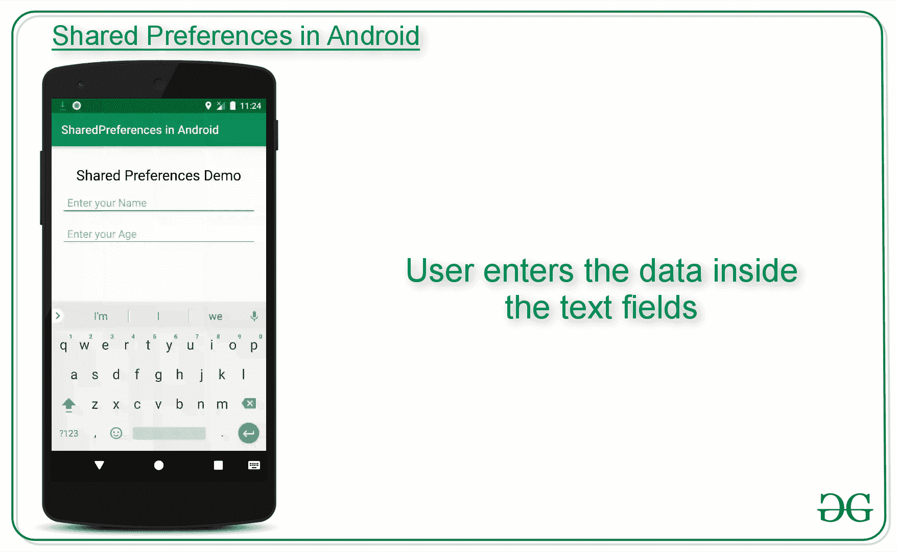
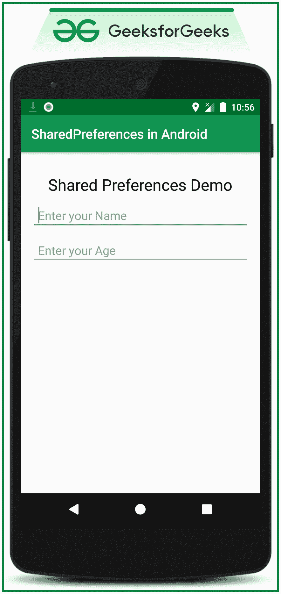

# 安卓共享偏好设置示例

> 原文:[https://www . geesforgeks . org/shared-preferences-in-Android-with-examples/](https://www.geeksforgeeks.org/shared-preferences-in-android-with-examples/)

安卓为用户提供的最有趣的数据存储选项之一是**共享首选项**。**共享首选项**是一种将少量原始数据作为键/值对存储和检索到设备存储上的文件中的方式，例如字符串、int、float、Boolean，它们在设备存储上的应用程序内部的 XML 文件中组成您的首选项。**共享首选项**可以被视为字典或键/值对。例如，您可能有一个名为“username”的密钥，对于该值，您可能会存储用户的用户名。然后你可以通过它的密钥(这里是用户名)来检索它。您可以有一个简单的共享首选项应用编程接口，用于存储首选项，并在需要时将它们拉回来。共享首选项类提供了读取、写入和管理这些数据的应用编程接口。下面给出了一个 GIF 示例，来了解一下我们在本文中要做什么。注意，我们将使用 **Java** 语言来实现这个项目。



**共享偏好**适合不同情况。例如，当需要保存用户的设置或存储可用于应用内不同活动的数据时。如您所知，onPause()总是在您的活动被放在后台或销毁之前被调用，所以为了持久保存数据，最好将其保存在 onPause()中，这可以在活动的 onCreate()中恢复。使用共享首选项存储的数据在应用程序范围内保持私有。但是，共享首选项不同于该活动的实例状态。

### **共享首选项与保存的实例状态有何不同？**

<figure class="table">

| 

共享首选项

 | 

保存的实例状态

 |
| --- | --- |
| 跨用户会话保存数据，即使应用程序被终止并重新启动，或者设备重新启动 | 保留同一用户会话中跨活动实例的状态数据。 |
| 应该跨会话记住的数据，例如用户的首选设置或他们的游戏分数。 | 不应跨会话记住的数据，例如当前选定的选项卡或当前活动状态。 |
| 一个常见的用途是存储用户偏好 | 一个常见的用途是在设备旋转后重新创建状态 |

</figure>

### **如何创建共享首选项？**

我们需要做的第一件事是为每个应用程序创建一个共享首选项文件。所以用你的应用程序的包名来命名它——唯一且容易与应用程序关联。当您想要获取值时，调用 **getSharedPreferences()** 方法。共享首选项提供了存储数据的模式(私有模式和公共模式)。这是为了向后兼容-仅使用**模式 _ 私人**是安全的。

> **公共抽象 SharedPreferences getSharedPreferences(字符串名称，int 模式)**
> 
> 这个方法有两个参数，第一个参数是 **SharedPreference(SP)文件**的名称，另一个参数是我们想要存储文件的**上下文模式**。
> 
> **MODE_PUBLIC** 将文件公开，设备上的其他应用程序可以访问该文件
> 
> **MODE_PRIVATE** 保持文件的私密性，保护用户的数据。
> 
> 从服务点文件读取数据时使用**模式 _ 追加**。

### **共享首选项的嵌套类**

1.  **shared references。编辑器**:用于在 SP 文件中写入(编辑)数据的界面。编辑完成后，必须**提交()**或**应用()**对文件所做的更改。
2.  **shared references。onshared preferencechangelistener()**:当共享首选项被更改、添加或删除时调用。即使首选项设置为其现有值，也可能会调用此方法。这个回调将在你的主线程上运行。

### **以下是共享首选项**的方法

1.  **包含(String key)** :该方法用于检查偏好是否包含偏好。

2.  **edit()** :这个方法用于为这些首选项创建一个新的编辑器，通过这个编辑器可以对首选项中的数据进行修改，并将这些修改自动提交回 SharedPreferences 对象。

3.  **getAll()** :此方法用于从首选项中检索所有值。

4.  **获取布尔值(字符串键，布尔值定义值)**:该方法用于从首选项中检索布尔值。

5.  **getFloat(String 键，Float defValue)** :此方法用于从首选项中检索一个 float 值。

6.  **getInt(String 键，Int defValue)** :此方法用于从首选项中检索一个 int 值。

7.  **getLong(String 键，long defValue)** :此方法用于从首选项中检索长值。

8.  **获取字符串(字符串键，字符串定义值)**:此方法用于从首选项中检索字符串值。

9.  **getStringSet(字符串键，设置定义值)**:此方法用于从首选项中检索一组字符串值。

10.  **registersonsharedpreferencechangelistener(shared references。onshared preferencechangelistener)**:这个方法用来注册一个回调，当一个首选项发生变化时调用。

11.  **取消注册共享首选项更改侦听器(共享引用。onshared preferencechangelistener)**:此方法用于取消注册上一个回调。

**以下是如何在共享首选项中写入数据的示例字节代码:**

## Java 语言(一种计算机语言，尤用于创建网站)

```java
// Storing data into SharedPreferences
SharedPreferences sharedPreferences = getSharedPreferences("MySharedPref",MODE_PRIVATE);

// Creating an Editor object to edit(write to the file)
SharedPreferences.Editor myEdit = sharedPreferences.edit();

// Storing the key and its value as the data fetched from edittext
myEdit.putString("name", name.getText().toString());
myEdit.putInt("age", Integer.parseInt(age.getText().toString()));

// Once the changes have been made,
// we need to commit to apply those changes made,
// otherwise, it will throw an error
myEdit.commit();
```

**以下是如何在共享首选项中读取数据的示例字节代码:**

## Java 语言(一种计算机语言，尤用于创建网站)

```java
// Retrieving the value using its keys the file name
// must be same in both saving and retrieving the data
SharedPreferences sh = getSharedPreferences("MySharedPref", MODE_APPEND);

// The value will be default as empty string because for
// the very first time when the app is opened, there is nothing to show
String s1 = sh.getString("name", "");
int a = sh.getInt("age", 0);

// We can then use the data
name.setText(s1);
age.setText(String.valueOf(a));
```

### **演示在安卓系统中使用共享首选项的示例**

下面是共享首选项的小演示。在这个特殊的演示中，有两个[编辑文本](https://www.geeksforgeeks.org/edittext-widget-in-android-using-java-with-examples/)，它们保存并保留了之前输入的数据。这种类型的功能可以在带有表单的应用程序中看到。使用共享首选项，用户不必一次又一次地填写详细信息。在 **activity_main.xml** 文件中调用以下代码来实现用户界面:

## 可扩展标记语言

```java
<?xml version="1.0" encoding="utf-8"?>
<RelativeLayout
    xmlns:android="http://schemas.android.com/apk/res/android"
    xmlns:tools="http://schemas.android.com/tools"
    android:layout_width="match_parent"
    android:layout_height="match_parent"
    tools:context=".MainActivity"
    tools:ignore="HardcodedText">

    <TextView
        android:id="@+id/textview"
        android:layout_width="wrap_content"
        android:layout_height="wrap_content"
        android:layout_centerHorizontal="true"
        android:layout_marginTop="32dp"
        android:text="Shared Preferences Demo"
        android:textColor="@android:color/black"
        android:textSize="24sp" />

    <!--EditText to take the data from the user
        and save the data in SharedPreferences-->
    <EditText
        android:id="@+id/edit1"
        android:layout_width="match_parent"
        android:layout_height="wrap_content"
        android:layout_below="@+id/textview"
        android:layout_marginStart="16dp"
        android:layout_marginTop="8dp"
        android:layout_marginEnd="16dp"
        android:hint="Enter your Name"
        android:padding="10dp" />

    <!--EditText to take the data from the user and
         save the data in SharedPreferences-->
    <EditText
        android:id="@+id/edit2"
        android:layout_width="match_parent"
        android:layout_height="wrap_content"
        android:layout_below="@+id/edit1"
        android:layout_marginStart="16dp"
        android:layout_marginTop="8dp"
        android:layout_marginEnd="16dp"
        android:hint="Enter your Age"
        android:padding="10dp"
        android:inputType="number" />

</RelativeLayout>
```

**输出 UI:**



使用 MainActivity.java 文件处理两个编辑文本，以保存用户在共享引用中输入的数据。以下是**MainActivity.java**文件的代码。代码中添加了注释，以更详细地理解代码。

## Java 语言(一种计算机语言，尤用于创建网站)

```java
import androidx.appcompat.app.AppCompatActivity;

import android.content.SharedPreferences;
import android.os.Bundle;
import android.widget.EditText;

public class MainActivity extends AppCompatActivity {

    private EditText name, age;

    @Override
    protected void onCreate(Bundle savedInstanceState) {
        super.onCreate(savedInstanceState);
        setContentView(R.layout.activity_main);
        name = findViewById(R.id.edit1);
        age = findViewById(R.id.edit2);
    }

    // Fetch the stored data in onResume()
    // Because this is what will be called
    // when the app opens again
    @Override
    protected void onResume() {
        super.onResume();

        // Fetching the stored data
        // from the SharedPreference
        SharedPreferences sh = getSharedPreferences("MySharedPref", MODE_PRIVATE);

        String s1 = sh.getString("name", "");
        int a = sh.getInt("age", 0);

        // Setting the fetched data
        // in the EditTexts
        name.setText(s1);
        age.setText(String.valueOf(a));
    }

    // Store the data in the SharedPreference
    // in the onPause() method
    // When the user closes the application
    // onPause() will be called
    // and data will be stored
    @Override
    protected void onPause() {
        super.onPause();

        // Creating a shared pref object
        // with a file name "MySharedPref"
        // in private mode
        SharedPreferences sharedPreferences = getSharedPreferences("MySharedPref", MODE_PRIVATE);
        SharedPreferences.Editor myEdit = sharedPreferences.edit();

        // write all the data entered by the user in SharedPreference and apply
        myEdit.putString("name", name.getText().toString());
        myEdit.putInt("age", Integer.parseInt(age.getText().toString()));
        myEdit.apply();
    }
}
```

### **输出:**

<video class="wp-video-shortcode" id="video-350413-1" width="640" height="360" preload="metadata" controls=""><source type="video/mp4" src="https://media.geeksforgeeks.org/wp-content/uploads/20201225111952/Untitled-Project.mp4?_=1">[https://media.geeksforgeeks.org/wp-content/uploads/20201225111952/Untitled-Project.mp4](https://media.geeksforgeeks.org/wp-content/uploads/20201225111952/Untitled-Project.mp4)</video>

**参考:** [共享偏好|安卓](https://developer.android.com/reference/android/content/SharedPreferences)