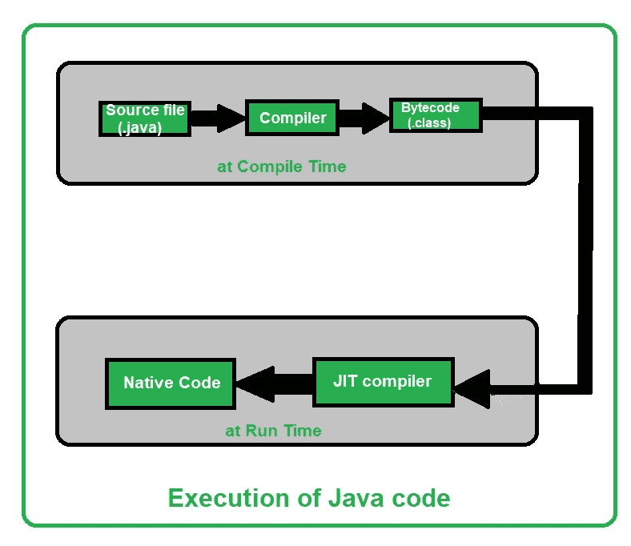

# 【Java 和 C++的异同

> 原文:[https://www . geesforgeks . org/Java 和-c 的异同/](https://www.geeksforgeeks.org/similarities-and-difference-between-java-and-c/)

如今 [Java](https://www.geeksforgeeks.org/java/) 和 [C++](https://www.geeksforgeeks.org/c-plus-plus/) 编程语言在竞争性编码中大量使用。由于一些令人敬畏的特性，这两种编程语言也主要用于工业。C++因其高效、高速和动态内存利用率而在程序员中广泛流行。Java 在 IT 行业应用广泛，在软件开发方面是其他任何编程语言无法比拟的。
让我们通过不同的点来比较这些流行的编码语言:

**<u>Java 和 C++的相似之处</u>**

1.  **Execution:** At compile-time, Java source code or **.java** file is converted into a bytecode or **.class** file. At runtime, [JVM(Java Virtual Machine)](https://www.geeksforgeeks.org/jvm-works-jvm-architecture/) will load the **.class** file and will convert it to machine code with the help of an [interpreter](https://www.geeksforgeeks.org/compiler-vs-interpreter-2/). After compilation of method calls(using Just-In-Time (JIT) compiler), JVM will execute the optimized code. So Java is both [compiled as well as an interpreted language](https://www.geeksforgeeks.org/difference-between-compiled-and-interpreted-language/). 

    另一方面，C++只使用编译器来执行代码。C++编译器将源代码编译并转换成机器代码。这就是为什么 c++比 Java 快，但不依赖于平台。

    下面是如何执行 Java 和 C++代码的图示:

    **<u>执行一个 Java 代码</u>**

1.  **<u>执行 C++代码</u>**

**2。特性:** C++和 Java 都有几个[面向对象编程](https://www.geeksforgeeks.org/object-oriented-programming-oops-concept-in-java/)特性，提供了许多有用的编程功能。有些功能受一个支持，有些不受支持。
下表显示了两种编程语言支持和不支持的特性:

<figure class="table">是T68】动态绑定 T72】是T75T78

| trait | c++ | Java 语言(一种计算机语言，尤用于创建网站) |
| --- | --- | --- |
| abstract |  | be |
| encapsulation | be | be |
| Polymorphism | be | be |
| Static binding | be | be |
| be |
| Operator overload |
| Template class | be | no |
| Interference and packet | no | be |
| 应用程序接口 | no | be |

</figure>

1.  **应用:**c++和 Java 都有广阔的应用领域。以下是两种语言的应用:
    *   **<u>c++编程语言的应用</u> :**
        1.  适合开发大型软件(如乘客预订系统)。
        2.  MySQL 是用 C++编写的。
        3.  为了快速执行，C++主要用于游戏开发。
        4.  谷歌 Chromium 浏览器、文件系统、集群数据处理都是用 C++编写的。
        5.  Adobe Premiere、Photoshop 和 Illustrator 这些用 C++编写脚本的流行应用程序。
        6.  高级计算和图形-实时物理模拟，高性能图像处理。
        7.  C++也用于许多先进的医疗设备，如核磁共振等。
    *   **<u>Java 编程语言的应用</u> :**
        1.  桌面图形用户界面应用程序开发。
        2.  安卓和移动应用开发。
        3.  Java 的应用是在嵌入式技术中，如 SIM 卡、磁盘播放器、电视等。
        4.  Java EE(企业版)为运行大型企业软件提供了一个 API 和运行时环境。
        5.  网络应用和网络服务，如互联网连接、网络应用开发。
2.  **环境:** C++是平台相关的，而 [Java 是平台无关的编程语言](https://www.geeksforgeeks.org/java-platform-independent/)。我们必须在同一个平台上编写和运行 C++代码。Java 有 **WORA(写一次，到处跑)**特性，通过这个特性，我们可以在一个平台上写一次代码，我们可以在任何地方运行代码。

**<u>Java 与 C++的区别:</u>**

<figure class="table">

| parameter | Java 语言(一种计算机语言，尤用于创建网站) | c++ |
| --- | --- | --- |
| founder | Java was developed by james gosling in Sun Microsystems. | C++ was developed by bjarne stroustrup in Bell Laboratories in 1979 as an extension of C language. |
| First release | May 23(rd), 1995 | October, 1985 |
| Stable release | Java SE 14 or JDK 14 was released on March 17th, 2020. | C++17 was released in December 2017. |
| official website | oracle.com/java | isocpp.org |
| Suffer from: | Java has been influenced by Ada 83, Pascal, C++, [C #](https://www.geeksforgeeks.org/csharp-programming-language/) and other languages. | C++)你好爱达 ada、algol 乌乎乎乎。 |
| Affected by: | Java 语言(一种计算机语言，尤用于创建网站)受影响开发了 BeanShell、C#、Clojure、Groovy、Hack、J#、Kotlin、PHP、Python、Scala 等语言。 | C++)嗨嗨嗨嗨 c99 Java js++、月亮 perl PHP python rust seed 7(英文)。 |
| Platform dependence | Platform independent, Java bytecode can work on any operating system. | Platform dependencies should be compiled for different platforms. |
| transportability | It can run in any operating system, so it is portable. | C++ is platform-dependent, so it is not portable. |
| compile | Java is both a compilation language and an interpretation language. | C++ has only compilation language. |
| memory management | Memory management is controlled by the system. | Memory management in c++ is manual. |
| Virtual keyword | It has no virtual keywords. | There are virtual keywords. |
| Multiple inheritance | It only supports single inheritance. Multiple inheritance parts are implemented using interfaces. | Support single inheritance and multiple inheritance. |
| heavy-loaded | Only method overloading is supported, but operator overloading is not allowed. | Method and operator overloading is supported. |
| needle | It supports limited support for pointers. | Strongly supports pointers. |
| warehouse | It does not support direct native library call, only Java native interface. | Support direct system library call, suitable for system level programming. |
| warehouse | There are a wide range of classes in the library for various advanced services. | C++ library is a relatively low-level function. |
| Document notes | Support document comments (for example,/* *) ... */) to obtain source code. | Document comments of source code are not supported. |
| Thread support | Java supports documentation comments (for example,/* *) .. */as source code. | C++ has no built-in support for threads and relies on third-party thread libraries. |
| type | Java is the only object-oriented programming language. | C++ is a procedural and object-oriented programming language. |
| Input-output mechanism | Java uses [system class] **system.in** for input and **system.out** for output. | C++ uses **CIN** for input and **cout** for output. |
| Goto keyword | Goto keyword is not supported in Java | C++ supports goto keyword. |
| Structure and union | Java does not support structure and union. | C++ supports structure and federation. |
| parameter passing | Java only supports the technology of passing by value. | C++ supports passing by value and passing by reference. |
| Global scope | Global scope is not supported. | Supports global scope and namespace scope. |
| Object management | Automatic object management with garbage collection. | Support manual object management by creating and deleting. |

</figure>