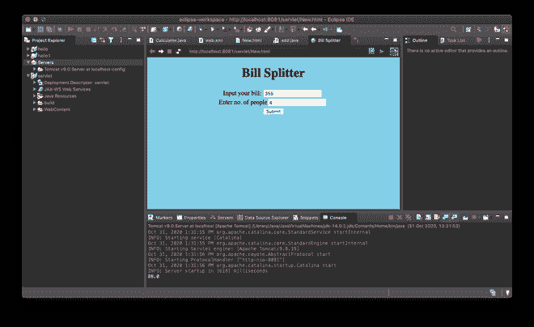
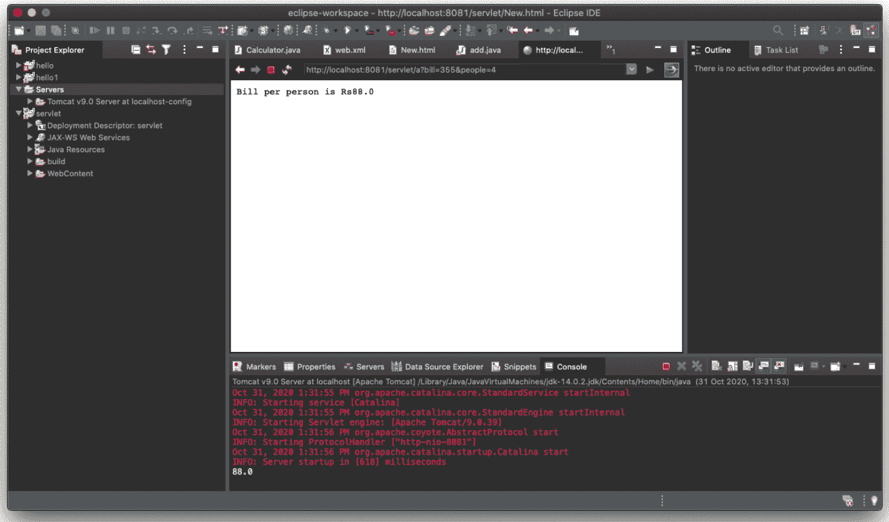

# 使用 Java Servlets 的简单账单拆分器应用程序

> 原文:[https://www . geesforgeks . org/simple-bill-splitter-application-use-Java-servlet/](https://www.geeksforgeeks.org/simple-bill-splitter-application-using-java-servlets/)

**先决条件:**[Java servlet](https://www.geeksforgeeks.org/introduction-java-servlets/)

Servlets 是一种用于服务器端编程的 Java 技术，通常用于创建 web 应用程序。它是一个运行在支持 Java 的网络服务器中的模块。

在这里，您将通过开发账单拆分器应用程序来查看实现。在这个 Java Servlets 应用程序中，有两个输入列，一个是总账单金额，第二个列是账单将被拆分的人数。让我们看看。

**输入:**

> 输入你的账单(整数值):GUI_User_Input
> 输入人数(整数值):GUI_User_Input

**输出:**

> 一旦用户输入，结果将显示，并点击提交按钮(双数据类型值)
> =
> 
> 输入您的账单/输入人数



在这里，我们将构建一个简单的 web 应用程序，该应用程序将在指定的人数之间分割账单金额。

**了解 Servlet 如何工作:**

*   客户端向服务器发送一个请求，该请求到达网络容器。
*   Web 容器使用一个名为 web.xml 的文件来检测要调用哪个 servlet，并调用所需的 servlet。
*   servlet 将处理信息，并向客户机发送响应。

**设置 Eclipse IDE:**

*   从 http://www.eclipse.org/downloads/下载用于 Java EE 开发的 Eclipse IDE
*   从 https://tomcat.apache.org 下载 Tomcat 服务器
*   转到文件>新建>动态网站项目。
*   将包含 Tomcat 的文件夹的链接添加到窗口底部的 servlet 选项卡，您就可以创建第一个 servlet 了！

**创建用于网页布局的** **HTML 文件:**

创建一个简单的 HTML 文件，其中包含一个表单来输入账单金额和人数的详细信息。

## 超文本标记语言

```java
<!DOCTYPE html>
<html>

<head>
<meta charset="UTF-8">
<title>Bill Splitter</title>

 <!-- CSS properties. -->
  <style type="text/css">
  body
{
background-color:skyblue;
text-align:center;
}
</style>
</head>

<body>
<h1>Bill Splitter</h1>

<!-- Application GUI form HTML code --> 
<form action="splitter">
Input your bill: <input type="text" name="bill">
<br>
Enter no. of people: <input type="text" name="people">
<br>
<input type="submit">
</form>
</body>

</html>
```

**创建 Java 文件:**

创建一个新的类并扩展 HttpServlet 类，使您的 java 类成为一个 Servlet。在 servlet 文件的情况下，响应和请求对象包含在 Servlet 类中。 *req* 对象用于从客户端获取数据，而 *res* 对象用于向客户端发送响应。这两个函数[解析](https://www.geeksforgeeks.org/string-to-integer-in-java-parseint/)和[获取参数](https://www.geeksforgeeks.org/getparameter-passing-data-from-client-to-jsp/)将帮助从 HTML 表单中获取输入，并从中获取整数值，然后执行计算，您将看到 [PrintWriter](https://www.geeksforgeeks.org/printwriter-printlnstring-method-in-java-with-examples/) 对象打印输出值。

```java
***parseInt*** is used to convert string to integer.
***getParameter*** is used to get the user input in string form.
***PrintWriter*** is used to fetch output to the output window and not the console.
```

## Java 语言(一种计算机语言，尤用于创建网站)

```java
package servlet;

import java.io.IOException;
import java.io.PrintWriter;

import javax.servlet.http.HttpServlet;
import javax.servlet.http.HttpServletRequest;
import javax.servlet.http.HttpServletResponse;

public class split extends HttpServlet{

public void service(HttpServletRequest req, HttpServletResponse res) throws IOException
{
    int i = Integer.parseInt(req.getParameter("bill"));
    int j = Integer.parseInt(req.getParameter("people"));
    double r = i/j;

    System.out.println(r);

    PrintWriter out=res.getWriter();

    out.println("Bill per person is Rs" +r);   
}
}
```

**配置 web.xml 文件:**

每当您创建一个新的动态 web 项目时，您都会在项目文件夹中获得一个名为 *web.xml* 的文件，这是将 servlet 和 HTML 文件映射在一起的最重要的文件。web.xml 文件使用两个标签*<servlet>&<Servlet-映射>* 将 Servlet 和 HTML 文件映射在一起。

```java
***<servlet-name>***is used to assign a universal name to the servlet.
***<servlet-class>*** is used to assign the java class to be executed when servlet is called.
***<url-pattern>*** is used to define the url pattern which when found will call the java class 
defined in ***<servlet-class>***
```

## 可扩展标记语言

```java
<?xml version="1.0" encoding="UTF-8"?>
<web-app xmlns:xsi="http://www.w3.org/2001/XMLSchema-instance"
         xmlns="http://xmlns.jcp.org/xml/ns/javaee"
         xsi:schemaLocation="http://xmlns.jcp.org/xml/ns/javaee
                             http://xmlns.jcp.org/xml/ns/javaee/web-app_4_0.xsd"
         id="WebApp_ID" version="4.0">
  <display-name>servlet</display-name>

 <servlet>
 <servlet-name>serv1</servlet-name>
 <servlet-class>servlet.split</servlet-class>
 </servlet>
 <servlet-mapping>
 <servlet-name>serv1</servlet-name>
 <url-pattern>/splitter</url-pattern>
 </servlet-mapping>

</web-app>
```

**运行应用程序:**

启动服务器并运行！

