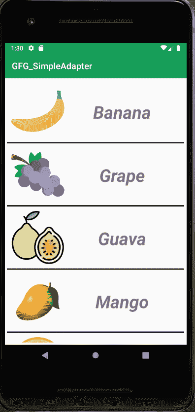
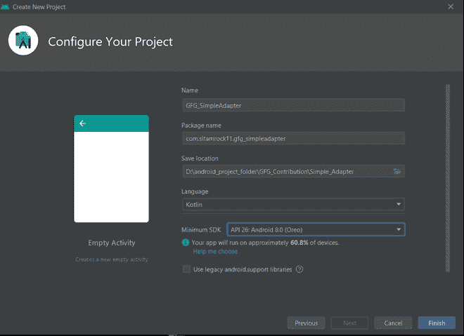
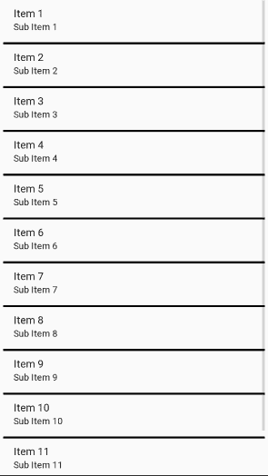
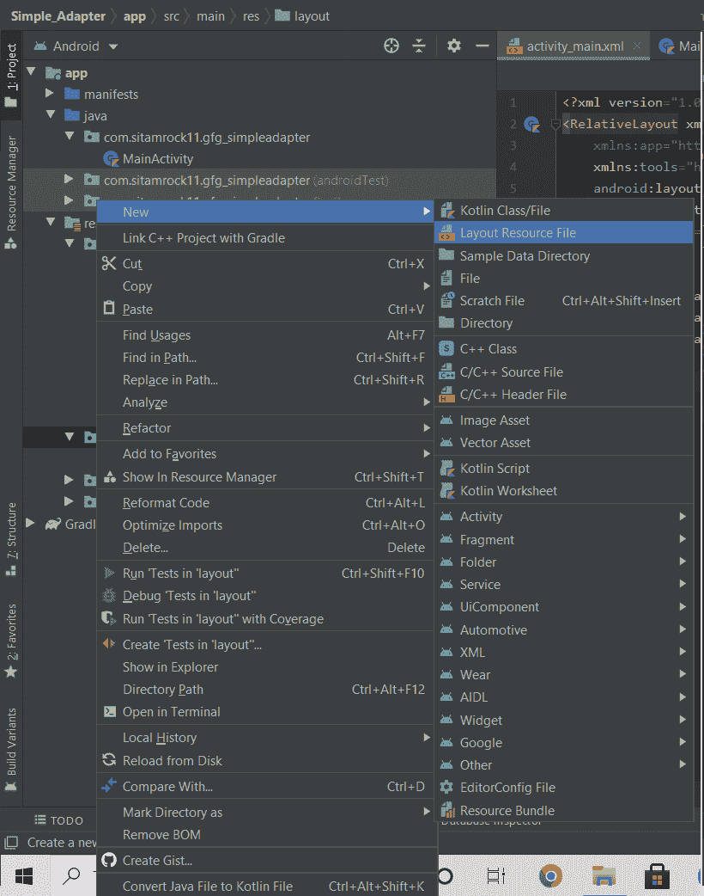
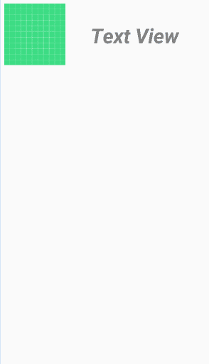

# 安卓中的简单适配器，示例

> 原文:[https://www . geesforgeks . org/simple adapter-in-Android-with-example/](https://www.geeksforgeeks.org/simpleadapter-in-android-with-example/)

在安卓系统中，每当我们想要绑定一些从任何数据源(例如数组列表、哈希映射、SQLite 等)获取的数据时。)与 UI 组件(例如，ListView、GridView 等)一起使用。)然后**适配器**进入画面。基本上**适配器**充当了用户界面组件和数据源之间的桥梁。这里**简易适配器**是**适配器**的一种。它基本上是一个简单的适配器，可以将静态数据映射到我们的 XML 文件(用户界面组件)中定义的视图，并用于定制列表或网格项目。这里我们使用了一个映射的数组列表(例如 hashmap、可变映射等)。)进行数据备份。数组列表中的每个条目对应于列表中的一行。地图包含每行的数据。现在要显示该行，我们需要一个视图，我们使用它来指定一个自定义列表项文件(一个 XML 文件)。

## 简单适配器的一般语法

> **SimpleAdapter** ( **上下文**上下文，**列表** <？延伸**地图** < **字符串**，？> >数据， **int** 资源， **String** [] from， **int** [] to)
> 
> ***这里上下文、数据、资源、自和至是五个参数* * *

<figure class="table">

| 

因素

 | 

数据类型

 | 

说明

 |
| --- | --- | --- |
| 语境 | 语境 | 当我们创建一个**简单适配器**类的**对象**时，它用于传递上下文(当前活动的引用)。 |
| 数据 | 列表 extends Map<string>></string>***表示**地图**的**列表**，其**键**的类型为**字符串**，**值**可以是任何数据类型。 | 列表中的每个元素都是不同的映射，包含每行的数据，并且应该包括“from”字符串数组中指定的所有条目。在我们的项目中，我们将使用**数组列表**。 |
| 资源 | （同 Internationalorganizations）国际组织* * *整数数据类型 | 此参数用于传递布局(XML 文件)的资源 id，它应该包含列表中每行的不同视图。布局文件应该至少包括那些在“到”中定义的命名视图。 |
| 从 | 一组**弦**型 | 将添加到与每个项目关联的地图中的列名列表。在这个数组中，列表每行的每个项目(视图)都应该有一个列名。 |
| 到 | **int** 类型的数组。 | 此数组参数存储不同视图的 id，这些视图应该在“from”参数中显示该列。这些都应该是文本视图。该列表中的前 N 个视图被赋予“从”参数中前 N 列的值。 |

</figure>

## 例子

下面给出了一个示例图像，以了解本文中要做什么。在这个项目中，我们将制作这个应用程序，其中有一些水果的列表，列表的每一行都有一个水果图像和名称。请注意，我们将在 **Kotlin** 和 **Java** 语言中实现同一个项目。现在你选择你喜欢的语言。



### 逐步实施

**第一步:创建新项目**

打开**安卓工作室>新建项目** >选择一个**空活动>** 给出一个项目名称(这里我们的项目名称是“ **GFG_SimpleAdapter** ”)。



> ***这里你可以选择你喜欢的 Kotlin 或者 Java，根据你的选择选择 API 级别。
> 
> * * *创建项目成功后，请将一些图片粘贴到 **res** 目录中的**可绘制**文件夹中。现在你可以使用我在我的项目中使用的相同的图片，否则你可以选择你自己选择的图片。要下载相同的图片，请点击下面的链接**:**
> 
> **[点击此处](https://drive.google.com/drive/folders/1xLAT6vSQGG4zC4rJJ3EGcJL2l2DOYGog?usp=sharing)**
> 
> *****请注意，它是可选的* * ***

****步骤 2:使用 activity_main.xml 文件****

**在 **activity_main.xml** 文件中，在 [RelativeLayout](https://www.geeksforgeeks.org/android-relativelayout-in-kotlin/) 内创建一个[列表视图](https://www.geeksforgeeks.org/android-listview-in-java-with-example/)。下面是 **activity_main.xml** 文件的代码。**

## **可扩展标记语言**

```
<?xml version="1.0" encoding="utf-8"?>
<RelativeLayout
    xmlns:android="http://schemas.android.com/apk/res/android"
    xmlns:tools="http://schemas.android.com/tools"
    android:layout_width="match_parent"
    android:layout_height="match_parent"
    tools:context=".MainActivity">

    <!--Creating a ListView-->
    <ListView
        android:id="@+id/listView"
        android:layout_width="match_parent"
        android:layout_height="wrap_content"
        android:divider="#000000"
        android:dividerHeight="3dp"
        android:padding="5dp" />

</RelativeLayout>
```

****activity_main.xml 接口:****

****

****第三步:创建另一个 XML 文件(命名为 list_row_items)，并为 ListView 的每一行创建 UI****

**创建一个新的**布局资源文件**，并将其命名为**列表 _ 行 _ 项目**。**

****

**下面是 **list_row_items.xml** 文件的代码。**

## **可扩展标记语言**

```
<?xml version="1.0" encoding="utf-8"?>
<RelativeLayout
    xmlns:android="http://schemas.android.com/apk/res/android"
    android:layout_width="match_parent"
    android:layout_height="match_parent">

    <!--Creating a ImageView-->
    <ImageView
        android:id="@+id/imageView"
        android:layout_width="120dp"
        android:layout_height="120dp"
        android:layout_margin="10dp"
        android:scaleType="fitCenter"
        android:src="@drawable/ic_launcher_background" />

    <!--Creating a TextView-->
    <TextView
        android:id="@+id/textView"
        android:layout_width="match_parent"
        android:layout_height="wrap_content"
        android:layout_marginTop="40dp"
        android:layout_marginRight="20dp"
        android:layout_toRightOf="@+id/imageView"
        android:gravity="center"
        android:padding="5dp"
        android:text="Text View"
        android:textColor="#808080"
        android:textSize="40sp"
        android:textStyle="bold|italic" />

</RelativeLayout>
```

****list_row_items.xml 接口:****

****

****步骤 4:使用主活动文件****

**在这里，我们将向您展示如何在 Java 和 Kotlin 中实现 SimpleAdapter。现在你选择你的首选。以下是**主活动**文件的代码。代码中添加了注释，以更详细地理解代码。**

## **Java 语言(一种计算机语言，尤用于创建网站)**

```
import android.os.Bundle;
import android.widget.ListView;
import android.widget.SimpleAdapter;
import androidx.appcompat.app.AppCompatActivity;
import java.util.ArrayList;
import java.util.HashMap;

public class MainActivity extends AppCompatActivity {

    ListView listView;

    // creating  a String type array (fruitNames)
    // which contains names of different fruits' images
    String fruitNames[] = {"Banana", "Grape", "Guava", "Mango", "Orange", "Watermelon"};

    // creating an Integer type array (fruitImageIds) which
    // contains IDs of different fruits' images
    int fruitImageIds[] = {R.drawable.banana,
            R.drawable.grape,
            R.drawable.guava,
            R.drawable.mango,
            R.drawable.orange,
            R.drawable.watermelon};

    @Override
    protected void onCreate(Bundle savedInstanceState) {
        super.onCreate(savedInstanceState);
        setContentView(R.layout.activity_main);

        // Binding the ListView  of activity_main.xml file
        // with this java code in MainActivity.java
        listView = findViewById(R.id.listView);

        // creating an ArrayList of HashMap.The kEY of the HashMap
        // is a String and VALUE is of any datatype(Object)
        ArrayList<HashMap<String, Object>> list = new ArrayList<>();

        // By a for loop, entering different types of data in HashMap,
        // and adding this map including it's datas into the ArrayList
        // as list item and this list is the second parameter of the SimpleAdapter
        for (int i = 0; i < fruitNames.length; i++) {

            // creating an Object of HashMap class
            HashMap<String, Object> map = new HashMap<>();

            // Data entry in HashMap
            map.put("fruitName", fruitNames[i]);
            map.put("fruitImage", fruitImageIds[i]);

            // adding the HashMap to the ArrayList
            list.add(map);
        }

        // creating A string type array(from) which contains
        // column names for each View in each row of the list
        // and this array(form) is the fourth parameter of the SimpleAdapter
        String[] from = {"fruitName", "fruitImage"};

        // creating an integer type array(to) which contains
        // id of each View in each row of the list
        // and this array(form) is the fifth parameter of the SimpleAdapter
        int to[] = {R.id.textView, R.id.imageView};

        // creating an Object of SimpleAdapter class and
        // passing all the required parameters
        SimpleAdapter simpleAdapter = new SimpleAdapter(getApplicationContext(), list, R.layout.list_row_items, from, to);

        // now setting the simpleAdapter to the ListView
        listView.setAdapter(simpleAdapter);
    }
}
```

## **我的锅**

```
import androidx.appcompat.app.AppCompatActivity
import android.os.Bundle
import android.widget.ListView
import android.widget.SimpleAdapter
import java.util.ArrayList
import java.util.HashMap

class MainActivity : AppCompatActivity() {

    private lateinit var listView:ListView

    // creating  a String type array
      // (fruitNames) which contains
    // names of different fruits' images
    private val fruitNames=arrayOf("Banana","Grape","Guava","Mango","Orange","Watermelon")

    // creating an Integer type array (fruitImageIds) which
    // contains IDs of different fruits' images
    private val fruitImageIds=arrayOf(R.drawable.banana,
                              R.drawable.grape,
                              R.drawable.guava,
                              R.drawable.mango,
                              R.drawable.orange,
                              R.drawable.watermelon) 

    override fun onCreate(savedInstanceState: Bundle?) {
        super.onCreate(savedInstanceState)
        setContentView(R.layout.activity_main)

        // ViewBinding the ListView  of activity_main.xml file
        // with this kotlin code in MainActivity.kt
        listView=findViewById(R.id.listView)

        // creating an ArrayList of HashMap.The kEY of the HashMap is
        // a String and VALUE is of any datatype(Any)
        val list=ArrayList<HashMap<String,Any>>()

        // By a for loop, entering different types of data in HashMap,
        // and adding this map including it's datas into the ArrayList
        // as list item and this list is the second parameter of the SimpleAdapter
        for(i in fruitNames.indices){
            val map=HashMap<String,Any>()

            // Data entry in HashMap
            map["fruitName"] = fruitNames[i]
            map["fruitImage"]=fruitImageIds[i]

            // adding the HashMap to the ArrayList
            list.add(map)
        }

        // creating A string type array(from) which contains
        // column names for each View in each row of the list
        // and this array(form) is the fourth parameter of the SimpleAdapter
        val from=arrayOf("fruitName","fruitImage")

        // creating an integer type array(to) which contains
        id of each View in each row of the list
        and this array(form) is the fifth parameter of the SimpleAdapter*/

        val to= intArrayOf(R.id.textView,R.id.imageView)

        // creating an Object of SimpleAdapter
          // class and passing
        // all the required parameters
        val simpleAdapter=SimpleAdapter(this,list,R.layout.list_row_items,from,to)

        // now setting the simpleAdapter
          // to the ListView
        listView.adapter = simpleAdapter
    }
}
```

> **因此，SimpleAdapter 保存数据并将数据发送到适配器视图，然后该视图可以从适配器视图中获取数据，并在我们之前创建的 ListView 上显示数据。**
> 
> *****请注意，您必须在 Java 和 Kotlin 之间选择任何一种语言作为特定项目的主要活动* * ***

### ****输出:****

**<video class="wp-video-shortcode" id="video-523017-1" width="640" height="360" preload="metadata" controls=""><source type="video/mp4" src="https://media.geeksforgeeks.org/wp-content/uploads/20201130004640/video-output.mp4?_=1">[https://media.geeksforgeeks.org/wp-content/uploads/20201130004640/video-output.mp4](https://media.geeksforgeeks.org/wp-content/uploads/20201130004640/video-output.mp4)</video>**