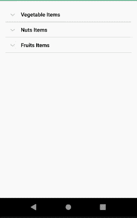

# 安卓中简单可扩展的适配器，示例

> 原文:[https://www . geeksforgeeks . org/simpleexpandablelelistaper-in-Android-with-example/](https://www.geeksforgeeks.org/simpleexpandablelistadapter-in-android-with-example/)

Android ExpandableListView 是一个视图，用于将项目显示为垂直滚动的两级列表。与[列表视图](https://www.geeksforgeeks.org/android-listview-in-java-with-example/)的基本区别在于，它允许两级显示，即可以通过触摸轻松展开和折叠的组来查看及其各自的子项目。为了显示视图，在 android 中使用了 ExpandableListViewAdapter。在许多应用程序中，需要一个可扩展的列表视图工具。例如:

*   在“城市”app(适用于任何城市)中，如果用户想要查看工程学院列表/艺术学院列表/医学学院列表等。,
*   蔬菜清单/水果清单/坚果清单等。，用于“jiomart”类应用程序
*   掀背车清单/横切清单/轿车清单等。，这是一款“优步”类型的应用

### **重要方法**

<figure class="table">

| 

方法

 | 

描述

 |
| --- | --- |
| 设置儿童指示器(可绘制) | 每个项目的当前状态指示器如果子项目为

组的最后一个子对象，state_last 将被设置 |
| 设置组指示器(可绘制) | 表示展开或折叠的状态如果组展开，则为 state；如果组的状态为，则为 state_collapsed如果没有组，则为 state_empty。 |
| getGroupView() | 用于获取列表组标题的视图 |
| getChildView() | 用于获取列表子项的视图 |

</figure>

### **值得注意的界面**

<figure class="table">

| 

接口

 | 

描述

 |
| --- | --- |
| ExpandableListView(可扩展列表视图)。onchildclicklistener | 当单击展开列表中的子级时，这将被覆盖 |
| ExpandableListView(可扩展列表视图)。OnGroupClickListener | 当单击展开列表中的组标题时，这将被覆盖 |
| ExpandableListView(可扩展列表视图)。ongroupcollapselistener | 当组折叠时，此方法通知 |
| ExpandableListView(可扩展列表视图)。分组 x listener | 当群组展开时，这个方法会通知 |

</figure>

### 例子

让我们看看在安卓系统中实现 SimpleExpandableListAdapter 的方法，在 ExpandableListAdapter 中有一个蔬菜列表/水果列表/坚果列表。下面给出了一个 GIF 示例，来了解一下在本文中要做什么。请注意，我们将使用 **Java** 语言来实现这个项目。



**第一步:创建新项目**

要在安卓工作室创建新项目，请参考[如何在安卓工作室创建/启动新项目](https://www.geeksforgeeks.org/android-how-to-create-start-a-new-project-in-android-studio/)。注意选择 **Java** 作为编程语言。

**第二步:创建 dimens.xml 文件**

转到**应用程序> res >值>右键单击>新建>值资源文件**，并将文件命名为**尺寸。**此文件中给出了维度相关信息。下面是 **dimens.xml** 文件的代码。

## 可扩展标记语言

```
<resources>
    <!-- Default screen margins, per the Android Design guidelines. -->
    <dimen name="activity_horizontal_margin">16dp</dimen>
    <dimen name="activity_vertical_margin">16dp</dimen>
</resources>
```

**第 3 步:处理 XML 文件**

*   为了设计用户界面，代码以 XML 的形式出现在 res\layout 文件夹下。它们在活动文件中使用，一旦 XML 文件在活动范围内，就可以访问 XML 中的组件。下面是 **activity_main.xml** 文件的代码。代码中添加了注释，以更详细地理解代码。

## 可扩展标记语言

```
<!-- RelativeLayout places the components vertically one by one.
     Necessary parameters also specified so that elegant output can be seen -->
<RelativeLayout 
    xmlns:android="http://schemas.android.com/apk/res/android"
    xmlns:tools="http://schemas.android.com/tools"
    android:layout_width="match_parent"
    android:layout_height="match_parent"
    android:paddingLeft="@dimen/activity_horizontal_margin"
    android:paddingTop="@dimen/activity_vertical_margin"
    android:paddingRight="@dimen/activity_horizontal_margin"
    android:paddingBottom="@dimen/activity_vertical_margin"
    tools:context=".MainActivity">

    <!-- ExpandableListView is used in relativelayout
         The android:indicatorLeft is the left bound for an items indicator.-->
    <ExpandableListView
        android:id="@+id/expandableListViewSample"
        android:layout_width="match_parent"
        android:layout_height="match_parent"
        android:divider="@android:color/darker_gray"
        android:dividerHeight="0.5dp"
        android:indicatorLeft="?android:attr/expandableListPreferredItemIndicatorLeft" />

</RelativeLayout>
<!-- Note: We cannot use the value wrap_content for the android:layout_height
     attribute of the ExpandableListView in XML. -->
```

*   转到 **app > res >布局>新建>布局资源文件**并将文件命名为**列表 _ 组。**下面是 **list_group.xml** 文件的代码。

## 可扩展标记语言

```
<?xml version="1.0" encoding="utf-8"?>
<LinearLayout 
    xmlns:android="http://schemas.android.com/apk/res/android"
    android:layout_width="match_parent"
    android:layout_height="match_parent"
    android:orientation="vertical">

    <TextView
        android:id="@+id/listTitle"
        android:layout_width="fill_parent"
        android:layout_height="wrap_content"
        android:paddingLeft="?android:attr/expandableListPreferredItemPaddingLeft"
        android:paddingTop="10dp"
        android:paddingBottom="10dp"
        android:textColor="@android:color/black" />

</LinearLayout>
```

*   接下来是子项目的布局行。这是通过 **list_item.xml** 文件完成的。转到 **app > res >布局>新建>布局资源文件**并将文件命名为 **list_item** 。下面是 **list_item.xml** 文件的代码。

## 可扩展标记语言

```
<?xml version="1.0" encoding="utf-8"?>
<LinearLayout 
    xmlns:android="http://schemas.android.com/apk/res/android"
    android:layout_width="match_parent"
    android:layout_height="wrap_content"
    android:orientation="vertical">

    <TextView
        android:id="@+id/expandedListItem"
        android:layout_width="fill_parent"
        android:layout_height="wrap_content"
        android:paddingLeft="?android:attr/expandableListPreferredChildPaddingLeft"
        android:paddingTop="10dp"
        android:paddingBottom="10dp" />

</LinearLayout>
```

*   有了上面的 XML，UI 设计元素就完成了。接下来是一个 java 文件来填充列表的内容。

**第 4 步:使用 Java 文件**

*   转到**应用程序> java >您的包名>右键单击>新建> Java 类**并将文件命名为**可扩展列表数据项目。**以下是**ExpandableListDataItems.java**文件的代码。代码中添加了注释，以更详细地理解代码。

## Java 语言(一种计算机语言，尤用于创建网站)

```
import java.util.ArrayList;
import java.util.HashMap;
import java.util.List;

public class ExpandableListDataItems {
    public static HashMap<String, List<String>> getData() {
        HashMap<String, List<String>> expandableDetailList = new HashMap<String, List<String>>();

        // As we are populating List of fruits, vegetables and nuts, using them here
        // We can modify them as per our choice.
        // And also choice of fruits/vegetables/nuts can be changed
        List<String> fruits = new ArrayList<String>();
        fruits.add("Apple");
        fruits.add("Orange");
        fruits.add("Guava");
        fruits.add("Papaya");
        fruits.add("Pineapple");

        List<String> vegetables = new ArrayList<String>();
        vegetables.add("Tomato");
        vegetables.add("Potato");
        vegetables.add("Carrot");
        vegetables.add("Cabbage");
        vegetables.add("Cauliflower");

        List<String> nuts = new ArrayList<String>();
        nuts.add("Cashews");
        nuts.add("Badam");
        nuts.add("Pista");
        nuts.add("Raisin");
        nuts.add("Walnut");

        // Fruits are grouped under Fruits Items. Similarly the rest two are under
        // Vegetable Items and Nuts Items respecitively.
        // i.e. expandableDetailList object is used to map the group header strings to
        // their respective children using an ArrayList of Strings.
        expandableDetailList.put("Fruits Items", fruits);
        expandableDetailList.put("Vegetable Items", vegetables);
        expandableDetailList.put("Nuts Items", nuts);
        return expandableDetailList;
    }
}
```

*   转到**应用程序> java >您的包名>右键单击>新建> Java 类**并将文件命名为**定制 CustomizedExpandableListAdapter。**以下是**CustomizedExpandableListAdapter.java**文件的代码。这个 java 类扩展了 BaseExpandableListAdapter，它覆盖了 ExpandableListView 所需的方法。代码中添加了注释，以更详细地理解代码。

## Java 语言(一种计算机语言，尤用于创建网站)

```
import android.content.Context;
import android.graphics.Typeface;
import android.view.LayoutInflater;
import android.view.View;
import android.view.ViewGroup;
import android.widget.BaseExpandableListAdapter;
import android.widget.TextView;
import java.util.HashMap;
import java.util.List;

public class CustomizedExpandableListAdapter extends BaseExpandableListAdapter {

    private Context context;
    private List<String> expandableTitleList;
    private HashMap<String, List<String>> expandableDetailList;

    // constructor
    public CustomizedExpandableListAdapter(Context context, List<String> expandableListTitle,
                                           HashMap<String, List<String>> expandableListDetail) {
        this.context = context;
        this.expandableTitleList = expandableListTitle;
        this.expandableDetailList = expandableListDetail;
    }

    @Override
    // Gets the data associated with the given child within the given group.
    public Object getChild(int lstPosn, int expanded_ListPosition) {
        return this.expandableDetailList.get(this.expandableTitleList.get(lstPosn)).get(expanded_ListPosition);
    }

    @Override
    // Gets the ID for the given child within the given group.
    // This ID must be unique across all children within the group. Hence we can pick the child uniquely
    public long getChildId(int listPosition, int expanded_ListPosition) {
        return expanded_ListPosition;
    }

    @Override
    // Gets a View that displays the data for the given child within the given group.
    public View getChildView(int lstPosn, final int expanded_ListPosition, 
                             boolean isLastChild, View convertView, ViewGroup parent) {
        final String expandedListText = (String) getChild(lstPosn, expanded_ListPosition);
        if (convertView == null) {
            LayoutInflater layoutInflater = (LayoutInflater) this.context.getSystemService(Context.LAYOUT_INFLATER_SERVICE);
            convertView = layoutInflater.inflate(R.layout.list_item, null);
        }
        TextView expandedListTextView = (TextView) convertView.findViewById(R.id.expandedListItem);
        expandedListTextView.setText(expandedListText);
        return convertView;
    }

    @Override
    // Gets the number of children in a specified group.
    public int getChildrenCount(int listPosition) {
        return this.expandableDetailList.get(this.expandableTitleList.get(listPosition)).size();
    }

    @Override
    // Gets the data associated with the given group.
    public Object getGroup(int listPosition) {
        return this.expandableTitleList.get(listPosition);
    }

    @Override
    // Gets the number of groups.
    public int getGroupCount() {
        return this.expandableTitleList.size();
    }

    @Override
    // Gets the ID for the group at the given position. This group ID must be unique across groups.
    public long getGroupId(int listPosition) {
        return listPosition;
    }

    @Override
    // Gets a View that displays the given group.
    // This View is only for the group--the Views for the group's children
    // will be fetched using getChildView()
    public View getGroupView(int listPosition, boolean isExpanded, View convertView, ViewGroup parent) {
        String listTitle = (String) getGroup(listPosition);
        if (convertView == null) {
            LayoutInflater layoutInflater = (LayoutInflater) this.context.
                    getSystemService(Context.LAYOUT_INFLATER_SERVICE);
            convertView = layoutInflater.inflate(R.layout.list_group, null);
        }
        TextView listTitleTextView = (TextView) convertView.findViewById(R.id.listTitle);
        listTitleTextView.setTypeface(null, Typeface.BOLD);
        listTitleTextView.setText(listTitle);
        return convertView;
    }

    @Override
    // Indicates whether the child and group IDs are stable across changes to the underlying data.
    public boolean hasStableIds() {
        return false;
    }

    @Override
    // Whether the child at the specified position is selectable.
    public boolean isChildSelectable(int listPosition, int expandedListPosition) {
        return true;
    }
}
```

*   下面是**MainActivity.java**文件的代码。代码中添加了注释，以更详细地理解代码。

## Java 语言(一种计算机语言，尤用于创建网站)

```
import android.os.Bundle;
import android.view.View;
import android.widget.ExpandableListAdapter;
import android.widget.ExpandableListView;
import android.widget.Toast;
import androidx.appcompat.app.AppCompatActivity;
import java.util.ArrayList;
import java.util.HashMap;
import java.util.List;

public class MainActivity extends AppCompatActivity {

    ExpandableListView expandableListViewExample;
    ExpandableListAdapter expandableListAdapter;
    List<String> expandableTitleList;
    HashMap<String, List<String>> expandableDetailList;

    @Override
    protected void onCreate(Bundle savedInstanceState) {
        super.onCreate(savedInstanceState);
        setContentView(R.layout.activity_main);
        expandableListViewExample = (ExpandableListView) findViewById(R.id.expandableListViewSample);
        expandableDetailList = ExpandableListDataItems.getData();
        expandableTitleList = new ArrayList<String>(expandableDetailList.keySet());
        expandableListAdapter = new CustomizedExpandableListAdapter(this, expandableTitleList, expandableDetailList);
        expandableListViewExample.setAdapter(expandableListAdapter);

        // This method is called when the group is expanded
        expandableListViewExample.setOnGroupExpandListener(new ExpandableListView.OnGroupExpandListener() {
            @Override
            public void onGroupExpand(int groupPosition) {
                Toast.makeText(getApplicationContext(), expandableTitleList.get(groupPosition) + " List Expanded.", Toast.LENGTH_SHORT).show();
            }
        });

        // This method is called when the group is collapsed
        expandableListViewExample.setOnGroupCollapseListener(new ExpandableListView.OnGroupCollapseListener() {
            @Override
            public void onGroupCollapse(int groupPosition) {
                Toast.makeText(getApplicationContext(), expandableTitleList.get(groupPosition) + " List Collapsed.", Toast.LENGTH_SHORT).show();
            }
        });

        // This method is called when the child in any group is clicked
        // via a toast method, it is shown to display the selected child item as a sample
        // we may need to add further steps according to the requirements
        expandableListViewExample.setOnChildClickListener(new ExpandableListView.OnChildClickListener() {
            @Override
            public boolean onChildClick(ExpandableListView parent, View v,
                                        int groupPosition, int childPosition, long id) {
                Toast.makeText(getApplicationContext(), expandableTitleList.get(groupPosition)
                                + " -> "
                                + expandableDetailList.get(
                                expandableTitleList.get(groupPosition)).get(
                                childPosition), Toast.LENGTH_SHORT
                ).show();
                return false;
            }
        });
    }
}
```

### 输出:**在仿真器上运行**

<video class="wp-video-shortcode" id="video-491582-1" width="640" height="360" preload="metadata" controls=""><source type="video/mp4" src="https://media.geeksforgeeks.org/wp-content/uploads/20200924151037/Sample-Emulator-Output.mp4?_=1">[https://media.geeksforgeeks.org/wp-content/uploads/20200924151037/Sample-Emulator-Output.mp4](https://media.geeksforgeeks.org/wp-content/uploads/20200924151037/Sample-Emulator-Output.mp4)</video>

### **结论**

ExpandableListView 是许多应用程序中使用的非常有用的强制功能。在移动应用程序的大小和可用空间中，为了显示多个项目，应该需要像可扩展列表视图和可扩展列表视图这样的功能，以便视图能够完美地匹配。由于可以滚动，我们可以在许多层面上保存信息。这些方法支持展开标题、折叠标题、完美地选择子项目，如模拟器输出所示。为了简单起见，我们提供了 Toast 消息。根据需求，我们可以添加更多的编码来与之匹配。