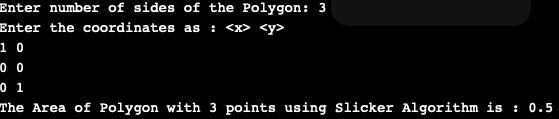

# Java 中求多边形面积的切片算法

> 原文:[https://www . geeksforgeeks . org/slicker-算法查找 java 多边形面积/](https://www.geeksforgeeks.org/slicker-algorithm-to-find-the-area-of-a-polygon-in-java/)

切片算法是一种确定 n 边多边形面积的方法。根据数学惯例，该算法将向上指向的 ***y 方向*** 视为正的，但是根据计算机系统，其中正的 ***y 方向*** 是向下的，最有效的方法是使用正的 y 向下坐标逆时针列出顶点，这抵消了两种效果，并依次返回正的区域。

**例**

```java
Input:
      Enter number of sides of the Polygon: 4
      Enter the coordinates as : <x> <y>
      0 0
      1 0
      1 1
      0 1
Output:
The Area of Polygon with 4 points using Slicker Algorithm is: 1      
```

**接近**

```java
Take no of sides and coordinates of n-sided polygon as an input from the user

Define function Area() which calculates the area with p as an argument as follows:
  for i = 0 to (p.n-1)
      j = (i + 1) % p.n;
     calculate area += (p.p[i].x * p.p[j].y) - (p.p[j].x * p.p[i].y);
     print total area as area/2

```

**注意:**输入点必须按顺序取，随机取点程序无法正常工作。

下面是上述程序的实现

## Java 语言(一种计算机语言，尤用于创建网站)

```java
// Implement Slicker Algorithm that avoids
// Triangulation to Find Area of a Polygon
import java.util.*;
class Main {
    // defining the maximum no of sides for the Polygon
    static final int MAXSIDES = 200;

    static class Corner {
        double x, y;
    }

    static class Polygon {
        Corner p[] = new Corner[MAXSIDES];
        int n;

        Polygon()
        {
            for (int i = 0; i < MAXSIDES; i++)
                p[i] = new Corner();
        }
    }

    // calculating area with Slicker Algorithm
    static double area(Polygon p)
    {
        double total = 0;
        for (int i = 0; i < p.n; i++) {
            int j = (i + 1) % p.n;
            total += (p.p[i].x * p.p[j].y)
                     - (p.p[j].x * p.p[i].y);
        }
        return total / 2;
    }

    static public void main(String[] args)
    {
        Polygon p = new Polygon();

        Scanner sc = new Scanner(System.in);

        // Taking inputs from the user

        System.out.print(
            "Enter number of sides of the Polygon: ");

        p.n = sc.nextInt();

        System.out.println(
            "Enter the coordinates as : <x> <y>");

        // Taking the coordinates of each Corner
        for (int i = 0; i < p.n; i++) {
            p.p[i].x = sc.nextDouble();
            p.p[i].y = sc.nextDouble();
        }
        double area = area(p);
        if (area > 0)
            System.out.print(
                "The Area of Polygon with " + p.n
                + " points using Slicker Algorithm is : "
                + area);
        else
            System.out.print(
                "The Area of Polygon with " + p.n
                + " points using Slicker Algorithm is : "
                + (area * -1));
        sc.close();
    }
}
```

**输出:**



**时间复杂度:** O(N)，其中 N 是多边形的边数。