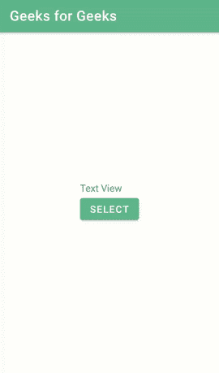

# 安卓中的滑块日期选择器

> 原文:[https://www . geesforgeks . org/slider-date-picker-in-Android/](https://www.geeksforgeeks.org/slider-date-picker-in-android/)

**滑块日期选择器**是我们在大多数应用程序中看到的最受欢迎的功能之一。我们可以在大多数旅行计划应用程序、机票预订服务等中看到这个滑块日期选择器。使用滑块日期选择器可以有效地选择日期。在本文中，我们将看到如何在安卓系统中实现滑块日期选择器。下面给出了一个 GIF 示例，来了解一下我们将在本文中做什么。注意，我们将使用 **Java** 语言来实现这个项目。



### 滑动日期选择器的应用

*   这种滑块日期选择器最常见的应用是，它用于大多数旅行计划应用。
*   此日期选择器也可以在机票预订服务中看到。
*   您可以在考试表格填写应用程序中看到此滑块日期选择器。

### **滑块日期选择器的属性**

<figure class="table">

| 

属性

 | 

描述

 |
| --- | --- |
| **。setStartDate()** | 设置日历的开始日期。 |
| T0。setenddate()t1 | 设置日历的结束日期。 |
| 。**【setthemecolor()** | 设置主题颜色。 |
| **.setHeaderTextColor（）** | 设置标题文本颜色。 |
| **.setHeaderDateFormat（）** | 设置日期格式。 |
| **。setShowYear()** | 显示当前年份。 |
| **.setCancelText（）** | 取消文本。 |
| **。set conf text()** | 确认文本。 |
| **setpreseleteddate()** | 选择今天的日期。 |

</figure>

### **分步实施**

**第一步:创建新项目**

要在安卓工作室创建新项目，请参考[如何在安卓工作室创建/启动新项目](https://www.geeksforgeeks.org/android-how-to-create-start-a-new-project-in-android-studio/)。注意选择 **Java** 作为编程语言。

**第二步:添加依赖和 JitPack 存储库**

导航到**渐变脚本>构建.渐变(模块:应用)**，并在依赖项部分添加以下依赖项。

> 实现' com . github . niwattep:material-slide-date-picker:v 2 . 0 . 0 '

将 JitPack 存储库添加到构建文件中。将其添加到 allprojects{ }部分内存储库末尾的 root build.gradle 中。

> *所有项目{*
> 
> *存储库{*
> 
> *……*
> 
> *maven { URL " https://jitpack . io " }*
> 
> *}*
> 
> *}*

添加这个依赖项后，同步您的项目，现在我们将开始实现它。

**第三步:在你的 activity_main.xml 文件中创建一个新的滑块日期选择器**

导航到**应用程序> res >布局> activity_main.xml** 并将下面的代码添加到该文件中。下面是 **activity_main.xml** 文件的代码。

## 可扩展标记语言

```java
<?xml version="1.0" encoding="utf-8"?>
<RelativeLayout
    xmlns:android="http://schemas.android.com/apk/res/android"
    xmlns:tools="http://schemas.android.com/tools"
    android:layout_width="match_parent"
    android:layout_height="match_parent"
    android:gravity="center"
    android:orientation="vertical"
    tools:context=".MainActivity">

    <!--Text View to display Date-->
    <TextView
        android:id="@+id/textView"
        android:layout_width="wrap_content"
        android:layout_height="wrap_content"
        android:gravity="center"
        android:text="Text View" />

    <!--Button to select date-->
    <Button
        android:id="@+id/button"
        android:layout_width="wrap_content"
        android:layout_height="wrap_content"
        android:layout_below="@+id/textView"
        android:text="SELECT" />

</RelativeLayout>
```

**第四步:使用****MainActivity.java 文件**

转到**MainActivity.java**文件，参考以下代码。以下是**MainActivity.java**文件的代码。代码中添加了注释，以更详细地理解代码。

## Java 语言(一种计算机语言，尤用于创建网站)

```java
import android.os.Bundle;
import android.view.View;
import android.widget.Button;
import android.widget.TextView;

import androidx.appcompat.app.AppCompatActivity;

import com.niwattep.materialslidedatepicker.SlideDatePickerDialog;
import com.niwattep.materialslidedatepicker.SlideDatePickerDialogCallback;

import java.text.SimpleDateFormat;
import java.util.Calendar;
import java.util.Locale;

public class MainActivity extends AppCompatActivity implements SlideDatePickerDialogCallback {

    // Initialize textview and button
    Button button;
    TextView textView;

    @Override
    protected void onCreate(Bundle savedInstanceState) {
        super.onCreate(savedInstanceState);
        setContentView(R.layout.activity_main);

        // button and text view called using id
        button = findViewById(R.id.button);
        textView = findViewById(R.id.textView);

        button.setOnClickListener(new View.OnClickListener() {
            @Override
            public void onClick(View view) {
                Calendar endDate = Calendar.getInstance();
                endDate.set(Calendar.YEAR, 2100);
                SlideDatePickerDialog.Builder builder = new SlideDatePickerDialog.Builder();
                builder.setEndDate(endDate);
                SlideDatePickerDialog dialog = builder.build();
                dialog.show(getSupportFragmentManager(), "Dialog");
            }
        });
    }

    // date picker
    @Override
    public void onPositiveClick(int date, int month, int year, Calendar calendar) {
        SimpleDateFormat format = new SimpleDateFormat("EEEE, MMM dd, yyyy", Locale.getDefault());
        textView.setText(format.format(calendar.getTime()));
    }
}
```

现在点击**运行**选项**构建梯度**需要一些时间。之后，您将获得如下所示的设备输出。

### **输出:**

<video class="wp-video-shortcode" id="video-547176-1" width="640" height="360" preload="metadata" controls=""><source type="video/mp4" src="https://media.geeksforgeeks.org/wp-content/uploads/20210120095139/Screenrecorder-2021-01-20-09-49-15-998.mp4?_=1">[https://media.geeksforgeeks.org/wp-content/uploads/20210120095139/Screenrecorder-2021-01-20-09-49-15-998.mp4](https://media.geeksforgeeks.org/wp-content/uploads/20210120095139/Screenrecorder-2021-01-20-09-49-15-998.mp4)</video>