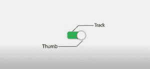
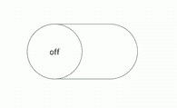
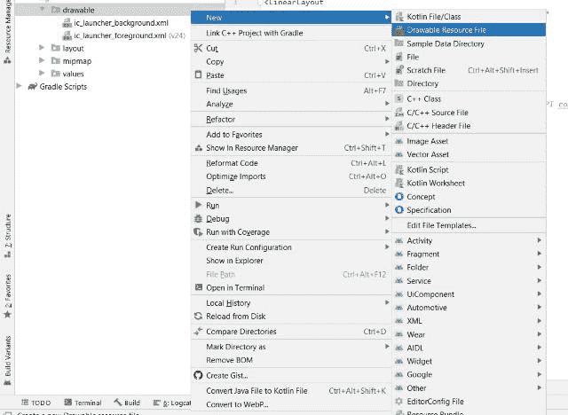
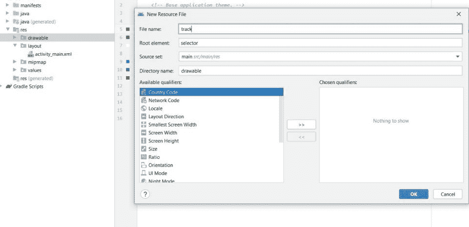
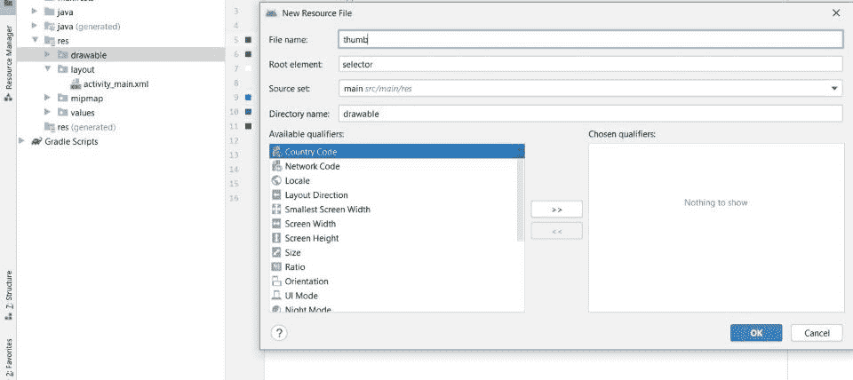

# 安卓中的滑动切换按钮

> 原文:[https://www . geesforgeks . org/滑动-切换-按钮-in-android/](https://www.geeksforgeeks.org/sliding-toggle-button-in-android/)

在本文中，我们将在**安卓工作室**中构建一个非常简单有趣的应用**“sliding togglebutton”**。安卓工作室真的是一个很好的应用设计平台。我们可以使用 **Java** 和 **Kotlin** 语言在 Android Studio 中进行编程，但请注意，我们将在应用程序开发中使用 Java。 [**切换按钮**](https://www.geeksforgeeks.org/togglebutton-in-kotlin/) 主要是一个**关/开**按钮，有一个指示灯指示切换按钮的当前状态。ToggleButton 最常见的例子是在声音、蓝牙、wifi、热点等方面做开/关。**开关**是自安卓 4.0 提供滑块控制以来生效的另一种切换按钮。从 ToggleButton 开始，我们转向了 switch，现在，从 Android 支持库 v21 开始，我们有了一个名为 **SwitchCompat** 的新样式，我们将在我们的应用程序中使用。这个小部件适用于任何安卓 7+软件开发工具包。SwitchCompat 是核心 Switch 小部件的完整副本，它将该小部件的功能带到了平台的旧版本。下面是我们将要创建的 ToggleButton 的图像。长方形称为**轨道**，椭圆形称为**拇指**。



切换按钮图像

下面给出了一个 GIF 示例，来了解一下我们将在本文中做什么。



### 逐步实施

**第一步:创建新项目**

要在安卓工作室创建新项目，请参考[如何在安卓工作室创建/启动新项目。](https://www.geeksforgeeks.org/android-how-to-create-start-a-new-project-in-android-studio/)注意，你要选择 **Java** 作为编程语言。

**第二步:为**创建一个文件

我们必须为图像的**轨迹**部分创建一个单独的可绘制文件。要创建此文件，导航至 **res >可绘制**。现在你要在**可绘制的**上右键，然后点击**新建**，再点击**可绘制的资源文件。**如下图所示。



点击**可绘制资源文件**后，我们可以创建一个新的可绘制文件，如下图所示。给你的文件命名，然后点击**确定，**我们的轨迹文件已经创建。



**步骤 3:使用 track.xml 文件**

导航至 **res >可绘制> track.xml** 并将以下代码添加到该文件**。**我们将创建切换按钮的轨迹部分并实现其功能。我把赛道做成矩形，有一些笔画和拐角半径，这样看起来很吸引人。当 ToggleButton 打开时，它的颜色被设置为具有颜色代码 **"#34c759"** 的绿色，当 ToggleButton 关闭时，它被设置为具有颜色代码**" # 8c 8c "**的白色。

## 可扩展标记语言

```java
<?xml version="1.0" encoding="utf-8"?>
<selector xmlns:android="http://schemas.android.com/apk/res/android">

    <!--we are going to create track the track and implement its functionality
    when the toggleButton is turned on. I have made its shape rectangular and color
    is set to green. Height is fitted to 20 dp and corners-radius is made 100 dp for
    rounded shape at every corner of rectangle.
    -->
    <item android:state_checked="true">
        <shape android:shape="rectangle">
            <solid android:color="#34c759" />
            <corners android:radius="100dp" />
            <stroke android:width="1dp" android:color="#8c8c8c" />
            <size android:height="20dp" />
        </shape>
    </item>

    <!--we are going to create track the track and implement its functionalities
    when the toggleButton is turned off.I have made its shape rectangular and color
    is set to white. Height is fitted to 20 dp and corners-radius is made 100 dp for
    rounded shape at every corner of rectangle.
    -->
    <item android:state_checked="false">
        <shape android:shape="rectangle">
            <solid android:color="@android:color/white" />
            <corners android:radius="100dp" />
            <stroke android:width="1dp" android:color="#8c8c8c" />
            <size android:height="20dp" />
        </shape>
    </item>

</selector>
```

**第 4 步:为“拇指”创建文件**

我们必须为图像的**拇指**部分创建一个单独的可绘制文件。要创建此文件，请导航至 **res >可绘制的**。现在你要右键点击**可绘制**，然后点击**新建**，再点击**可绘制资源文件**。点击可绘制资源文件后，您将获得如下所示的图像:



你只需要添加一个文件名，然后点击**确定，**你的拇指文件就创建好了。

**第 5 步:使用 thumb.xml 文件**

导航到 **res >可绘制> tracks.xml** 并将下面的代码添加到该文件中。我们将创建切换按钮的拇指部分，并实现其功能。拇指做成椭圆形，填充白色。当拨动按钮打开时，它向右移动，其边框颜色为**绿色(# 34c 759)**；当拨动按钮关闭时，它向左移动，其边框颜色为**白色(# 8c 8c)**。

## 可扩展标记语言

```java
<?xml version="1.0" encoding="utf-8"?>
<selector xmlns:android="http://schemas.android.com/apk/res/android">

    <!--first of all we are going to create thumb item where we will
    keep state_checked="true" that means when toggleButton is turned on. 
    It is filled with white color having border-color green. Its height and
    width both are made made 100 dp.-->
    <item android:state_checked="true">
        <shape android:shape="oval">
            <solid android:color="@android:color/white" />
            <stroke android:width="1dp" android:color="#34c759" />
            <size android:width="100dp" android:height="100dp" />
        </shape>
    </item>

    <!--first of all we are going to create thumb item where we will
    keep state_checked="false" that means when toggleButton is turned off. 
    It is filled with white color having border-color white. Its height and
    width both are made made 100 dp.-->
    <item android:state_checked="false">
        <shape android:shape="oval">
            <solid android:color="@android:color/white" />
            <stroke android:width="1dp" android:color="#8c8c8c" />
            <size android:width="100dp" android:height="100dp" />
        </shape>
    </item>

</selector>
```

**第 6 步:使用 activity_main.xml 文件**

导航到 **res >布局> activity_main.xml** 并将下面的代码添加到该文件中。这里我添加了**开关兼容性**而不是简单的开关。当**切换按钮**打开时，显示文字**“开”**，当切换按钮关闭时，显示**“关”**。

**XML 属性**

> **安卓:拇指**(可抽作来回切换的“拇指”使用)
> 
> **安卓:轨迹**(可画成开关拇指滑动的“轨迹”)
> 
> **安卓:showText** (是否绘制开/关文本)
> 
> **安卓:textOn** (开关处于“开”状态时显示的文字)
> 
> **安卓:textOff** (开关处于“Off”状态时显示的文字)

下面是**activity _ main . XML**文件的代码。

## 可扩展标记语言

```java
<?xml version="1.0" encoding="utf-8"?>
<!--We are going to use linearlayout for this application-->
<LinearLayout 
    xmlns:android="http://schemas.android.com/apk/res/android"
    xmlns:app="http://schemas.android.com/apk/res-auto"
    xmlns:tools="http://schemas.android.com/tools"
    android:layout_width="match_parent"
    android:layout_height="match_parent"
    android:orientation="vertical"
    tools:context=".MainActivity">

    <!--Instead of simple ToggleButton i will be using SwitchCompat
     because it has backward API compatibility. Here track and thumb are
     called. when ToggleButton is turned on it will display "on" and
     when it is turned off it will display "off".-->
    <androidx.appcompat.widget.SwitchCompat
        android:layout_width="wrap_content"
        android:layout_height="wrap_content"
        android:layout_marginTop="100dp"
        android:padding="50dp"
        android:textOff="off"
        android:textOn="on"
        android:thumb="@drawable/thumb"
        app:showText="true"
        app:track="@drawable/track" />

</LinearLayout>
```

**第七步:更改应用标题**

首先进入**值**文件夹，然后选择**字符串. xml** 文件。使用这个文件，我们可以更改我们的应用程序的标题。我保留了标题**“GFG | sliding togglebutton”。**

## 可扩展标记语言

```java
<resources>
    <string name="app_name">GFG | SlidingToggleButton</string>
</resources>
```

**第八步:改变 AppBar 的颜色**

首先进入**值**文件夹，然后选择 **colors.xml** 文件。在 colors.xml 文件中，您可以将自己选择的颜色保留在应用程序中，数量不限。你只需给出名称，并输入相应颜色的颜色代码。我们将 AppBar 颜色保留为**“# 0f9d 58”**，我们将其命名为“绿色”。

## 可扩展标记语言

```java
<?xml version="1.0" encoding="utf-8"?>
<resources>
    <color name="green">#0F9D58</color>
    <color name="purple_500">#FF6200EE</color>
    <color name="purple_700">#FF3700B3</color>
    <color name="teal_200">#FF03DAC5</color>
    <color name="teal_700">#FF018786</color>
    <color name="black">#FF000000</color>
    <color name="white">#FFFFFFFF</color>
</resources>
```

**输出:**

<video class="wp-video-shortcode" id="video-583737-1" width="640" height="360" preload="metadata" controls=""><source type="video/mp4" src="https://media.geeksforgeeks.org/wp-content/uploads/20210327113305/toggle_button.mp4?_=1">[https://media.geeksforgeeks.org/wp-content/uploads/20210327113305/toggle_button.mp4](https://media.geeksforgeeks.org/wp-content/uploads/20210327113305/toggle_button.mp4)</video>

**你可以在下面给出的 GitHub 链接上获得源代码:**[https://github.com/Babitababy/SlidingToggleButton](https://github.com/Babitababy/SlidingToggleButton)