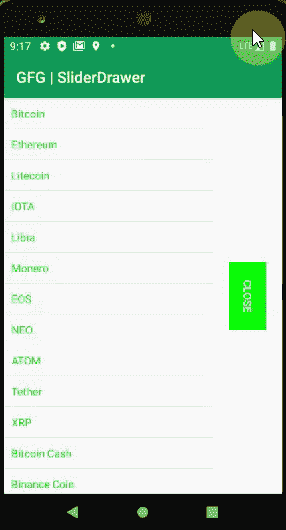

# 安卓滑动抽屉示例

> 原文:[https://www . geeksforgeeks . org/sliding drawer-in-Android-with-example/](https://www.geeksforgeeks.org/slidingdrawer-in-android-with-example/)

**滑动抽屉**是安卓手机的常见要求，无论何时需要，都可以通过水平和垂直滑动来查看内容。在本文中，让我们来看看 Sliding Drawer，它用于将内容隐藏在屏幕之外，并允许用户在需要时拖动手柄，以非常用户友好的方式将内容带到屏幕上。滑动抽屉是一个特殊的小部件，它包含两个子视图，一个用来处理用户拖动的内容，另一个是附加到拖动的手柄上的内容。

### 滑动抽屉的重要方法

**由于这是滑动抽屉，我们可以在必要时拖动并查看内容。所以基本上，打开和关闭是非常重要的方法。在我们的例子中，通过使用这个让我们有一个小的演示代码。除此之外，其他重要的方法也在这里讨论。要初始化(或实例化)sliding 抽屉的一个变量，我们需要像下面这样做**

## **Java 语言(一种计算机语言，尤用于创建网站)**

```java
// First initiate the SlidingDrawer, simpleSlidingDrawer1 
// is the id of SlidingDrawer defined in activity_main.xml
// Here using simpleSlidingDrawer1 as object and 
// this is used throughout next
SlidingDrawer simpleSlidingDrawer1 = (SlidingDrawer) findViewById (R.id.simpleSlidingDrawer1);
```

<figure class="table">

| 

方法

 | 

描述

 |
| --- | --- |
| 打开() | 为了立即打开抽屉，我们点击视图(按钮、文本视图等)打开抽屉 |
| 关闭() | 为了立即关闭抽屉，我们在视图点击(按钮、文本视图等)时关闭抽屉 |
| animateOpen() | 此方法类似于 open()方法，但带有动画。我们也可以在点击视图(按钮或任何其他视图)时使用这种方法 |
| 动画关闭() | 此方法类似于 close()方法，但带有动画。我们也可以在点击视图(按钮或任何其他视图)时使用这种方法 |
| 等化的() | 在许多地方，我们可能需要检查抽屉是否打开。结果是一个布尔值，如果为真，抽屉就会打开 |
| 锁定() | 如果有必要禁用触摸事件，我们可以使用这种方法。

虽然这是一个罕见的场景，这个设施也是可用的它用于锁定 SliderDrawer 并忽略触摸事件。我们也可以在点击视图(按钮或任何其他视图)时使用这种方法 |
| 解锁() | 如果意外锁定，即触摸事件被禁用，则必须解锁。为此，我们可以使用这种方法。我们也可以在点击视图(按钮或任何其他视图)时使用这种方法 |

</figure>

## **Java 语言(一种计算机语言，尤用于创建网站)**

```java
// important methods are discussed here

// open the Sliding Drawer
simpleSlidingDrawer1.open(); 

// close the Sliding Drawer
simpleSlidingDrawer1.close(); 

// open the Sliding Drawer but with an animation
simpleSlidingDrawer1.animateOpen(); 

// close the Sliding Drawer but with an animation
simpleSlidingDrawer1.animateClose();
```

**通过编程，我们可能需要检查滑动抽屉是打开还是关闭的。为此，我们可以使用下面的一组方法。**

## **Java 语言(一种计算机语言，尤用于创建网站)**

```java
// check whether the slider is opened or not and 
// depends upon that we can do rest of the calculations
Boolean isSliderSrawerOpen = simpleSlidingDrawer1.isOpened(); 

// If we do not want touch events to occur, set this
simpleSlidingDrawer1.lock(); 

// In order to process the touch events
// if accidentally locked or due to some requirement got locked
simpleSlidingDrawer1\. unlock();
```

****设置方法:****

****setandless listener(ondrawercloslisteneroutercloslistener):****

**此方法用于设置抽屉关闭时接收通知的侦听器。方法的名称不言自明。**

## **Java 语言(一种计算机语言，尤用于创建网站)**

```java
simpleSlidingDrawer1.setOnDrawerCloseListener(
    new SlidingDrawer.OnDrawerCloseListener() {
        @Override public void onDrawerClosed()
        {
            // Suppose you can give a toast message or when
            // drawer closes need to navigate to another
            // event etc., So required steps are done here
        }
    });
```

****【setonderopenlistenereropenlistener】****

**此方法用于设置抽屉打开时接收通知的侦听器。方法的名称不言自明。**

## **Java 语言(一种计算机语言，尤用于创建网站)**

```java
simpleSlidingDrawer1.setOnDrawerOpenListener(
    new SlidingDrawer.OnDrawerOpenListener() {
        @Override public void onDrawerOpened()
        {
            // As per your requirement, add code here.
        }
    });
```

****setndrawesorscrolllistener(ondrawerscrolllistenerdrawerscrolllistener):****

**此方法用于设置当抽屉开始或结束滚动时接收通知的侦听器。方法的名称不言自明。**

## **Java 语言(一种计算机语言，尤用于创建网站)**

```java
simpleSlidingDrawer1.setOnDrawerScrollListener(
    new SlidingDrawer.OnDrawerScrollListener() {
        @Override public void onScrollStarted()
        {
            // Scroll is necessary for large data to view,
            // so necessary code is required here
        }

        @Override public void onScrollEnded()
        {
            // add code here for the scroll ended.
        }
    });
```

### **滑动抽屉的重要**属性****

**为了识别幻灯片绘制者，某些属性是非常强制性的。**

<figure class="table"> **| 

属性

 | describe |
| --- | --- |
| **Id** | Id 属性用于唯一标识一个 SliderDrawer。在您的整个代码中，使用这个 id，可以访问SliderDrawer。这是关键字段，通过为 id 保留有意义的和用户友好的名称，未来的开发人员可以很容易地理解和维护代码 |
| **Handle** | 该属性被用作代表抽屉句柄的孩子的标识符。这在应用中始终可见 |
| **Content** | 在这里可以定义抽屉的内容。为了使内容可见，可以点击手柄查看。open()和 close()方法都有让内容可见和不可见的作用。 |
| **bearing** | 默认方位为垂直。有时可能会要求将的方向设为水平。这个属性使它成为一种便利。 |
| **Rotate** | Depending on the requirements, the views are different. Some people prefer 90/180/270/360 degrees and so on. |** </figure>

### **例子**

**让我们看看提供的视频内容的整个示例代码。下面给出了一个 GIF 示例，来了解一下在本文中要做什么。请注意，我们将使用 **Java** 语言来实现这个项目。**

****

### **逐步实施**

****第一步:创建新项目****

**要在安卓工作室创建新项目，请参考[如何在安卓工作室创建/启动新项目](https://www.geeksforgeeks.org/android-how-to-create-start-a-new-project-in-android-studio/)。注意选择 **Java** 作为编程语言。**

****步骤 2:使用 activity_main.xml 文件****

**这通常在 **res >布局**文件夹下。对于不同的手机尺寸，可能需要不同的布局。但通常首选的是布局文件夹。下面是**activity _ main . XML**文件的代码。**

## **可扩展标记语言**

```java
<?xml version="1.0" encoding="utf-8"?>
<LinearLayout 
    xmlns:android="http://schemas.android.com/apk/res/android"
    android:id="@+id/layout"
    android:layout_width="fill_parent"
    android:layout_height="fill_parent">

    <SlidingDrawer
        android:id="@+id/simpleSlidingDrawer1"
        android:layout_width="fill_parent"
        android:layout_height="wrap_content"
        android:content="@+id/content1"
        android:handle="@+id/handle1"
        android:orientation="horizontal"
        android:rotation="180">

        <!-- Let us define the button -->
        <Button
            android:id="@id/handle1"
            android:layout_width="wrap_content"
            android:layout_height="wrap_content"
            android:background="#0f0"
            android:rotation="270"
            android:text="Open"
            android:textColor="#fff" />

        <!-- layout for the content of the SlidingDrawer -->
        <LinearLayout
            android:id="@id/content1"
            android:layout_width="fill_parent"
            android:layout_height="fill_parent"
            android:orientation="horizontal"
            android:rotation="180">

            <!-- DEFINE ALL YOUR CONTENT,WIDGETS HERE 
                 WHICH YOU WANT TO ADD IN SLIDING DRAWER LAYOUT. -->
            <ListView
                android:id="@+id/simpleListView1"
                android:layout_width="fill_parent"
                android:layout_height="fill_parent" />

        </LinearLayout>
    </SlidingDrawer>
</LinearLayout>
```

****第三步:新建布局资源文件****

**转到**应用程序> res >布局>右键单击>新建>布局资源文件**并创建一个新的布局文件，并将该文件命名为 **list_item.xml.** 该 xml 将保存您在**数组编辑器**中指定的内容。让我们以垂直方向在[线性布局](https://www.geeksforgeeks.org/linearlayout-and-its-important-attributes-with-examples-in-android/)中声明它们，以便内容可以在垂直方向上下滚动。**

## **可扩展标记语言**

```java
<?xml version="1.0" encoding="utf-8"?>
<LinearLayout 
    xmlns:android="http://schemas.android.com/apk/res/android"
    android:layout_width="match_parent"
    android:layout_height="wrap_content"
    android:orientation="vertical">

    <!-- TextView for the list item -->
    <TextView
        android:id="@+id/name1"
        android:layout_width="fill_parent"
        android:layout_height="wrap_content"
        android:padding="10dp"
        android:textColor="#0f0" />
</LinearLayout>
```

****步骤 4:使用 MainActivity.java 文件****

**现在转到 java 文件夹，在**MainActivity.java**中，向 sliding 抽屉提供实现。下面是**MainActivity.java**文件的代码。在代码内部添加注释，更详细地理解代码。**

## **Java 语言(一种计算机语言，尤用于创建网站)**

```java
import android.os.Bundle;
import android.widget.ArrayAdapter;
import android.widget.Button;
import android.widget.ListView;
import android.widget.SlidingDrawer;
import androidx.appcompat.app.AppCompatActivity;

public class MainActivity extends AppCompatActivity {

    String[] nameArray = {"Bitcoin", "Ethereum", "Litecoin", "IOTA", "Libra", "Monero", "EOS",
                          "NEO", "ATOM", "Tether", "XRP", "Bitcoin Cash", "Binance Coin", "REN",
                          "Bitcoin SV", "USD Coin", "Stellar", "Tezos", "Dash", "Zcash"};

    @Override
    protected void onCreate(Bundle savedInstanceState) {
        super.onCreate(savedInstanceState);
        setContentView(R.layout.activity_main);

        // initiate the SlidingDrawer
        SlidingDrawer simpleSlidingDrawer1 = (SlidingDrawer) findViewById(R.id.simpleSlidingDrawer1);

        // initiate a Button which is used for 
        // handling the content of SlidingDrawer
        // We can able to have open and close 
        // methods for this handleButton
        final Button handleButton = (Button) findViewById(R.id.handle1);

        // initiate the ListView that is used for content of Sl.idingDrawer
        // adapter for the list view. As all are text, 
        // it is defined as ArrayAdapter<String>
        // Your cryptocurrency items are going to be displayed via this
        // view using below cryptocurrency ArrayAdapter
        ListView simpleListView1 = (ListView) findViewById(R.id.simpleListView1);

        // Below syntax is for defining ArrayAdapter
        ArrayAdapter<String> cryptocurrencyArrayAdapter = new ArrayAdapter<String>(getApplicationContext(),
                R.layout.list_item, R.id.name1, nameArray);

        // set an adapter to fill the data in the ListView
        simpleListView1.setAdapter(cryptocurrencyArrayAdapter);

        // implement setOnDrawerOpenListener event,
        // name itself suggests that
        // we need to write code for drawer opening
        simpleSlidingDrawer1.setOnDrawerOpenListener(new SlidingDrawer.OnDrawerOpenListener() {
            @Override
            public void onDrawerOpened() {
                // When drawer is opened, we may need 
                // to indicate user that close option
                // is available, so just setting text to close. 
                // But required functionality can be done here
                handleButton.setText("Close");
            }
        });

        // implement setOnDrawerCloseListener event,
        // name itself suggests we need to write close events
        simpleSlidingDrawer1.setOnDrawerCloseListener(new SlidingDrawer.OnDrawerCloseListener() {
            @Override
            public void onDrawerClosed() {
                // if close is done, we should have the option to open.
                // according to the requirement, 
                // carry out necessary steps for close
                handleButton.setText("Open");
            }
        });
    }
}
```

### ****输出:在仿真器上运行****

**在安卓工作室设置代码时，我们可以看到 setting 抽屉正常工作。附上同样的小视频。当然，这个功能在很多应用中都是非常必要的，你会喜欢使用它的。所附视频将有助于通过在您的应用程序中模拟相同的内容来可视化和欣赏它。**

**<video class="wp-video-shortcode" id="video-501815-1" width="640" height="360" preload="metadata" controls=""><source type="video/mp4" src="https://media.geeksforgeeks.org/wp-content/uploads/20201012165501/SliderDrawer_Example.mp4?_=1">[https://media.geeksforgeeks.org/wp-content/uploads/20201012165501/SliderDrawer_Example.mp4](https://media.geeksforgeeks.org/wp-content/uploads/20201012165501/SliderDrawer_Example.mp4)</video>**