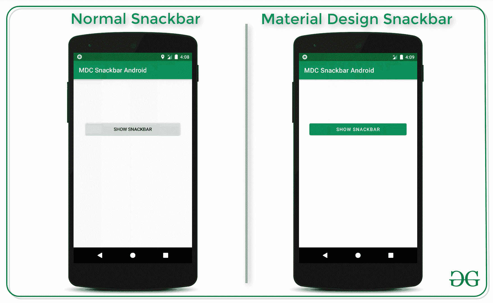
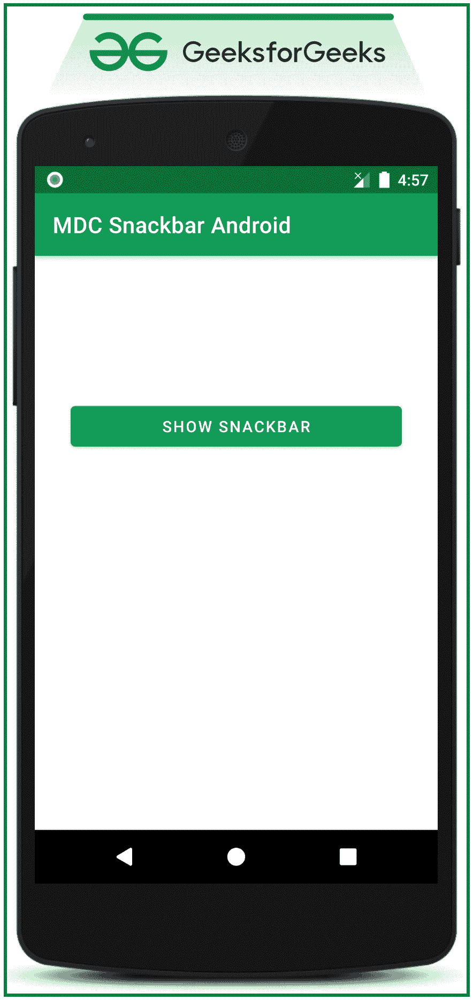

# 安卓中的 Snackbar 材质设计组件

> 原文:[https://www . geeksforgeeks . org/snack bar-材料-设计-安卓组件/](https://www.geeksforgeeks.org/snackbar-material-design-components-in-android/)

其他各种[材料设计组件](https://www.geeksforgeeks.org/introduction-to-material-design-in-android/)需要特殊属性才能实现。但是在本文中，实现了材质设计 Snackbar，它不需要特殊属性就可以在应用程序中实现。请看下图，区分安卓系统中的普通小吃店和材质设计小吃店。使材料设计 Snackbar 的是它的设计和易于实施和定制。请注意，我们将使用 **Java** 语言来实现这个项目。



### **实施材料设计障碍的步骤**

**第一步:创建一个空的活动安卓工作室项目**

*   创建一个空的活动安卓工作室项目。参考[安卓|如何在安卓工作室创建/启动新项目](https://www.geeksforgeeks.org/android-how-to-create-start-a-new-project-in-android-studio/)创建安卓工作室项目。注意，我们将使用 **Java** 语言来实现这个项目。

**第二步:添加需要的依赖关系**

*   将材料设计依赖库添加到应用程序级渐变文件中。
*   获取应用等级[渐变](https://www.geeksforgeeks.org/android-build-gradle/)文件转到**项目>应用>构建.渐变**T4**。**
*   并调用以下依赖项。

> 实现' com . Google . Android . material:material:1 . 3 . 0-alpha 03 '

*   如果无法获取应用级渐变文件并调用依赖关系，请参考下图。调用依赖关系后，点击右上角的“ ***【立即同步】*** ”按钮。并确保系统应该连接到网络，以便它可以下载所需的文件。


**第三步:在 styles.xml 文件**中将基础应用主题更改为材质组件主题

*   要更改应用程序的基本主题，请转到**应用程序> src > res > styles.xml** 并调用以下代码。

## 可扩展标记语言

```
<resources>

    <!-- Base application theme. -->
    <style name="AppTheme" parent="Theme.MaterialComponents.Light.DarkActionBar">
        <!-- Customize your theme here. -->
        <item name="colorPrimary">@color/colorPrimary</item>
        <item name="colorPrimaryDark">@color/colorPrimaryDark</item>
        <item name="colorAccent">@color/colorAccent</item>
    </style>

</resources>
```

*   如果无法定位和调用“材料组件”主题，请参考下图。


**第 4 步:现在使用 activity_main.xml 文件**

*   在 activity_main.xml 中调用下面的 XML 代码，或者自己设计。

## 可扩展标记语言

```
<?xml version="1.0" encoding="utf-8"?>
<LinearLayout 
    xmlns:android="http://schemas.android.com/apk/res/android"
    xmlns:app="http://schemas.android.com/apk/res-auto"
    xmlns:tools="http://schemas.android.com/tools"
    android:layout_width="match_parent"
    android:layout_height="match_parent"
    tools:context=".MainActivity"
    tools:ignore="HardcodedText">

    <!--a sample button to show or popup a MDC snackbar-->
    <Button
        android:id="@+id/show_snackbar_button"
        android:layout_width="match_parent"
        android:layout_height="wrap_content"
        android:layout_marginStart="32dp"
        android:layout_marginTop="128dp"
        android:layout_marginEnd="32dp"
        android:text="SHOW SNACKBAR" />

</LinearLayout>
```

**输出界面:在仿真器上运行**



**第五步:现在与 MainActivity.java 合作**

## Java 语言(一种计算机语言，尤用于创建网站)

```
import androidx.appcompat.app.AppCompatActivity;
import android.os.Bundle;
import android.view.View;
import android.widget.Button;
import android.widget.Toast;
import com.google.android.material.snackbar.Snackbar;

public class MainActivity extends AppCompatActivity {

    // Button to show the snackbar
    Button bShowSnackbar;

    @Override
    protected void onCreate(Bundle savedInstanceState) {
        super.onCreate(savedInstanceState);
        setContentView(R.layout.activity_main);

        // register the show snackbar button with the appropriate ID
        bShowSnackbar = findViewById(R.id.show_snackbar_button);

        // button click listener to show the snackbar
        bShowSnackbar.setOnClickListener(new View.OnClickListener() {
            @Override
            public void onClick(View v) {
                Snackbar snackbar = Snackbar.make(v, "You have deleted an item", Snackbar.LENGTH_LONG);
                snackbar.setAction("UNDO", new View.OnClickListener() {
                    @Override
                    public void onClick(View v) {
                        // perform any action when the button on the snackbar is clicked here in this case 
                          // it shows a simple toast
                        Toast.makeText(MainActivity.this, "The item has been restored", Toast.LENGTH_SHORT).show();
                    }
                });
                snackbar.show();
            }
        });
    }
}
```

**产生以下输出:**

<video class="wp-video-shortcode" id="video-510624-1" width="640" height="360" preload="metadata" controls=""><source type="video/mp4" src="https://media.geeksforgeeks.org/wp-content/uploads/20201102171116/GFG_nexus_5.mp4?_=1">[https://media.geeksforgeeks.org/wp-content/uploads/20201102171116/GFG_nexus_5.mp4](https://media.geeksforgeeks.org/wp-content/uploads/20201102171116/GFG_nexus_5.mp4)</video>

## **材料设计工具条的更多功能**

### **功能 1:手动设置 Snackbar 的持续时间**

*   在**MainActivity.java**中调用以下代码。
*   在这种情况下，Snackbar 消除持续时间设置为 3 秒。

## Java 语言(一种计算机语言，尤用于创建网站)

```
import androidx.appcompat.app.AppCompatActivity;
import android.os.Bundle;
import android.view.View;
import android.widget.Button;
import android.widget.Toast;
import com.google.android.material.snackbar.Snackbar;

public class MainActivity extends AppCompatActivity {

    // Button to show the snackbar
    Button bShowSnackbar;

    @Override
    protected void onCreate(Bundle savedInstanceState) {
        super.onCreate(savedInstanceState);
        setContentView(R.layout.activity_main);

        // register the show snackbar button with the appropriate ID
        bShowSnackbar = findViewById(R.id.show_snackbar_button);

        // button click listener to show the snackbar
        bShowSnackbar.setOnClickListener(new View.OnClickListener() {
            @Override
            public void onClick(View v) {
                Snackbar snackbar = Snackbar.make(v, "You have deleted an item", Snackbar.LENGTH_LONG);
                snackbar.setAction("UNDO", new View.OnClickListener() {
                    @Override
                    public void onClick(View v) {
                        // perform any action when the button on the snackbar is clicked here in this case 
                          // it shows a simple toast
                        Toast.makeText(MainActivity.this, "The item has been restored", Toast.LENGTH_SHORT).show();
                    }
                });
                // the duration is in terms of milliseconds in this case its 3 seconds
                snackbar.setDuration(3000);
                snackbar.show();
            }
        });
    }
}
```

**产生以下输出:**

<video class="wp-video-shortcode" id="video-510624-2" width="640" height="360" preload="metadata" controls=""><source type="video/mp4" src="https://media.geeksforgeeks.org/wp-content/uploads/20201102171939/GFG_nexus_5.mp4?_=2">[https://media.geeksforgeeks.org/wp-content/uploads/20201102171939/GFG_nexus_5.mp4](https://media.geeksforgeeks.org/wp-content/uploads/20201102171939/GFG_nexus_5.mp4)</video>

### **功能 2:在 FAB(浮动动作按钮)**上防止 Snackbar 重叠

*   要防止 Sncakbar 的简单重叠，请参考[如何避免安卓系统中 Snackbar 重叠浮动动作按钮？](https://www.geeksforgeeks.org/how-to-avoid-snackbar-overlap-floating-action-button-in-android/)。该方法显示了将**控制点**设置为浮动动作按钮。
*   在 **activity_main.xml** 中调用以下代码。

## 可扩展标记语言

```
<?xml version="1.0" encoding="utf-8"?>
<androidx.constraintlayout.widget.ConstraintLayout 
    xmlns:android="http://schemas.android.com/apk/res/android"
    xmlns:app="http://schemas.android.com/apk/res-auto"
    xmlns:tools="http://schemas.android.com/tools"
    android:layout_width="match_parent"
    android:layout_height="match_parent"
    tools:context=".MainActivity"
    tools:ignore="HardcodedText">

    <!--a sample button to show or popup a MDC snackbar-->
    <Button
        android:id="@+id/show_snackbar_button"
        android:layout_width="0dp"
        android:layout_height="wrap_content"
        android:layout_marginStart="32dp"
        android:layout_marginTop="128dp"
        android:layout_marginEnd="32dp"
        android:text="SHOW SNACKBAR"
        app:layout_constraintEnd_toEndOf="parent"
        app:layout_constraintStart_toStartOf="parent"
        app:layout_constraintTop_toTopOf="parent" />

    <!--a simple floating action button with icon-->
    <com.google.android.material.floatingactionbutton.FloatingActionButton
        android:layout_width="wrap_content"
        android:layout_height="wrap_content"
        android:layout_marginEnd="16dp"
        android:layout_marginBottom="16dp"
        android:backgroundTint="@color/colorPrimary"
        android:src="@drawable/ic_add_black_24dp"
        app:layout_constraintBottom_toTopOf="@+id/snackbar_layout"
        app:layout_constraintEnd_toEndOf="parent" />

    <!--this layout makes the floating action button to raise up 
        whenever the snackbar pops up from bottom-->
    <androidx.coordinatorlayout.widget.CoordinatorLayout
        android:id="@+id/snackbar_layout"
        android:layout_width="match_parent"
        android:layout_height="wrap_content"
        android:layout_alignParentStart="true"
        android:layout_alignParentBottom="true"
        app:layout_constraintBottom_toBottomOf="parent" />

</androidx.constraintlayout.widget.ConstraintLayout>
```

*   现在使用**MainActivity.java**文件来处理 Snackbar 的重叠。

## Java 语言(一种计算机语言，尤用于创建网站)

```
import androidx.appcompat.app.AppCompatActivity;
import androidx.coordinatorlayout.widget.CoordinatorLayout;
import android.os.Bundle;
import android.view.View;
import android.widget.Button;
import android.widget.Toast;
import com.google.android.material.snackbar.Snackbar;

public class MainActivity extends AppCompatActivity {

    // Button to show the snackbar
    Button bShowSnackbar;

    // coordinator layout for snackbar
    CoordinatorLayout mSnackbarLayout;

    @Override
    protected void onCreate(Bundle savedInstanceState) {
        super.onCreate(savedInstanceState);
        setContentView(R.layout.activity_main);

        // register the show snackbar button with the appropriate ID
        bShowSnackbar = findViewById(R.id.show_snackbar_button);

        // register the coordinator layout with the appropriate ID
        mSnackbarLayout = findViewById(R.id.snackbar_layout);

        // button click listener to show the snackbar
        bShowSnackbar.setOnClickListener(new View.OnClickListener() {
            @Override
            public void onClick(View v) {
                // pass the mSnackbarLayout as the view to the "make" function
                Snackbar snackbar = Snackbar.make(mSnackbarLayout, "You have deleted an item", Snackbar.LENGTH_LONG);
                snackbar.setAction("UNDO", new View.OnClickListener() {
                    @Override
                    public void onClick(View v) {
                        // perform any action when the button on the snackbar is clicked
                        // here in this case it shows a simple toast
                        Toast.makeText(MainActivity.this, "The item has been restored", Toast.LENGTH_SHORT).show();
                    }
                });
                // the duration is in terms of milliseconds
                snackbar.setDuration(3000);
                snackbar.show();
            }
        });
    }
}
```

**输出:在仿真器上运行**

<video class="wp-video-shortcode" id="video-510624-3" width="640" height="360" preload="metadata" controls=""><source type="video/mp4" src="https://media.geeksforgeeks.org/wp-content/uploads/20201102174849/GFG_nexus_5.mp4?_=3">[https://media.geeksforgeeks.org/wp-content/uploads/20201102174849/GFG_nexus_5.mp4](https://media.geeksforgeeks.org/wp-content/uploads/20201102174849/GFG_nexus_5.mp4)</video>

### **功能 3:扫动 Snackbar 功能将其关闭**

*   在 **activity_main.xml** 中调用以下代码

## 可扩展标记语言

```
<?xml version="1.0" encoding="utf-8"?>
<androidx.constraintlayout.widget.ConstraintLayout 
    xmlns:android="http://schemas.android.com/apk/res/android"
    xmlns:app="http://schemas.android.com/apk/res-auto"
    xmlns:tools="http://schemas.android.com/tools"
    android:layout_width="match_parent"
    android:layout_height="match_parent"
    tools:context=".MainActivity"
    tools:ignore="HardcodedText">

    <!--a sample button to show or popup a MDC snackbar-->
    <Button
        android:id="@+id/show_snackbar_button"
        android:layout_width="0dp"
        android:layout_height="wrap_content"
        android:layout_marginStart="32dp"
        android:layout_marginTop="128dp"
        android:layout_marginEnd="32dp"
        android:text="SHOW SNACKBAR"
        app:layout_constraintEnd_toEndOf="parent"
        app:layout_constraintStart_toStartOf="parent"
        app:layout_constraintTop_toTopOf="parent" />

    <!--this layout makes the floating action button to 
        raise up whenever the snackbar pops up from bottom-->
    <androidx.coordinatorlayout.widget.CoordinatorLayout
        android:id="@+id/snackbar_layout"
        android:layout_width="match_parent"
        android:layout_height="wrap_content"
        android:layout_alignParentStart="true"
        android:layout_alignParentBottom="true"
        app:layout_constraintBottom_toBottomOf="parent" />

</androidx.constraintlayout.widget.ConstraintLayout>
```

*   现在使用**MainActivity.java**文件，在构建 Snackbar 时，确保传递“ **make** ”功能的协调器布局。

## Java 语言(一种计算机语言，尤用于创建网站)

```
import androidx.appcompat.app.AppCompatActivity;
import androidx.coordinatorlayout.widget.CoordinatorLayout;
import android.os.Bundle;
import android.view.View;
import android.widget.Button;
import android.widget.Toast;
import com.google.android.material.snackbar.Snackbar;

public class MainActivity extends AppCompatActivity {

    // Button to show the snackbar
    Button bShowSnackbar;

    // coordinator layout for snackbar
    CoordinatorLayout mSnackbarLayout;

    @Override
    protected void onCreate(Bundle savedInstanceState) {
        super.onCreate(savedInstanceState);
        setContentView(R.layout.activity_main);

        // register the show snackbar button with the
        // appropriate ID
        bShowSnackbar = findViewById(R.id.show_snackbar_button);

        // register the coordinator layout with the
        // appropriate ID
        mSnackbarLayout = findViewById(R.id.snackbar_layout);

        // button click listener to show the snackbar
        bShowSnackbar.setOnClickListener(
                new View.OnClickListener() {
                    @Override
                    public void onClick(View v) {
                        // pass the mSnackbarLayout as the view
                        // to the make function
                        Snackbar snackbar = Snackbar.make(mSnackbarLayout, "You have deleted an item", Snackbar.LENGTH_LONG);
                        snackbar.setAction("UNDO", new View.OnClickListener() {
                            @Override
                            public void onClick(View v) {
                                // perform any action when the button on the snackbar is clicked here in this
                                // case it shows a simple toast
                                Toast.makeText(MainActivity.this, "The item has been restored", Toast.LENGTH_SHORT).show();
                            }
                        });
                        // the duration is in terms of milliseconds
                        snackbar.setDuration(3000);
                        snackbar.show();
                    }
                });
    }
}
```

**输出:在仿真器上运行**

<video class="wp-video-shortcode" id="video-510624-4" width="640" height="360" preload="metadata" controls=""><source type="video/mp4" src="https://media.geeksforgeeks.org/wp-content/uploads/20201102175629/GFG_nexus_5.mp4?_=4">[https://media.geeksforgeeks.org/wp-content/uploads/20201102175629/GFG_nexus_5.mp4](https://media.geeksforgeeks.org/wp-content/uploads/20201102175629/GFG_nexus_5.mp4)</video>