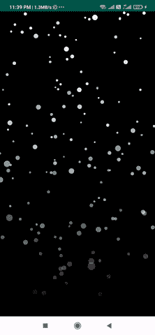

# 安卓降雪动画

> 原文:[https://www . geesforgeks . org/snow-animation-in-Android/](https://www.geeksforgeeks.org/snowfall-animation-in-android/)

在本文中，我们将使用 Android-降雪库创建降雪动画。在这里，我们将只是创建一个降雪视图的布局，并将指定背景颜色。我们创建的降雪动画很容易创建，因为我们使用的是一个库。下面给出了一个示例 GIF，以了解我们将在本文中做什么。注意，我们将使用 **Java** 语言来实现这个项目。



### **分步实施**

**第一步:创建新项目**

要在安卓工作室创建新项目，请参考[如何在安卓工作室创建/启动新项目](https://www.geeksforgeeks.org/android-how-to-create-start-a-new-project-in-android-studio/)。注意选择 **Java** 作为编程语言。

**第二步:添加依赖和 JitPack 存储库**

导航到**渐变脚本>构建.渐变(模块:应用)**，并在依赖项部分添加以下依赖项。

> 编译' com . github . jetradarmobile:Android-降雪:1.2.1 '

将 JitPack 存储库添加到构建文件中。将其添加到 allprojects{ }部分内存储库末尾的 root build.gradle 中。

> *所有项目{*
> 
> *存储库{*
> 
> *……*
> 
> *maven { URL " https://jitpack . io " }*
> 
> *}*
> 
> *}*

添加这个依赖项后，同步您的项目，现在我们将开始实现它。

**步骤 3:使用 activity_main.xml 文件**

导航到**应用程序> res >布局> activity_main.xml** 并将下面的代码添加到该文件中。下面是 **activity_main.xml** 文件的代码。

## 可扩展标记语言

```
<?xml version="1.0" encoding="utf-8"?>
<LinearLayout 
    xmlns:android="http://schemas.android.com/apk/res/android"
    xmlns:app="http://schemas.android.com/apk/res-auto"
    xmlns:tools="http://schemas.android.com/tools"
    android:layout_width="match_parent"
    android:layout_height="match_parent"
    android:gravity="center"
    android:orientation="vertical"
    tools:context=".MainActivity">

    <!--Creating SnowfallView layout for showing snow-->
    <com.jetradarmobile.snowfall.SnowfallView
        android:layout_width="match_parent"
        android:layout_height="match_parent"
        android:background="@color/black"
        app:snowflakeAlphaMax="255"
        app:snowflakeAlphaMin="150"
        app:snowflakeAngleMax="5"
        app:snowflakeSizeMax="10dp"
        app:snowflakeSizeMin="2dp"
        app:snowflakeSpeedMax="12"
        app:snowflakeSpeedMin="4"
        app:snowflakesAlreadyFalling="false"
        app:snowflakesFadingEnabled="true" />

</LinearLayout>
```

**第四步:使用****MainActivity.java 文件**

转到**MainActivity.java**文件，参考以下代码。对于这个项目，我们在**MainActivity.java**文件中没有做任何事情。

## Java 语言(一种计算机语言，尤用于创建网站)

```
import android.os.Bundle;

import androidx.appcompat.app.AppCompatActivity;

public class MainActivity extends AppCompatActivity {

    @Override
    protected void onCreate(Bundle savedInstanceState) {
        super.onCreate(savedInstanceState);
        setContentView(R.layout.activity_main);
    }
}
```

**输出:**

<video class="wp-video-shortcode" id="video-594175-1" width="640" height="360" preload="metadata" controls=""><source type="video/mp4" src="https://media.geeksforgeeks.org/wp-content/uploads/20210420234720/snowfall.mp4?_=1">[https://media.geeksforgeeks.org/wp-content/uploads/20210420234720/snowfall.mp4](https://media.geeksforgeeks.org/wp-content/uploads/20210420234720/snowfall.mp4)</video>