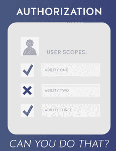
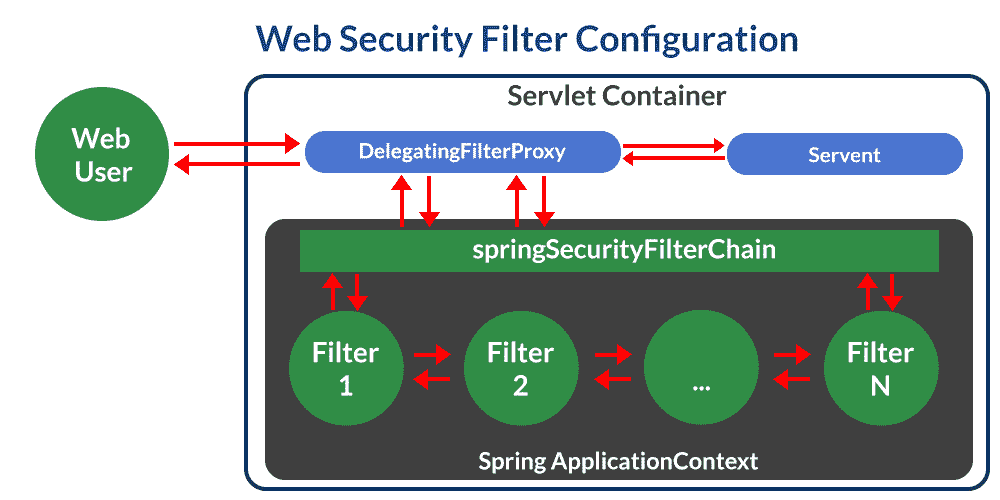

# 春季安全中的一些重要术语

> 原文:[https://www . geesforgeks . org/某些重要术语-春季安全/](https://www.geeksforgeeks.org/some-important-terms-in-spring-security/)

**Spring Security** 默认保护我们的 web 应用程序，而且我们可以根据需要对其进行定制。Spring Securit 中的重要术语如下:

1.  证明
2.  批准
3.  过滤器

让我们分别讨论它们，如下所示:

**术语 1:** 认证

验证用户的身份以提供对系统的访问。如果根据保存的凭证验证了用户，则接受请求，并从服务器向客户端给出所需的响应。一些方法如下:

*   登录表单
*   HTTP 身份验证
*   客户认证方法

**1.1** 登录表单:是指向需要用户识别和认证的网站的网页，通过输入用户名和密码来执行。

**1.2** HTTP 认证–在这种情况下，服务器可以向客户端请求认证信息(用户 ID 和密码)。

**1.3** 客户认证方式——客户认证是一项新规定，旨在防止网上交易欺诈。

**术语 2:** 授权

授予用户访问特定资源或功能的权限。一些方法:-

**2.1** 对网址的访问控制–网址的安全性允许您根据网址的内容(关键词)限制对特定网站的访问。

**2.2** 安全对象和方法–类方法由安全拦截器实现调用，以确保配置的访问决策管理器支持或不支持安全对象的类型。

**2.3** 访问控制列表–访问控制列表指定哪些用户有权访问对象，以及允许对其进行哪些操作。

**术语 3:** 过滤器

过滤器是在对请求进行预处理和后处理时调用的功能。Spring Security 维护一个过滤器链，其中所有过滤器都有不同的职责，根据需要哪些服务来添加或删除过滤器。

