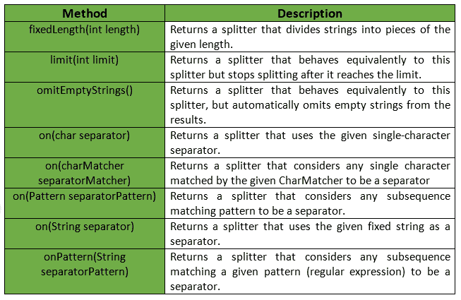
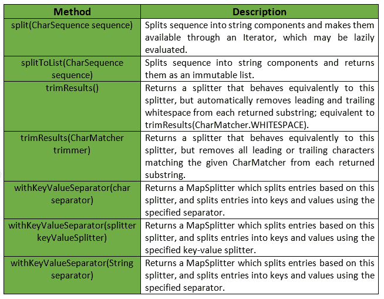

# 拆分器类|番石榴| Java

> 原文:[https://www.geeksforgeeks.org/splitter-class-guava-java/](https://www.geeksforgeeks.org/splitter-class-guava-java/)

番石榴的**拆分器类**提供了多种方法来处理字符串、对象等的拆分操作。它通常通过识别分隔符序列的外观，从输入字符串中提取不重叠的子字符串。此分隔符可以指定为单个字符、固定字符串、正则表达式或 CharMatcher 实例。

**申报:**以下为**com . Google . common . base . splitter**类申报:

```
@GwtCompatible(emulated = true)
public final class Splitter
   extends Object

```

下表简要总结了番石榴的 Splitter 类方法:



**示例:**

```
// Java code to show implementation of
// Guava's Splitter class's method

import com.google.common.base.Splitter;

class GFG {

    // Driver's code
    public static void main(String[] args)
    {

        // Splitter.on(char separator) returns a splitter
        // that uses the given single-character separator.

        // Splitter omitEmptyStrings() omits empty 
        // strings from the results.
        System.out.println(Splitter.on(',')
                  .trimResults()
                  .omitEmptyStrings()
                  .split("GeeksforGeeks ,is, the, 
                     best, website, to, prepare, for, interviews"));
    }
}
```

**Output:**

```
[GeeksforGeeks, is, the, best, website, to, prepare, for, interviews]

```

拆分器类提供的其他一些方法有:



**示例:**

```
// Java code to show implementation of
// Guava's Splitter class's method

import com.google.common.base.Splitter;
import java.util.List;

class GFG {

    // Driver's code
    public static void main(String[] args)
    {
        // A string variable named str
        String str= "Hello, GFG, What's up ?";

        // SplitToList returns a List of the strings. 
        // This can be transformed to an ArrayList or 
        // used directly in a loop.
        List<String> myList = Splitter.on(',').splitToList(str);

        for (String ele : myList) {
            System.out.println(ele);
        }
    }
}
```

**Output:**

```
Hello
 GFG
 What's up ?

```

**参考:**T2】谷歌番石榴